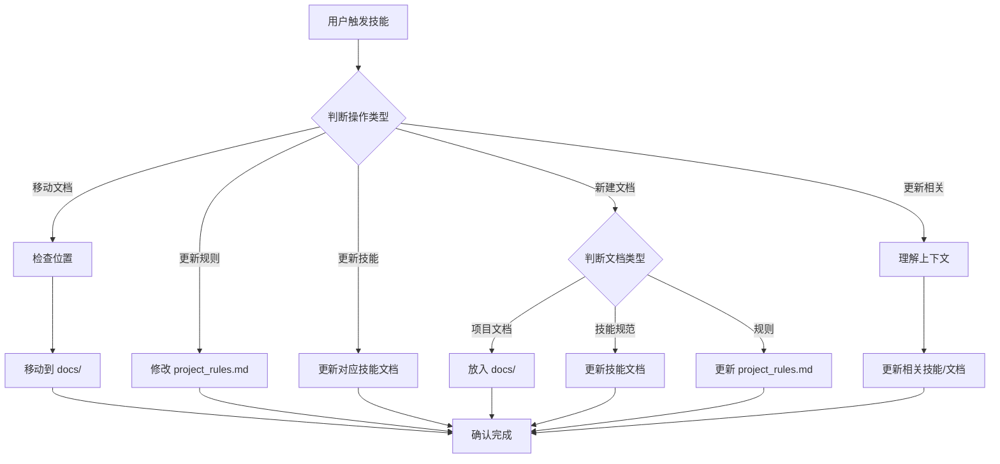

# Hyper Duty 文档管理专家

这个技能负责 Hyper Duty 项目的所有文档、技能、规则的管理工作。

## 🎯 技能触发词

当用户说以下内容时，必须调用此技能：
- "更新相关文档"
- "更新相关技能"
- "更新相关规则"
- "整理文档"
- "更新技能"
- "文档管理"
- "移动文档到docs"
- 其他涉及文档、技能、规则管理的内容

## 📁 文档目录规范

### 统一文档目录
**所有项目文档必须统一放在 `d:\workspace\lasudev\hyper-duty\docs\` 目录下**

### 禁止存放位置
- ❌ 项目根目录 `d:\workspace\lasudev\hyper-duty\`
- ❌ 其他任意位置

## 📋 文档分类与存放位置

| 文档类型 | 存放位置 | 说明 |
|---------|---------|------|
| **技能文档** | `.trae/skills/技能名/SKILL.md` | 各个技能的具体实现规范 |
| **项目规则** | `.trae/rules/project_rules.md` | 技术栈强制约束、架构规范 |
| **模块实现文档** | `docs/` | 各模块的功能说明、技术实现 |
| **快速入门文档** | `docs/` | 各模块的使用快速指南 |
| **技能总结文档** | `docs/` | 开发技能总结、最佳实践 |
| **平台文档** | `docs/` | 平台开发手册、需求说明书 |
| **其他业务文档** | `docs/` | 所有项目相关的业务文档 |

## 🏗️ 必须放在 docs/ 的文档清单

以下文档必须永久存放在 `docs/` 目录：
- `工作流快速入门.md`
- `工作流模块实现文档.md`
- `平台开发手册.md`
- `平台需求说明书.md`
- `前端开发技能总结.md`
- `项目管理中心实现文档.md`
- `值班管理中心实现文档.md`
- 未来新建的所有项目文档

## 🔒 不归入 docs/ 的文件

以下文件**不得**移动到 docs/ 目录：
- `.trae/skills/` 下的所有技能文档（SKILL.md）
- `.trae/rules/` 下的所有规则文件
- 代码文件（.java、.vue、.js、.ts 等）
- 配置文件（.json、.yml、.properties 等）
- 其他非文档类文件

## 🔧 文档管理操作流程

### 操作1：移动文档到 docs/ 目录
当发现文档在非 docs/ 目录时，执行：
1. 读取原文档内容
2. 在 docs/ 目录下创建同名文档（使用 Write 工具）
3. 删除原位置文档（使用 DeleteFile 工具）
4. 向用户确认操作完成

### 操作2：更新项目规则
当涉及技术栈、架构规范变更时：
1. 修改 `.trae/rules/project_rules.md`
2. 保持简洁，仅包含强制约束
3. 不要在其中写具体开发规范（开发规范放在技能文档）

### 操作3：更新技能文档
当需要更新某个模块的开发规范时：
1. 找到对应技能的 `.trae/skills/技能名/SKILL.md`
2. 更新其中的开发规范
3. 保证 `hyper-duty-navigator` 技能包含最新的通用规范

### 操作4：新建文档
当需要新建文档时：
1. 确定文档类型
2. 如果是项目文档 → 放在 `docs/` 目录
3. 如果是技能规范 → 更新对应技能的 SKILL.md
4. 如果是规则变更 → 更新 `project_rules.md`

### 操作5：更新相关文档/技能/规则
当用户说"更新相关文档"、"更新相关技能"、"更新相关规则"时：
1. 理解当前上下文，判断涉及哪些模块
2. 找到相关的技能文档（hyper-duty-navigator、duty-module-developer、project-module-developer 等）
3. 根据本次变更内容，更新对应技能文档中的规范
4. 检查是否需要更新 `project_rules.md`（仅当涉及技术栈、架构变更时）
5. 如果有新生成的业务文档，放入 `docs/` 目录
6. 向用户确认更新完成

## 📝 通用开发规范位置

通用开发规范（包括移动端适配、分页规范、缓存规范等）必须放在 `hyper-duty-navigator` 技能文档中，**不要放在 project_rules.md**。

## 🎯 执行流程图

## 📌 注意事项

1. **技能文档和项目规则不归入 docs/**，保持在 `.trae/` 目录下
2. **所有业务文档必须在 docs/ 目录**
3. **更新规范时同步对应技能文档**
4. **不要在 project_rules.md 写具体开发规范**
5. **用户说"更新相关"时，必须先理解上下文，再更新对应的技能文档**
