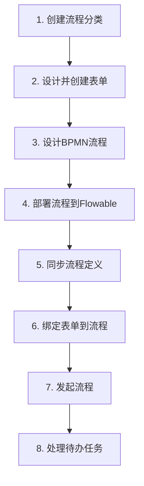

# Hyper Duty 工作流模块 - 快速开始

## 已完成功能清单

✅ 后端架构（独立 workflow 模块，参考 duty/pm 结构）
✅ Flowable 7.0 工作流引擎集成
✅ RESTful API（流程部署、任务管理、批量转办）
✅ 前端页面（流程设计、待办任务、已办任务）
✅ 人员选择器集成（复用 PersonSelector）
✅ 多实例+会签+并行流程示例 BPMN
✅ 数据库 SQL 脚本
✅ **流程分类管理** - 完整的分类增删改查
✅ **表单管理** - 表单设计器、表单预览
✅ **流程发起** - 树状流程选择、表单自动加载
✅ **流程表单绑定** - 流程与表单关联
✅ **流程定义同步** - 同步Flowable流程到扩展表
✅ **完整菜单配置**

## 快速启动

### 第一步：执行数据库脚本

**注意**：工作流模块基于 **PostgreSQL** 数据库。

执行以下 SQL 文件：

```sql
-- 1. hyper_duty_workflow_ddl.sql - 表结构（PostgreSQL语法）
-- 2. hyper_duty_workflow_menu.sql - 菜单数据
-- 3. update_workflow_tables.sql - 表结构更新（可选，如已执行主脚本可跳过）
```

### 第二步：启动后端

```bash
# 启动 Spring Boot 应用
# Flowable 会自动创建 ACT_ 开头的表
```

### 第三步：安装前端依赖

```bash
cd frontend
npm install
```

### 第四步：启动前端

```bash
npm run dev
```

### 第五步：访问页面

完整的工作流菜单已配置，访问左侧菜单即可：

| 菜单项 | 路径 | 说明 |
|--------|------|------|
| 流程设计 | `/workflow/designer` | 流程设计器 |
| 流程定义 | `/workflow/process-list` | 流程定义列表（含同步和绑定） |
| 流程发起 | `/workflow/start` | 发起流程 |
| 流程分类 | `/workflow/category-list` | 分类管理 |
| 表单管理 | `/workflow/form-list` | 表单设计和管理 |
| 待办任务 | `/workflow/todo-task` | 待办任务 |
| 已办任务 | `/workflow/done-task` | 已办任务 |
| 委托配置 | `/workflow/delegate-list` | 委托配置 |

## 完整使用流程（必看）



**详细操作步骤：**

### 1. 创建流程分类
- 进入"流程分类"页面
- 点击"新增分类"
- 填写分类名称和编码
- 保存分类

### 2. 设计并创建表单
- 进入"表单管理"页面
- 点击"新增表单"
- 填写表单信息
- 点击"设计表单"打开 **form-create** 表单设计器
- 拖拽组件设计表单
- 保存表单

### 3. 设计流程
- 进入"流程设计"页面
- 使用 BPMN 设计器拖拽组件
- 设置任务节点（如用户任务）
- 配置流程属性

### 4. 部署流程
- 点击"部署流程"按钮
- 输入流程名称
- 确认部署

### 5. **同步流程定义** ⭐
- 进入"流程定义"页面
- 点击右上角"同步流程"按钮
- 系统自动将 Flowable 中的流程同步到 `wf_definition` 表

### 6. **绑定表单** ⭐
- 在流程定义列表中找到刚才同步的流程
- 点击"绑定表单"按钮
- 选择要关联的表单（可选"无"）
- 提交绑定

### 7. **发起流程** ⭐
- 进入"发起流程"页面
- 左侧树状结构选择流程分类
- 选择要发起的流程
- 如果流程绑定了表单，右侧会显示表单
- 填写表单数据
- 点击"提交发起"

### 8. 处理任务
- 进入"待办任务"页面
- 找到刚才发起流程产生的任务
- 点击"办理"
- 填写审批意见并提交

## 主要 API 接口

### 流程分类

| Method | Path | Description |
|--------|------|-------------|
| GET | /workflow/category/page | 分页查询分类 |
| GET | /workflow/category/list | 获取分类列表 |
| POST | /workflow/category | 新增分类 |
| PUT | /workflow/category | 更新分类 |
| DELETE | /workflow/category/{id} | 删除分类 |

### 流程管理

| Method | Path | Description |
|--------|------|-------------|
| GET | /workflow/process/definition/page | 分页查询流程定义 |
| GET | /workflow/process/definition/list | 获取列表 |
| POST | /workflow/process/definition/sync | 同步流程定义 |
| POST | /workflow/process/definition/bind-form | 绑定表单 |
| POST | /workflow/process/start | 启动流程 |
| POST | /workflow/process/instance/cancel/{id} | 作废流程 |

### 任务管理

| Method | Path | Description |
|--------|------|-------------|
| GET | /workflow/task/todo/page | 待办任务 |
| GET | /workflow/task/done/page | 已办任务 |
| POST | /workflow/task/complete | 办理任务 |
| POST | /workflow/task/reassign | 转办任务 |
| POST | /workflow/task/batch-reassign | 批量转办 |
| POST | /workflow/task/claim/{id} | 认领 |
| POST | /workflow/task/unclaim/{id} | 取消认领 |

### 表单/委托

| Method | Path | Description |
|--------|------|-------------|
| GET | /workflow/form/page | 表单列表 |
| POST | /workflow/form | 新增 |
| PUT | /workflow/form | 更新 |
| DELETE | /workflow/form/{id} | 删除 |
| GET | /workflow/delegate/page | 委托配置 |
| POST | /workflow/delegate | 新增委托 |
| POST | /workflow/delegate/enable/{id} | 启用 |
| POST | /workflow/delegate/disable/{id} | 禁用 |

## 多实例、会签、抢占配置说明

### 1. 多实例并行

```xml
<userTask id="..." name="并行任务">
  <multiInstanceLoopCharacteristics 
    isSequential="false"
    flowable:collection="${assignees}"
    flowable:elementVariable="assignee">
    <completionCondition>
      ${nrOfCompletedInstances >= nrOfInstances}
    </completionCondition>
  </multiInstanceLoopCharacteristics>
</userTask>
```

### 2. 会签（按比例通过）

```xml
<userTask id="..." name="会签任务">
  <multiInstanceLoopCharacteristics 
    isSequential="false"
    flowable:collection="${countersignUsers}"
    flowable:elementVariable="countersignUser">
    <completionCondition>
      ${nrOfCompletedInstances/nrOfInstances >= 0.5}
    </completionCondition>
  </multiInstanceLoopCharacteristics>
</userTask>
```

### 3. 串行多实例

```xml
<multiInstanceLoopCharacteristics isSequential="true">
  ...
</multiInstanceLoopCharacteristics>
```

### 4. 抢占任务（Task Candidate）

```xml
<userTask id="..." name="抢单任务"
  flowable:candidateUsers="${candidates}" />
```

通过 API 认领任务：
```
POST /workflow/task/claim/{taskId}
```

## 文件结构说明

### 后端
```
src/main/java/com/lasu/hyperduty/
├── workflow/
│   ├── controller/       # 控制器（含分类、流程、任务、表单、委托）
│   ├── service/          # 服务接口
│   ├── service/impl/     # 实现
│   ├── mapper/           # MyBatis
│   ├── entity/           # 实体
│   └── dto/              # DTO
└── common/config/        # Flowable 配置

src/main/resources/
└── processes/            # BPMN 流程文件
```

### 前端
```
frontend/src/
├── api/workflow/         # API 封装（category, process, task, form, delegate）
├── components/           # BpmnDesigner
└── views/workflow/       # 页面（分类、流程、发起、表单、任务等）
```

## 最新更新（2026-05-10）

### 新增功能
1. **流程分类管理** - 完整的分类CRUD和状态管理
2. **表单管理** - **form-create** 表单设计器集成，表单预览
3. **流程发起页面** - 树状流程选择，表单自动加载
4. **流程定义同步** - 从Flowable同步流程到扩展表
5. **流程表单绑定** - 在流程定义页面绑定表单
6. **完整菜单配置** - 所有页面菜单已配置完成
7. **PostgreSQL 支持** - 工作流模块完全基于 PostgreSQL 数据库

### 修复问题
1. 流程名称为null时的默认处理（使用key作为名称）
2. 流程分类和表单管理页面的404错误修复
3. 表结构字段统一

## 常见问题

### Q: 工作流模块支持什么数据库？
A: 工作流模块完全基于 **PostgreSQL** 数据库，SQL脚本使用PostgreSQL语法。

### Q: Flowable 表没自动创建？
A: 检查 `FlowableConfig.java` 配置，确保 `databaseSchemaUpdate` 为 true

### Q: 部署流程失败？
A: 检查 BPMN XML 格式是否正确，或者用流程设计器重新导出

### Q: 前端人员选择器不显示？
A: 确保 `getEmployeeList` 等 API 返回正确数据

### Q: 流程发起页面没有流程显示？
A: ⭐ 部署流程后，必须到"流程定义"页面点击"同步流程"按钮！

### Q: 流程没有表单怎么发起？
A: 流程可以不绑定表单直接发起，发起时表单区域为空

### Q: 点击"查看"按钮显示null？
A: 已修复，现在点击"查看"会跳转到流程设计器

---
**有问题随时联系开发团队！**
