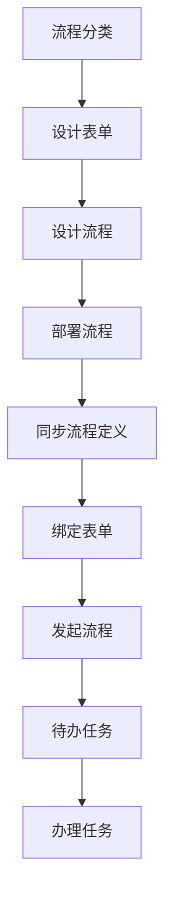

# Hyper Duty 工作流模块

## 功能概述

已完成工作流模块的核心功能开发，包括：

### 后端功能

1. **流程引擎集成**
   - 集成 Flowable 7.0.1 工作流引擎
   - 配置了数据库自动建表和字体支持
   - 提供流程部署、启动、查询、终止等基础功能

2. **流程管理 API**
   - 流程部署和删除
   - 流程定义列表查询（支持分类和表单绑定信息）
   - 流程定义同步
   - 表单绑定到流程
   - 流程实例启动和管理
   - 流程变量管理

3. **任务管理 API**
   - 待办任务列表查询
   - 已办任务列表查询
   - 任务完成、转办、委托
   - 任务认领和取消认领
   - 批量转办任务
   - 历史任务和流程实例查询

4. **表单管理 API**
   - 表单的增删改查
   - 表单配置和内容管理
   - 表单设计器集成（form-create）

5. **流程分类管理 API**
   - 分类的增删改查
   - 分类的启用/禁用

6. **委托管理 API**
   - 委托配置管理
   - 委托配置的启用/禁用

### 前端功能

1. **流程设计器**
   - 集成 bpmn-js 拖拽式流程设计器
   - 支持 BPMN 2.0 标准
   - 提供保存、导入导出、缩放等功能
   - 流程部署功能

2. **流程定义管理**
   - 流程定义列表展示
   - 流程搜索功能
   - 流程定义同步功能
   - 流程表单绑定功能
   - 流程查看（跳转设计器）

3. **流程分类管理**
   - 流程分类列表
   - 分类的增删改查
   - 分类状态管理

4. **表单管理**
   - 表单列表展示
   - 表单的增删改查
   - 表单设计器（form-create）
   - 表单预览功能

5. **流程发起**
   - 流程树状选择（按分类）
   - 表单自动加载
   - 表单数据填写
   - 流程提交发起

6. **任务管理**
   - 待办任务列表
   - 任务办理、转办、委托
   - 已办任务列表
   - 批量转办功能

### 数据库表

新增的工作流相关业务表：
- `wf_category` - 流程分类
- `wf_definition` - 流程定义扩展（含表单和分类绑定）
- `wf_form` - 流程表单
- `wf_instance` - 流程实例扩展
- `wf_delegate` - 委托代理

## 技术栈

### 后端

- Spring Boot 3.1.0
- Flowable 7.0.1
- MyBatis Plus 3.5.6
- PostgreSQL
- Lombok
- Knife4j（API文档）

### 前端

- Vue 3
- Element Plus
- Vue Router
- Pinia
- bpmn-js 17.9.0
- @form-create/element-ui

## 项目结构

### 后端

```
src/main/java/com/lasu/hyperduty/
├── common/config/
│   └── FlowableConfig.java          # Flowable 配置
└── workflow/
    ├── controller/                   # 控制器
    │   ├── WfCategoryController.java # 流程分类
    │   ├── WfProcessController.java  # 流程管理
    │   ├── WfTaskController.java     # 任务管理
    │   ├── WfFormController.java     # 表单管理
    │   └── WfDelegateController.java # 委托管理
    ├── dto/                          # 数据传输对象
    │   ├── WfProcessStartDTO.java
    │   ├── ProcessDefinitionDTO.java
    │   ├── WfTaskCompleteDTO.java
    │   ├── WfTaskReassignDTO.java
    │   ├── WfTaskDelegateDTO.java
    │   ├── WfTaskBatchReassignDTO.java
    │   └── WfDelegateConfigDTO.java
    ├── entity/                       # 实体类
    │   ├── WfCategory.java
    │   ├── WfDefinition.java
    │   ├── WfForm.java
    │   ├── WfInstance.java
    │   └── WfDelegate.java
    ├── mapper/                       # MyBatis Mapper
    │   ├── WfCategoryMapper.java
    │   ├── WfDefinitionMapper.java
    │   ├── WfFormMapper.java
    │   ├── WfInstanceMapper.java
    │   └── WfDelegateMapper.java
    └── service/                      # 服务层
        ├── WfCategoryService.java
        ├── WfProcessService.java
        ├── WfTaskService.java
        ├── WfFormService.java
        ├── WfDelegateService.java
        └── impl/
            ├── WfCategoryServiceImpl.java
            ├── WfProcessServiceImpl.java
            ├── WfTaskServiceImpl.java
            ├── WfFormServiceImpl.java
            └── WfDelegateServiceImpl.java
```

### 前端

```
frontend/src/
├── api/workflow/                    # API 接口
│   ├── category.js                  # 分类 API
│   ├── process.js                   # 流程 API
│   ├── task.js                      # 任务 API
│   ├── form.js                      # 表单 API
│   └── delegate.js                  # 委托 API
├── components/
│   └── BpmnDesigner.vue            # 流程设计器组件
└── views/workflow/                 # 页面
    ├── WorkflowLayout.vue
    ├── ProcessDesigner.vue
    ├── ProcessList.vue
    ├── ProcessStart.vue           # 流程发起
    ├── CategoryList.vue           # 流程分类
    ├── FormList.vue               # 表单管理
    ├── TodoTaskList.vue
    └── DoneTaskList.vue
```

## 安装和部署

### 1. 后端依赖安装

在项目根目录执行：

```bash
mvn clean install
```

### 2. 前端依赖安装

在 frontend 目录执行：

```bash
cd frontend
npm install
```

### 3. 数据库初始化

执行 SQL 脚本创建工作流业务表：

```bash
# 执行 hyper_duty_workflow_ddl.sql
# 执行 hyper_duty_workflow_menu.sql（菜单数据）
```

### 4. 启动应用

**后端：**
```bash
mvn spring-boot:run
```

**前端：**
```bash
cd frontend
npm run dev
```

## 使用指南

### 完整流程使用步骤



**详细步骤：**

| 步骤 | 操作 | 说明 |
|------|------|------|
| 1 | 创建流程分类 | 在"流程分类"页面创建分类 |
| 2 | 设计和创建表单 | 在"表单管理"页面使用设计器创建表单 |
| 3 | 设计流程 | 在"流程设计"页面使用 BPMN 设计器创建流程 |
| 4 | 部署流程 | 点击"部署流程"按钮部署到 Flowable 引擎 |
| 5 | **同步流程定义** | 在"流程定义"页面点击"同步流程"按钮，将流程同步到扩展表 |
| 6 | **绑定表单** | 点击流程的"绑定表单"按钮，选择要关联的表单 |
| 7 | **发起流程** | 在"发起流程"页面选择流程，填写表单，提交发起 |
| 8 | 办理任务 | 在"待办任务"页面处理任务 |

### 流程分类管理

1. 访问流程分类管理页面
2. 新增/编辑/删除流程分类
3. 设置分类的启用/禁用状态

### 表单设计和管理

1. 访问表单管理页面
2. 点击"新增表单"创建新表单
3. 点击"设计表单"打开表单设计器
4. 拖拽组件设计表单
5. 保存表单配置

### 流程设计和部署

1. 访问流程设计器页面
2. 拖拽组件设计流程
3. 输入流程名称
4. 点击"部署流程"按钮

### 流程表单绑定

1. 在流程定义列表找到要绑定表单的流程
2. 点击"绑定表单"按钮
3. 选择要绑定的表单（可选"无"）
4. 提交绑定

### 流程发起

1. 访问流程发起页面
2. 在左侧树状结构中选择流程分类
3. 选择要发起的流程
4. 如果流程绑定了表单，右侧会显示表单
5. 填写表单数据
6. 点击"提交发起"按钮

### 任务办理

1. 查看待办任务列表
2. 点击"办理"按钮
3. 填写审批意见
4. 提交完成任务

### 任务转办

1. 在待办任务列表中找到要转办的任务
2. 点击"转办"按钮
3. 选择接收人并填写原因
4. 提交完成转办

### 批量转办

1. 点击"批量转办"按钮
2. 填写转办原因
3. 提交批量转办

## API 接口文档

### 流程分类管理

| 接口 | 方法 | 描述 |
|------|------|------|
| /api/workflow/category/page | GET | 分页查询流程分类 |
| /api/workflow/category/list | GET | 获取流程分类列表 |
| /api/workflow/category/{id} | GET | 获取分类详情 |
| /api/workflow/category | POST | 创建分类 |
| /api/workflow/category | PUT | 更新分类 |
| /api/workflow/category/{id} | DELETE | 删除分类 |

### 流程管理

| 接口 | 方法 | 描述 |
|------|------|------|
| /api/workflow/process/deploy | POST | 部署流程 |
| /api/workflow/process/deploy/{deploymentId} | DELETE | 删除部署 |
| /api/workflow/process/definition/page | GET | 分页查询流程定义 |
| /api/workflow/process/definition/list | GET | 获取流程定义列表 |
| /api/workflow/process/definition/sync | POST | 同步流程定义到扩展表 |
| /api/workflow/process/definition/bind-form | POST | 绑定表单到流程 |
| /api/workflow/process/start | POST | 启动流程 |
| /api/workflow/process/instance/{processInstanceId} | GET | 获取流程实例 |
| /api/workflow/process/instance/my/page | GET | 分页查询我发起的流程 |
| /api/workflow/process/instance/cancel/{processInstanceId} | POST | 作废流程 |

### 任务管理

| 接口 | 方法 | 描述 |
|------|------|------|
| /api/workflow/task/todo/page | GET | 分页查询待办任务 |
| /api/workflow/task/done/page | GET | 分页查询已办任务 |
| /api/workflow/task/complete | POST | 完成任务 |
| /api/workflow/task/reassign | POST | 转办任务 |
| /api/workflow/task/delegate | POST | 委托任务 |
| /api/workflow/task/batch-reassign | POST | 批量转办任务 |
| /api/workflow/task/claim/{taskId} | POST | 认领任务 |
| /api/workflow/task/unclaim/{taskId} | POST | 取消认领任务 |

### 表单管理

| 接口 | 方法 | 描述 |
|------|------|------|
| /api/workflow/form/page | GET | 分页查询表单 |
| /api/workflow/form | POST | 创建表单 |
| /api/workflow/form | PUT | 更新表单 |
| /api/workflow/form/{id} | DELETE | 删除表单 |
| /api/workflow/form/{id} | GET | 获取表单详情 |

### 委托管理

| 接口 | 方法 | 描述 |
|------|------|------|
| /api/workflow/delegate/page | GET | 分页查询委托配置 |
| /api/workflow/delegate | POST | 创建委托配置 |
| /api/workflow/delegate/{id} | PUT | 更新委托配置 |
| /api/workflow/delegate/{id} | DELETE | 删除委托配置 |
| /api/workflow/delegate/enable/{id} | POST | 启用委托配置 |
| /api/workflow/delegate/disable/{id} | POST | 禁用委托配置 |

## 已完成功能更新

### 最新更新（2026-05-10）

✅ **流程分类管理页面和API**
✅ **表单管理页面和API**
✅ **流程发起页面** - 支持流程树状选择和表单自动加载
✅ **流程定义同步功能** - 同步Flowable流程到扩展表
✅ **流程表单绑定功能** - 在流程定义页面绑定表单
✅ **流程发起功能** - 完整的流程发起流程
✅ **数据库表结构更新** - 统一字段命名
✅ **菜单配置** - 完整的工作流模块菜单

## 待完善功能

1. **流程实例列表管理页面** - 展示所有流程实例
2. **流程跟踪（流程图高亮显示）** - 显示当前流程位置
3. **委托自动转办功能** - 定时扫描并自动转办
4. **多实例、会签、抢占等高级特性的完整支持**
5. **VForm 表单设计器集成** - 可选集成其他表单设计器

## 注意事项

1. Flowable 引擎会自动创建所需的数据库表，表名以 `ACT_` 开头
2. 首次启动时会自动执行数据库初始化
3. 确保数据库连接配置正确
4. 首次安装前端依赖需要较长时间，因为 bpmn-js 包较大
5. **部署流程后必须"同步流程定义"才能在发起页面看到**
6. 流程可以不绑定表单直接发起（表单数据为空）
7. 流程名称可能为 null，系统会自动使用 key 作为默认名称

## 支持的 BPMN 2.0 元素

- 开始事件 (Start Event)
- 结束事件 (End Event)
- 用户任务 (User Task)
- 服务任务 (Service Task)
- 任务网关 (Exclusive Gateway)
- 并行网关 (Parallel Gateway)
- 多实例任务 (Multi-Instance)
- 等等...
