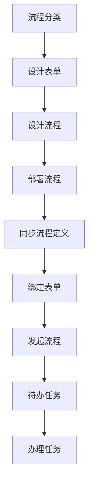

# Hyper Duty 工作流模块

## 功能概述

已完成工作流模块的核心功能开发，包括：

### 后端功能

1. **流程引擎集成**
   - 集成 Flowable 7.0.1 工作流引擎
   - 配置了数据库自动建表和字体支持
   - 提供流程部署、启动、查询、终止等基础功能

2. **流程管理 API**
   - 流程部署和删除
   - 流程定义列表查询（支持分类和表单绑定信息）
   - 流程定义同步
   - 表单绑定到流程
   - 流程实例启动和管理
   - 流程变量管理

3. **任务管理 API**
   - 待办任务列表查询
   - 已办任务列表查询
   - 任务完成、转办、委托
   - 任务认领和取消认领
   - 批量转办任务
   - 历史任务和流程实例查询

4. **表单管理 API**
   - 表单的增删改查
   - 表单配置和内容管理
   - 表单设计器集成（form-create）

5. **流程分类管理 API**
   - 分类的增删改查
   - 分类的启用/禁用

6. **委托管理 API**
   - 委托配置管理
   - 委托配置的启用/禁用

### 前端功能

1. **流程设计器**
   - 集成 bpmn-js 拖拽式流程设计器
   - 支持 BPMN 2.0 标准
   - 提供保存、导入导出、缩放等功能
   - 流程部署功能

2. **流程定义管理**
   - 流程定义列表展示
   - 流程搜索功能
   - 流程定义同步功能
   - 流程表单绑定功能
   - 流程查看（跳转设计器）

3. **流程分类管理**
   - 流程分类列表
   - 分类的增删改查
   - 分类状态管理

4. **表单管理**
   - 表单列表展示
   - 表单的增删改查
   - 表单设计器（form-create）
   - 表单预览功能

5. **流程发起**
   - 流程树状选择（按分类）
   - 表单自动加载
   - 表单数据填写
   - 流程提交发起

6. **任务管理**
   - 待办任务列表
   - 任务办理、转办、委托
   - 已办任务列表
   - 批量转办功能

### 数据库表

新增的工作流相关业务表：
- `wf_category` - 流程分类
- `wf_definition` - 流程定义扩展（含表单和分类绑定）
- `wf_form` - 流程表单
- `wf_instance` - 流程实例扩展
- `wf_delegate` - 委托代理

## 技术栈

### 后端

- Spring Boot 3.1.0
- Flowable 7.0.1
- MyBatis Plus 3.5.6
- PostgreSQL
- Lombok
- Knife4j（API文档）

### 前端

- Vue 3
- Element Plus
- Vue Router
- Pinia
- bpmn-js 17.9.0
- @form-create/element-ui

## 项目结构

### 后端

```
src/main/java/com/lasu/hyperduty/
├── common/config/
│   └── FlowableConfig.java          # Flowable 配置
└── workflow/
    ├── controller/                   # 控制器
    │   ├── WfCategoryController.java # 流程分类
    │   ├── WfProcessController.java  # 流程管理
    │   ├── WfTaskController.java     # 任务管理
    │   ├── WfFormController.java     # 表单管理
    │   └── WfDelegateController.java # 委托管理
    ├── dto/                          # 数据传输对象
    │   ├── WfProcessStartDTO.java
    │   ├── ProcessDefinitionDTO.java
    │   ├── WfTaskCompleteDTO.java
    │   ├── WfTaskReassignDTO.java
    │   ├── WfTaskDelegateDTO.java
    │   ├── WfTaskBatchReassignDTO.java
    │   └── WfDelegateConfigDTO.java
    ├── entity/                       # 实体类
    │   ├── WfCategory.java
    │   ├── WfDefinition.java
    │   ├── WfForm.java
    │   ├── WfInstance.java
    │   └── WfDelegate.java
    ├── mapper/                       # MyBatis Mapper
    │   ├── WfCategoryMapper.java
    │   ├── WfDefinitionMapper.java
    │   ├── WfFormMapper.java
    │   ├── WfInstanceMapper.java
    │   └── WfDelegateMapper.java
    └── service/                      # 服务层
        ├── WfCategoryService.java
        ├── WfProcessService.java
        ├── WfTaskService.java
        ├── WfFormService.java
        ├── WfDelegateService.java
        └── impl/
            ├── WfCategoryServiceImpl.java
            ├── WfProcessServiceImpl.java
            ├── WfTaskServiceImpl.java
            ├── WfFormServiceImpl.java
            └── WfDelegateServiceImpl.java
```

### 前端

```
frontend/src/
├── api/workflow/                    # API 接口
│   ├── category.js                  # 分类 API
│   ├── process.js                   # 流程 API
│   ├── task.js                      # 任务 API
│   ├── form.js                      # 表单 API
│   └── delegate.js                  # 委托 API
├── components/
│   └── BpmnDesigner.vue            # 流程设计器组件
└── views/workflow/                 # 页面
    ├── WorkflowLayout.vue
    ├── ProcessDesigner.vue
    ├── ProcessList.vue
    ├── ProcessStart.vue           # 流程发起
    ├── CategoryList.vue           # 流程分类
    ├── FormList.vue               # 表单管理
    ├── TodoTaskList.vue
    └── DoneTaskList.vue
```

## 安装和部署

### 1. 后端依赖安装

在项目根目录执行：

```bash
mvn clean install
```

### 2. 前端依赖安装

在 frontend 目录执行：

```bash
cd frontend
npm install
```

### 3. 数据库初始化

执行 SQL 脚本创建工作流业务表：

```bash
# 执行 hyper_duty_workflow_ddl.sql
# 执行 hyper_duty_workflow_menu.sql（菜单数据）
```

### 4. 启动应用

**后端：**
```bash
mvn spring-boot:run
```

**前端：**
```bash
cd frontend
npm run dev
```

## 使用指南

### 完整流程使用步骤



**详细步骤：**

| 步骤 | 操作 | 说明 |
|------|------|------|
| 1 | 创建流程分类 | 在"流程分类"页面创建分类 |
| 2 | 设计和创建表单 | 在"表单管理"页面使用设计器创建表单 |
| 3 | 设计流程 | 在"流程设计"页面使用 BPMN 设计器创建流程 |
| 4 | 部署流程 | 点击"部署流程"按钮部署到 Flowable 引擎 |
| 5 | **同步流程定义** | 在"流程定义"页面点击"同步流程"按钮，将流程同步到扩展表 |
| 6 | **绑定表单** | 点击流程的"绑定表单"按钮，选择要关联的表单 |
| 7 | **发起流程** | 在"发起流程"页面选择流程，填写表单，提交发起 |
| 8 | 办理任务 | 在"待办任务"页面处理任务 |

### 流程分类管理

1. 访问流程分类管理页面
2. 新增/编辑/删除流程分类
3. 设置分类的启用/禁用状态

### 表单设计和管理

1. 访问表单管理页面
2. 点击"新增表单"创建新表单
3. 点击"设计表单"打开表单设计器
4. 拖拽组件设计表单
5. 保存表单配置

### 流程设计和部署

1. 访问流程设计器页面
2. 拖拽组件设计流程
3. 输入流程名称
4. 点击"部署流程"按钮

### 流程表单绑定

1. 在流程定义列表找到要绑定表单的流程
2. 点击"绑定表单"按钮
3. 选择要绑定的表单（可选"无"）
4. 提交绑定

### 流程发起

1. 访问流程发起页面
2. 在左侧树状结构中选择流程分类
3. 选择要发起的流程
4. 如果流程绑定了表单，右侧会显示表单
5. 填写表单数据
6. 点击"提交发起"按钮

### 任务办理

1. 查看待办任务列表
2. 点击"办理"按钮
3. 填写审批意见
4. 提交完成任务

### 任务转办

1. 在待办任务列表中找到要转办的任务
2. 点击"转办"按钮
3. 选择接收人并填写原因
4. 提交完成转办

### 批量转办

1. 点击"批量转办"按钮
2. 填写转办原因
3. 提交批量转办

## ⚠️ 踩坑经验（必读）

### 1. ResponseResult.success() 泛型重载陷阱

`com.lasu.hyperduty.common.ResponseResult` 有两个重载：

```java
public static <T> ResponseResult<T> success(String message)   // String → message
public static <T> ResponseResult<T> success(T data)           // 对象 → data
```

**坑点**：当传入 String 类型参数时（如 BPMN XML），Java 编译器会匹配 `success(String message)`，导致 XML 被塞进 `message` 字段、`data` 字段为 null。

**正确做法**：返回 String 类型数据时，显式使用双参重载：

```java
// ❌ 错误：XML 会被当作 message
return ResponseResult.success(bpmnXml);

// ✅ 正确
return ResponseResult.success("success", bpmnXml);
```

### 2. 流程定义"查看"跳转后设计器空白

**症状**：点击流程定义"查看"按钮，URL 跳转到 `/workflow/process-designer?processDefinitionId=xxx`，但设计器是空的或解析报错。

**排查思路**（按优先级）：
1. **MCP 看网络请求**（Chrome DevTools → Network）：
   - 找到 `bpmn-xml` 请求，查看响应内容
   - 检查 `response.body` 是 XML 字符串还是被 `ResponseResult` 包裹的对象
2. **MCP 看控制台**（Console）：
   - "导入BPMN失败 TypeError: Cannot read properties of undefined (reading 'root-0')" → XML 内容为空或格式错误
   - "流程XML为空，使用默认模板" → 后端返回的 `data.data` 是 null

**根因**：后端 `ResponseResult.success(bpmnXml)` 把 XML 放到了 `message` 字段，前端从 `data.data` 拿不到。

### 3. 前端响应拦截器会破坏 XML 内容

`frontend/src/utils/request.js` 的响应拦截器默认会调用 `unescapeHtmlDeep(data.data)`，把 `&amp;` 还原成 `&`。但 BPMN XML 中 `&amp;` 是合法实体，被错误解码后会导致 XML 结构损坏。

**解决方案**：在 API 调用中设置 `rawText: true` 跳过解码：

```javascript
export function getProcessBpmnXml(processDefinitionId) {
  return request({
    url: '/workflow/process/definition/bpmn-xml',
    method: 'get',
    params: { processDefinitionId },
    rawText: true  // 关键：跳过 HTML 实体解码
  })
}
```

### 4. processDefinitionId 含冒号导致路径问题

Flowable 的 processDefinitionId 形如 `leave:1:50004`，包含冒号。在 URL path 中传参时冒号可能被错误解析。

**解决方案**：用 query 参数传，不用 path 参数：

```java
// ❌ path 参数
@GetMapping("/definition/{processDefinitionId}/xml")

// ✅ query 参数
@GetMapping("/definition/bpmn-xml")
public ResponseResult<String> getProcessBpmnXml(@RequestParam String processDefinitionId) {
```

### 5. 流程设计器"查看"时 importXML 并发抛 `Cannot read properties of undefined (reading 'root-0')` 或 `clientWidth`

**症状**：点击流程定义"查看"，设计器可能空白或控制台报 `TypeError: Cannot read properties of undefined (reading 'root-0')` / `Cannot read properties of undefined (reading 'clientWidth')`。

**根因**：[ProcessDesigner.vue](file:///d:/workspace/lasudev/hyper-duty/frontend/src/views/workflow/workflow/ProcessDesigner.vue) 早期用 `v-if="!loading"` 控制 [BpmnDesigner](file:///d:/workspace/lasudev/hyper-duty/frontend/src/components/BpmnDesigner.vue) 的渲染，导致 `loading=true` 时 BpmnDesigner 被卸载，`loading=false` 时再重新挂载。两段时序叠加出问题：
1. **跨实例残留 importXML**：旧实例的 `await modeler.value.importXML(...)` 还在异步进行时，DOM 已卸载，`importXML` 内部访问 `canvas.clientWidth` 抛错。
2. **同实例并发 importXML**：`onMounted` 中的 `importBpmn(props.xml)` 与 props.xml 变化触发的 watch `importBpmn(newXml)` 并发，bpmn-js 内部按 `root-0` 这种 id 索引的缓存被破坏。

**解决方案（两步同时做）**：
- **第一步**：[ProcessDesigner.vue](file:///d:/workspace/lasudev/hyper-duty/frontend/src/views/workflow/ProcessDesigner.vue) 去掉 `v-if="!loading"`，让 BpmnDesigner 始终挂载；loading 时用绝对定位的遮罩层覆盖在画布之上展示"加载中"。
- **第二步**：[BpmnDesigner.vue](file:///d:/workspace/lasudev/hyper-duty/frontend/src/components/BpmnDesigner.vue) 的 `importBpmn` 加**导入锁**，处理同实例并发：

```javascript
let importing = false
let pendingXml = null

const importBpmn = async (xml) => {
  if (!modeler.value) return
  if (importing) {                // 已有导入在进行中：记录最新请求
    pendingXml = xml
    return
  }
  importing = true
  try {
    // ...省略默认模板兜底逻辑
    await modeler.value.importXML(bpmnXml)
    if (modeler.value) {          // 实例未被销毁
      const canvas = modeler.value.get('canvas')
      canvas.zoom('fit-viewport')
    }
  } catch (error) {
    console.error('导入BPMN失败', error)
  } finally {
    importing = false
    if (pendingXml !== null && pendingXml !== xml) {
      const next = pendingXml
      pendingXml = null
      importBpmn(next)            // 处理最新的一次请求
    } else {
      pendingXml = null
    }
  }
}
```

### 6. 环节处理人 / 表单字段在设计器里没生效（响应拦截器 unwrap + moddle 扩展双坑）

**症状**：选中 UserTask 节点后，右侧属性面板的 Assignee / Candidate Users / Candidate Groups 字段能输入也能"保存到 Vue 状态"，但导出 XML 后这些字段没出现；或者用员工/角色弹窗选了人，控制台报 `Cannot read properties of undefined`，最终 `bo.assignee` 仍是空。

**根因**：两个独立但叠加的坑：

1. **axios 响应拦截器已 unwrap**：项目 [request.js](file:///d:/workspace/lasudev/hyper-duty/frontend/src/utils/request.js) 的 `response.use` 中对 `data.code === 200` 的响应会 `return unescapeHtmlDeep(data.data)`——**直接返回 `data.data` 字段**，不再是 axios 的 Response 对象。所以前端 `await request(...)` 拿到的就是业务对象本体。如果封装时再写 `res.data.records`，会变成 `data.data.records`（两层 `.data`），永远 undefined，回退到空数组，弹窗里啥都没有。
   - **症状细节**：员工/角色 API 明明返回 200、Network 面板也能看到 15 条 records，但 `employeeOptions.value` 始终是 `[]`。
2. **bpmn-js 默认 moddle 不认识 camunda 命名空间**：`bo.assignee` / `bo.candidateUsers` / `bo.candidateGroups` / `bo.formKey` 是 Camunda/Flowable 扩展属性。bpmn-js 默认 moddle 不知道这些字段，直接 `modeling.updateProperties(elt, { assignee: 'admin' })` 在某些版本上会抛 `Cannot read properties of undefined (reading 'name')`（Moddle.getType 内部错），或者写入后导出 XML 仍然没有 `camunda:` 前缀。

**解决方案**：

- **第一步：业务数据解析对齐拦截器**。在 [api/system/employee.js](file:///d:/workspace/lasudev/hyper-duty/frontend/src/api/system/employee.js) / [role.js](file:///d:/workspace/lasudev/hyper-duty/frontend/src/api/system/role.js) 里，**不要再 `.data.records`，直接拿 records**：

  ```js
  // ✅ 正确：request(...) 已经是业务对象本体（拦截器已 unwrap）
  const page = await request({ url: '/employee/list', method: 'get', params: { pageNum: 1, pageSize: 1000 } })
  const records = (page && Array.isArray(page.records)) ? page.records : []
  ```

  > 排查时一定要打开 Network 面板对比"后端响应的 body"和"代码里拿到的对象"——很多时候不是后端没给数据，是前端解析的层级搞错。

- **第二步：注册 camunda moddle 扩展**。在 [BpmnDesigner.vue](file:///d:/workspace/lasudev/hyper-duty/frontend/src/components/BpmnDesigner.vue) 初始化 `BpmnModeler` 时引入 `camunda-bpmn-moddle`：

  ```js
  import camundaModdleDescriptor from 'camunda-bpmn-moddle/resources/camunda.json'

  modeler.value = new BpmnModeler({
    container: canvas.value,
    moddleExtensions: { camunda: camundaModdleDescriptor }
  })
  ```

  注册后导出 XML 头部会带 `xmlns:camunda="http://camunda.org/schema/1.0/bpmn"`，Flowable 7 完全兼容；`bo.assignee = 'admin'` 也能在 `modeler.saveXML()` 出来的 XML 里看到 `<bpmn:userTask id="..." camunda:assignee="admin" camunda:candidateUsers="..." camunda:candidateGroups="..." camunda:formKey="..." />`。

- **第三步：mock 数据兜底**。为了在 PostgreSQL 后端连不上的开发环境也能演示，把 [api/system/employee.js](file:///d:/workspace/lasudev/hyper-duty/frontend/src/api/system/employee.js) / [role.js](file:///d:/workspace/lasudev/hyper-duty/frontend/src/api/system/role.js) 里保留一份 MOCK 数据，注意**字段命名要和后端驼峰一致**（`employeeName` / `username` / `employeeCode` / `roleCode` / `roleName`），否则弹窗里只会看到空列。

### 7. BaseTable 翻页事件被吞（跨模块通用坑）

**症状**：流程定义列表、待办任务、已办任务等使用 BaseTable 的页面，点击翻页按钮不请求、URL 不变。
**根因**：`frontend/src/components/BaseTable.vue` 中 `el-pagination` 用 `v-model:current-page` 双向绑定本地 ref 后，`@current-change` 触发时本地 ref 已被 el-pagination 提前更新，导致 `localCurrentPage.value !== current` 恒为 false，事件被吞。
**修复**（`frontend/src/components/BaseTable.vue:554-568`）：把判断条件从 `localCurrentPage.value !== current` 改为 `props.pagination.currentPage !== current`。
**详细说明**：[`docs/业务字典使用手册.md` 踩坑经验 #7](业务字典使用手册.md)

## 环节处理人实现细节（2026-06-10 落地）

> 解决"流程设计器里怎么设置审批人 / 候选人 / 候选组 / 表单 key"的核心需求。

### 功能范围

选中 UserTask 节点 → 右侧属性面板出现「处理人设置」分组：

| 字段 | 含义 | 写入位置 |
|------|------|----------|
| 审批人 (Assignee) | 单个具体人员，节点最终落到此人 | `camunda:assignee` |
| 候选人 (Candidate Users) | 多个人员，认领制 | `camunda:candidateUsers` (逗号分隔) |
| 候选组 (Candidate Groups) | 多个角色，组内认领制 | `camunda:candidateGroups` (逗号分隔) |
| 表单 key (Form Key) | 绑定业务表单 key | `camunda:formKey` |

### 选择方式

- **审批人**：下拉 + 弹窗（`SelectorDialog` 单选）
- **候选人 / 候选组**：下拉 + 弹窗（`SelectorDialog` 多选）
- **表单 key**：下拉，从后端 `/api/workflow/form/list` 拉表单列表

### 三件套

1. **moddle 扩展**（BpmnDesigner 初始化时）
   ```js
   import camundaModdleDescriptor from 'camunda-bpmn-moddle/resources/camunda.json'
   modeler = new BpmnModeler({
     container, moddleExtensions: { camunda: camundaModdleDescriptor }
   })
   ```

2. **属性面板**（右侧 UserTask-properties 面板内的"处理人设置"分组），写入：
   ```js
   modeling.updateProperties(element, {
     'assignee': 'admin',
     'candidateUsers': 'u1,u2',
     'candidateGroups': 'role1,role2',
     'formKey': 'leave_form'
   })
   ```

3. **SelectorDialog 通用弹窗**
   - 支持单选 / 多选
   - 支持"员工"/"角色"两种数据源
   - 详见 `frontend/src/components/SelectorDialog.vue`

### Flowable 7 兼容性

`camunda:` 前缀属性 Flowable 7 完全兼容。导出 XML 头部会自动带：
```xml
xmlns:camunda="http://camunda.org/schema/1.0/bpmn"
```

UserTask 节点示例：
```xml
<bpmn:userTask id="Task_1" name="部门经理审批"
                camunda:assignee="manager01"
                camunda:candidateUsers="u01,u02"
                camunda:candidateGroups="dept_lead"
                camunda:formKey="leave_form" />
```

## 业务字典接入（2026-06-10 落地）

工作流模块涉及的字典详见 [`docs/业务字典使用手册.md` 第 2.3 节](业务字典使用手册.md)：

| 字典 | 用途 | 出现位置 |
|------|------|----------|
| `form_type` | 表单类型 | 表单管理列表 / 表单设计器 |
| `deploy_status` | 流程部署状态 | 流程定义列表 |
| `approval_status` | 审批状态 | 通用审批流-审批状态 |

**实现位置**：
- 后端：`com.lasu.hyperduty.workflow` 模块下相关 Service / Controller
- 前端：`frontend/src/views/workflow/` 下相关 .vue 文件，通过 `useDict('form_type')` 加载

**完整字典体系**（覆盖 20+ 个业务枚举）见 [`docs/业务字典使用手册.md` 第 2.3 节 已注册字典清单](业务字典使用手册.md)。

---

### 流程分类管理

| 接口 | 方法 | 描述 |
|------|------|------|
| /api/workflow/category/page | GET | 分页查询流程分类 |
| /api/workflow/category/list | GET | 获取流程分类列表 |
| /api/workflow/category/{id} | GET | 获取分类详情 |
| /api/workflow/category | POST | 创建分类 |
| /api/workflow/category | PUT | 更新分类 |
| /api/workflow/category/{id} | DELETE | 删除分类 |

### 流程管理

| 接口 | 方法 | 描述 |
|------|------|------|
| /api/workflow/process/deploy | POST | 部署流程 |
| /api/workflow/process/deploy/{deploymentId} | DELETE | 删除部署 |
| /api/workflow/process/definition/page | GET | 分页查询流程定义 |
| /api/workflow/process/definition/list | GET | 获取流程定义列表 |
| /api/workflow/process/definition/sync | POST | 同步流程定义到扩展表 |
| /api/workflow/process/definition/bind-form | POST | 绑定表单到流程 |
| /api/workflow/process/start | POST | 启动流程 |
| /api/workflow/process/instance/{processInstanceId} | GET | 获取流程实例 |
| /api/workflow/process/instance/my/page | GET | 分页查询我发起的流程 |
| /api/workflow/process/instance/cancel/{processInstanceId} | POST | 作废流程 |

### 任务管理

| 接口 | 方法 | 描述 |
|------|------|------|
| /api/workflow/task/todo/page | GET | 分页查询待办任务 |
| /api/workflow/task/done/page | GET | 分页查询已办任务 |
| /api/workflow/task/complete | POST | 完成任务 |
| /api/workflow/task/reassign | POST | 转办任务 |
| /api/workflow/task/delegate | POST | 委托任务 |
| /api/workflow/task/batch-reassign | POST | 批量转办任务 |
| /api/workflow/task/claim/{taskId} | POST | 认领任务 |
| /api/workflow/task/unclaim/{taskId} | POST | 取消认领任务 |

### 表单管理

| 接口 | 方法 | 描述 |
|------|------|------|
| /api/workflow/form/page | GET | 分页查询表单 |
| /api/workflow/form | POST | 创建表单 |
| /api/workflow/form | PUT | 更新表单 |
| /api/workflow/form/{id} | DELETE | 删除表单 |
| /api/workflow/form/{id} | GET | 获取表单详情 |

### 委托管理

| 接口 | 方法 | 描述 |
|------|------|------|
| /api/workflow/delegate/page | GET | 分页查询委托配置 |
| /api/workflow/delegate | POST | 创建委托配置 |
| /api/workflow/delegate/{id} | PUT | 更新委托配置 |
| /api/workflow/delegate/{id} | DELETE | 删除委托配置 |
| /api/workflow/delegate/enable/{id} | POST | 启用委托配置 |
| /api/workflow/delegate/disable/{id} | POST | 禁用委托配置 |

## 已完成功能更新

### 最新更新（2026-06-10）

✅ **业务枚举统一走字典**（参见 [`docs/业务字典使用手册.md`](业务字典使用手册.md)）
✅ **BaseTable 翻页事件被吞 bug 修复**（参见踩坑经验 #7）
✅ **环节处理人完整支持**（Assignee / CandidateUsers / CandidateGroups / FormKey）
✅ **BpmnDesigner 集成 camunda-bpmn-moddle**（Flowable 7 完全兼容）
✅ **SelectorDialog 通用弹窗**（支持单选/多选，员工/角色两种数据源）
✅ **API 解析对齐拦截器**（去掉 `.data.records` 多余层级）

### 历史更新（2026-05-10）

✅ **流程分类管理页面和API**
✅ **表单管理页面和API**
✅ **流程发起页面** - 支持流程树状选择和表单自动加载
✅ **流程定义同步功能** - 同步Flowable流程到扩展表
✅ **流程表单绑定功能** - 在流程定义页面绑定表单
✅ **流程发起功能** - 完整的流程发起流程
✅ **数据库表结构更新** - 统一字段命名
✅ **菜单配置** - 完整的工作流模块菜单

## 待完善功能

1. **流程实例列表管理页面** - 展示所有流程实例
2. **流程跟踪（流程图高亮显示）** - 显示当前流程位置
3. **委托自动转办功能** - 定时扫描并自动转办
4. **多实例、会签、抢占等高级特性的完整支持**
5. **VForm 表单设计器集成** - 可选集成其他表单设计器

## 注意事项

1. Flowable 引擎会自动创建所需的数据库表，表名以 `ACT_` 开头
2. 首次启动时会自动执行数据库初始化
3. 确保数据库连接配置正确
4. 首次安装前端依赖需要较长时间，因为 bpmn-js 包较大
5. **部署流程后必须"同步流程定义"才能在发起页面看到**
6. 流程可以不绑定表单直接发起（表单数据为空）
7. 流程名称可能为 null，系统会自动使用 key 作为默认名称

## 支持的 BPMN 2.0 元素

- 开始事件 (Start Event)
- 结束事件 (End Event)
- 用户任务 (User Task)
- 服务任务 (Service Task)
- 任务网关 (Exclusive Gateway)
- 并行网关 (Parallel Gateway)
- 多实例任务 (Multi-Instance)
- 等等...
