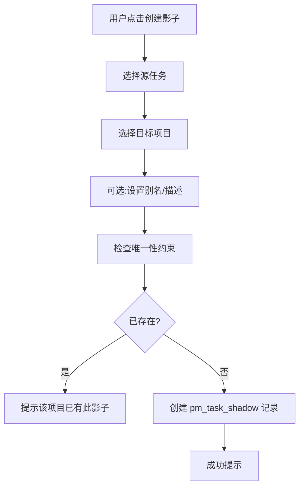
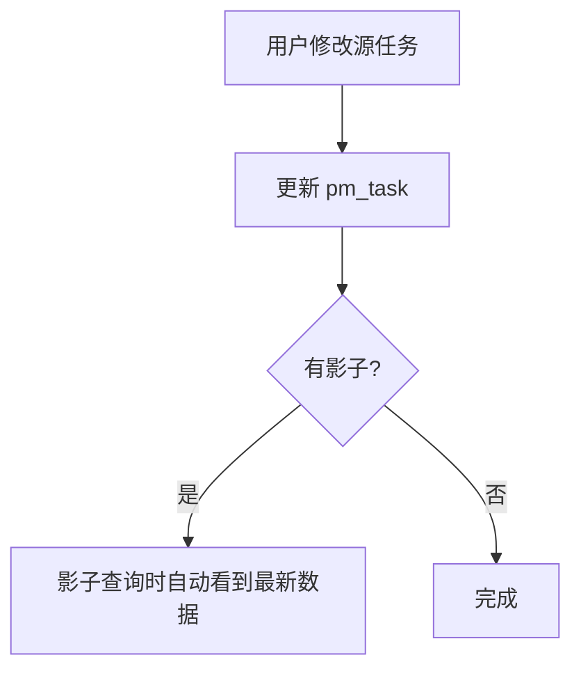
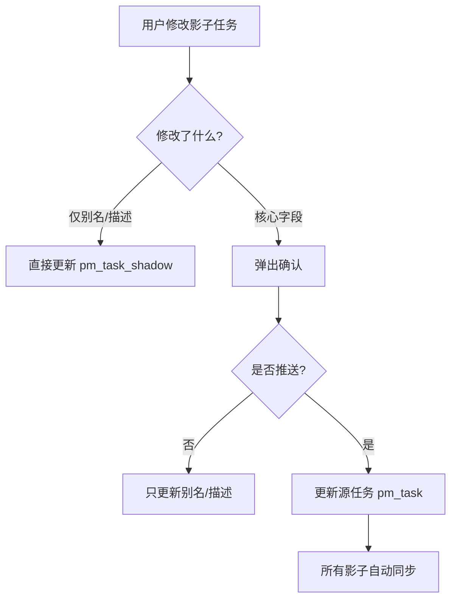
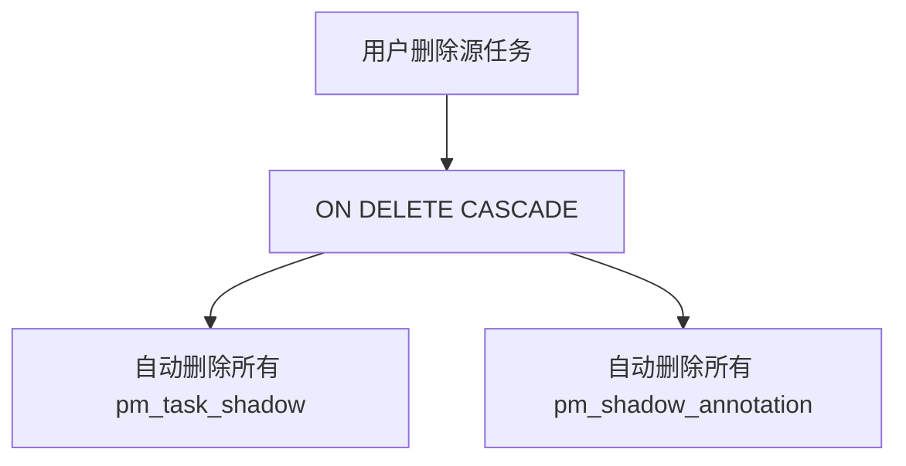
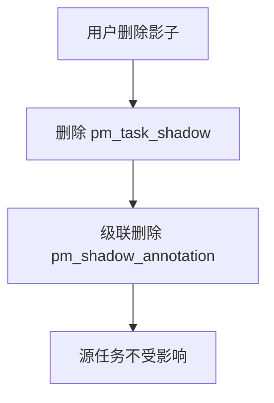

# 影子任务设计文档 v2

**版本**：2.4  
**日期**：2026-05-19  
**设计理念**：影子任务是源任务在项目中的"视图"，实现跨项目跟踪

---

## 更新日志

### v2.5 - 2026-05-21
- **任务排序与分页逻辑修复**：完全重写了任务排序和分页逻辑，确保状态分组连续
- **正确的排序规则**：采用方案A，先按置顶状态分组，再按状态分组，最后按优先级和创建时间排序
  - 第1组：置顶的未开始/进行中任务
  - 第2组：置顶的已完成/已暂停任务
  - 第3组：未置顶的未开始/进行中任务
  - 第4组：未置顶的已完成/已暂停任务
- **扁平列表分页**：改为先构建完整的扁平任务列表（包含父子关系展开），再进行分页，确保状态分组在页码切换时保持连续
- **同步修复真实任务和影子任务**：同时修复了 `PmTaskServiceImpl.java` 和 `PmTaskShadowServiceImpl.java` 中的排序和分页逻辑

### v2.4 - 2026-05-19
- **修复 `last_progress_update_time` 查询逻辑**
  - 之前该字段错误地复用了 `update_time` 的值
  - 现在改为真正从 `pm_task_progress_update` 表查询最新的进展更新时间
  - 对于没有进展更新记录的任务，该字段正确显示为空（NULL）
- **新增双时间列显示**
  - 在任务列表中同时显示"任务更新时间"和"进展更新时间"两个独立列
  - 清晰区分任务编辑（任何修改）和进度更新（仅添加进展记录）
  - 前端格式化显示：空值显示为 `--`

**关键区别：**
- **任务更新时间（`update_time`）**：任务任何属性修改都会更新
- **进展更新时间（`last_progress_update_time`）**：只有在添加任务进展记录时才会更新

### v2.3 - 2026-05-17
- **影子任务支持父子关系**：影子任务现在可以选择父任务
  - 在 `pm_task_shadow` 表新增 `parent_id` 字段（默认 0）
  - 新增 `idx_shadow_parent_id` 索引
  - 在 `ShadowTaskCreateDTO` 和 `ShadowTaskUpdateDTO` 新增 `parentId` 字段
  - 创建和编辑影子任务对话框新增父任务选择器（树形选择）
  - 影子任务分页显示使用和真实任务相同的逻辑（父任务和子任务一起分页）
- **修复分页 total 显示问题**：total 现在显示真实的总任务数，而不是调整后的页数

### v2.2 - 2026-05-17
- **批注创建人显示优化**：批注显示创建人真实姓名而非用户名
  - 新增 `PmShadowAnnotationVO` 类，包含 `createdByName` 字段
  - 查询时关联 `sys_employee` 表获取真实姓名
- **源任务影子列表优化**：影子任务显示创建人真实姓名
  - 在 `PmTaskShadow` 实体添加 `createdByName` 字段
  - 查询源任务影子时关联获取创建人信息
- **源任务详情展示影子批注**：在源任务详情页新增"影子批注"区域
  - 新增 `ShadowAnnotationWithProjectVO` 类，包含影子项目信息
  - 新增 API `/pm/shadow/annotation/source-task/{sourceTaskId}`
  - 所有影子批注集中展示，标注清楚来源项目和影子

### v2.1 - 2026-05-17
- 优化影子任务详情页，完善源任务信息展示
- 在源任务详情页增加影子任务列表展示
- 添加targetProjectName字段到PmTaskShadow实体
- 补充getShadowTaskBySource API接口

### v2.0 - 2026-05-16
- 初始版本，完整的影子任务功能设计

---

## 目录

1. [需求概述](#需求概述)
2. [核心概念](#核心概念)
3. [数据模型设计](#数据模型设计)
4. [API 设计](#api-设计)
5. [核心流程](#核心流程)
6. [UI/UX 设计](#uiux-设计)
7. [实现计划](#实现计划)

---

## 需求概述

### 业务背景

在多项目协作场景中，同一个任务可能在多个项目中出现。用户希望：
- 从不同项目角度跟踪同一个任务
- 任务更新时，所有项目都能看到最新状态
- 每个项目可以有自己的批注和描述

### 核心需求

| 需求项 | 说明 |
|--------|------|
| **跨项目跟踪** | 同一个任务可以在多个项目中以"影子"形式存在 |
| **双向同步** | 源任务更新 → 所有影子同步；影子更新可选择推送到源 |
| **源任务优先** | 源任务修改直接同步到影子；影子修改需要显式推送 |
| **全字段同步** | 任务名称、描述、进度、状态等所有核心字段同步 |
| **视图概念** | 影子是源任务的"窗口"，不是独立任务 |
| **查询与导出** | 影子任务与真实任务一起出现在项目任务列表中 |

---

## 核心概念

### 概念模型

```
源任务 (pm_task) - 唯一真实存储
  ↓ 1:N
影子关联 (pm_task_shadow) - 源任务在项目中的"视图"
  ↓ 1:N
项目特定批注 (pm_shadow_annotation) - 每个项目的独立批注
```

### 关键定义

- **源任务**：真实的 `pm_task` 记录，唯一的数据存储
- **影子任务**：不是真实的 `pm_task`，只是 `pm_task_shadow` 关联记录
- **影子视图**：查询时，影子任务 = 源任务数据 + 影子别名/描述
- **推送**：影子修改同步到源任务的操作
- **同步**：源任务修改自动反映到所有影子（通过查询时 JOIN 实现）

---

## 数据模型设计

### 1. pm_task_shadow（影子任务关联表）

```sql
CREATE TABLE IF NOT EXISTS public.pm_task_shadow (
    id BIGSERIAL PRIMARY KEY,
    source_task_id BIGINT NOT NULL REFERENCES public.pm_task(id) ON DELETE CASCADE,
    project_id BIGINT NOT NULL REFERENCES public.pm_project(id) ON DELETE CASCADE,
    parent_id BIGINT DEFAULT 0,  -- 在本项目中的父任务ID（0表示根任务）
    shadow_alias VARCHAR(500),  -- 在本项目中的别名（可选，不填显示源任务名）
    shadow_description TEXT,    -- 本项目的描述（可选）
    created_by VARCHAR(100),
    created_at TIMESTAMP DEFAULT CURRENT_TIMESTAMP,
    updated_at TIMESTAMP DEFAULT CURRENT_TIMESTAMP,
    
    -- 同一个源任务在同一个项目中只能有一个影子
    CONSTRAINT uk_source_task_project UNIQUE (source_task_id, project_id)
);

CREATE INDEX IF NOT EXISTS idx_shadow_source_task ON public.pm_task_shadow(source_task_id);
CREATE INDEX IF NOT EXISTS idx_shadow_project ON public.pm_task_shadow(project_id);
CREATE INDEX IF NOT EXISTS idx_shadow_parent_id ON public.pm_task_shadow(parent_id);

COMMENT ON TABLE public.pm_task_shadow IS '影子任务关联表 - 影子是源任务在项目中的视图';
COMMENT ON COLUMN public.pm_task_shadow.source_task_id IS '源任务ID';
COMMENT ON COLUMN public.pm_task_shadow.project_id IS '项目ID';
COMMENT ON COLUMN public.pm_task_shadow.parent_id IS '在本项目中的父任务ID（0表示根任务）';
COMMENT ON COLUMN public.pm_task_shadow.shadow_alias IS '在本项目中的别名';
COMMENT ON COLUMN public.pm_task_shadow.shadow_description IS '本项目的描述';
```

### 2. pm_shadow_annotation（影子任务批注表）

```sql
CREATE TABLE IF NOT EXISTS public.pm_shadow_annotation (
    id BIGSERIAL PRIMARY KEY,
    shadow_id BIGINT NOT NULL REFERENCES public.pm_task_shadow(id) ON DELETE CASCADE,
    content TEXT NOT NULL,
    created_by VARCHAR(100),
    created_at TIMESTAMP DEFAULT CURRENT_TIMESTAMP,
    updated_at TIMESTAMP DEFAULT CURRENT_TIMESTAMP
);

CREATE INDEX IF NOT EXISTS idx_annotation_shadow ON public.pm_shadow_annotation(shadow_id);

COMMENT ON TABLE public.pm_shadow_annotation IS '影子任务批注 - 项目特定的批注';
COMMENT ON COLUMN public.pm_shadow_annotation.shadow_id IS '影子任务关联ID';
COMMENT ON COLUMN public.pm_shadow_annotation.content IS '批注内容';
```

### 3. ER 图

```
pm_project (项目表)
    ↑
    │ 1
    │
    │ N
pm_task_shadow (影子关联) ── N:1 ──> pm_task (源任务)
    ↑
    │ 1
    │
    │ N
pm_shadow_annotation (批注)
```

---

## API 设计

### 1. 影子任务管理

#### 创建影子任务

```
POST /api/pm/shadow-tasks
Content-Type: application/json

{
  "source_task_id": 100,
  "project_id": 10,
  "parent_id": 0,  -- 父任务ID（可选，0表示根任务）
  "shadow_alias": "我的别名（可选）",
  "shadow_description": "本项目描述（可选）"
}

Response:
{
  "code": 200,
  "message": "创建成功",
  "data": {
    "id": 5,
    "source_task_id": 100,
    "project_id": 10,
    ...
  }
}
```

#### 获取项目的所有任务（含真实和影子）

```
GET /api/pm/projects/{projectId}/tasks-with-shadows?pageNum=1&pageSize=20

Response:
{
  "code": 200,
  "data": {
    "records": [
      {
        // 真实任务
        "task_id": 1,
        "task_name": "真实任务1",
        "description": "...",
        "status": 2,
        "progress": 50,
        "project_id": 10,
        "is_shadow": false,
        "shadow_id": null,
        "source_task_id": null,
        "shadow_alias": null,
        "created_at": "2026-05-01T10:00:00"
      },
      {
        // 影子任务
        "task_id": 100,  // 源任务的 ID
        "task_name": "我的影子别名",  // 优先显示别名
        "description": "我的描述",  // 优先显示影子描述
        "status": 2,
        "progress": 50,
        "project_id": 10,
        "is_shadow": true,
        "shadow_id": 5,  // pm_task_shadow 的 ID
        "source_task_id": 100,
        "shadow_alias": "我的影子别名",
        "created_at": "2026-05-02T14:00:00"
      }
    ],
    "total": 2,
    "pageNum": 1,
    "pageSize": 20
  }
}
```

**关键 SQL**：
```sql
-- 查询项目的真实任务 + 影子任务，合并返回
SELECT 
    t.id AS task_id,
    t.task_name,
    t.description,
    t.status,
    t.progress,
    t.project_id,
    false AS is_shadow,
    NULL AS shadow_id,
    NULL AS source_task_id,
    NULL AS shadow_alias,
    t.created_at AS order_time
FROM public.pm_task t
WHERE t.project_id = :projectId

UNION ALL

SELECT 
    t.id AS task_id,
    COALESCE(s.shadow_alias, t.task_name) AS task_name,
    COALESCE(s.shadow_description, t.description) AS description,
    t.status,
    t.progress,
    s.project_id,
    true AS is_shadow,
    s.id AS shadow_id,
    t.id AS source_task_id,
    s.shadow_alias,
    s.created_at AS order_time
FROM public.pm_task_shadow s
JOIN public.pm_task t ON s.source_task_id = t.id
WHERE s.project_id = :projectId

ORDER BY order_time DESC;
```

#### 获取影子任务详情

```
GET /api/pm/shadow-tasks/{shadowId}

Response:
{
  "code": 200,
  "data": {
    "shadow_id": 5,
    "source_task_id": 100,
    "project_id": 10,
    
    // 源任务数据
    "task_name": "源任务名称",
    "description": "源任务描述",
    "status": 2,
    "progress": 50,
    "owner": "...",
    "start_date": "...",
    "end_date": "...",
    
    // 影子特定数据
    "shadow_alias": "我的别名",
    "shadow_description": "我的描述",
    "is_shadow": true,
    "source_project_name": "源项目名称",
    
    // 批注列表
    "annotations": [
      {
        "id": 1,
        "content": "批注内容",
        "created_by": "张三",
        "created_at": "2026-05-03T10:00:00"
      }
    ]
  }
}
```

#### 更新影子任务（推送或不推送）

```
PUT /api/pm/shadow-tasks/{shadowId}
Content-Type: application/json

{
  "parent_id": 0,  -- 父任务ID（可选）
  "shadow_alias": "新别名",
  "shadow_description": "新描述",
  
  // 核心字段修改（需要推送）
  "task_name": "新任务名",
  "description": "新描述",
  "status": 3,
  "progress": 60,
  
  "push_to_source": true  // 是否推送到源任务
}

Response:
{
  "code": 200,
  "message": "更新成功"
}
```

**逻辑**：
- 如果 `push_to_source = false`，只更新 `shadow_alias` 和 `shadow_description`
- 如果 `push_to_source = true`，更新源任务的核心字段 → 所有影子自动同步

#### 删除影子任务

```
DELETE /api/pm/shadow-tasks/{shadowId}

Response:
{
  "code": 200,
  "message": "删除成功"
}
```

#### 获取源任务的所有影子

```
GET /api/pm/tasks/{taskId}/shadows

Response:
{
  "code": 200,
  "data": [
    {
      "shadow_id": 5,
      "project_id": 10,
      "project_name": "项目A",
      "shadow_alias": "别名",
      "annotation_count": 3,
      "created_at": "2026-05-02T14:00:00"
    }
  ]
}
```

### 2. 批注管理

#### 添加批注

```
POST /api/pm/shadow-tasks/{shadowId}/annotations
Content-Type: application/json

{
  "content": "批注内容"
}

Response:
{
  "code": 200,
  "data": {
    "id": 1,
    "content": "批注内容",
    "created_by": "张三",
    "created_at": "2026-05-03T10:00:00"
  }
}
```

#### 获取批注列表

```
GET /api/pm/shadow-tasks/{shadowId}/annotations

Response:
{
  "code": 200,
  "data": [...]
}
```

#### 删除批注

```
DELETE /api/pm/shadow-tasks/annotations/{annotationId}

Response:
{
  "code": 200,
  "message": "删除成功"
}
```

#### 获取源任务的所有影子批注

```
GET /api/pm/shadow/annotation/source-task/{sourceTaskId}

Response:
{
  "code": 200,
  "data": [
    {
      "id": 1,
      "shadowId": 5,
      "shadowAlias": "影子别名",
      "targetProjectName": "目标项目A",
      "content": "批注内容",
      "createdBy": "wangguohao",
      "createdByName": "王国豪",
      "createdAt": "2026-05-17T10:00:00",
      "updatedAt": "2026-05-17T10:00:00"
    },
    {
      "id": 2,
      "shadowId": 6,
      "shadowAlias": null,
      "targetProjectName": "目标项目B",
      "content": "另一个批注",
      "createdBy": "zhangshan",
      "createdByName": "张珊",
      "createdAt": "2026-05-17T11:00:00",
      "updatedAt": "2026-05-17T11:00:00"
    }
  ]
}
```

---

## 核心流程

### 1. 创建影子任务



### 2. 修改源任务 → 自动同步



**关键点**：不需要同步影子表！因为影子查询时是 JOIN 源任务的。

### 3. 修改影子任务 → 推送到源



### 4. 删除源任务



### 5. 删除影子任务



---

## UI/UX 设计

### 1. 任务列表中的影子标识

**ShadowTaskBadge 组件**：

- **源任务**：显示 `[有 N 个影子]`，点击查看所有影子
- **影子任务**：显示 `[影子 · 来自项目 X]`，点击查看源任务

### 2. 影子任务详情页

```
┌─────────────────────────────────────────┐
│  📋 [影子标识] 任务名称（可编辑别名）   │
│  来自：源任务项目 | [查看源任务]         │
├─────────────────────────────────────────┤
│  进度：[████████░░] 50%  [编辑]         │
│  状态：进行中              [编辑]         │
│  ... 其他源任务字段 ...                 │
├─────────────────────────────────────────┤
│  本项目描述：                            │
│  [可编辑的本项目特定描述]                │
├─────────────────────────────────────────┤
│  💬 批注                                │
│  [添加批注]                             │
│  • 批注 1                               │
│  • 批注 2                               │
└─────────────────────────────────────────┘
```

**关键交互**：
- 编辑核心字段（进度、状态）时，弹出确认框："是否推送到源任务和其他影子？"
- 编辑别名和本项目描述时，直接保存

### 3. 创建影子任务对话框

```
┌─────────────────────────────────────────┐
│  创建影子任务                            │
├─────────────────────────────────────────┤
│  源任务：[选择任务 ▼]                    │
│  目标项目：[选择项目 ▼] （支持多选）    │
│  父任务：[树形选择器 ▼] （可选）        │
│  别名：[输入框] （可选）                 │
│  本项目描述：[文本域] （可选）           │
├─────────────────────────────────────────┤
│              [取消]  [创建]              │
└─────────────────────────────────────────┘
```

### 4. 编辑影子任务对话框

```
┌─────────────────────────────────────────┐
│  编辑影子任务                            │
├─────────────────────────────────────────┤
│  父任务：[树形选择器 ▼] （可选）        │
│  别名：[输入框] （可选）                 │
│  本项目描述：[文本域] （可选）           │
├─────────────────────────────────────────┤
│              [取消]  [保存]              │
└─────────────────────────────────────────┘
```

### 5. 源任务的影子列表

在源任务详情页添加"影子任务"区域：

```
┌─────────────────────────────────────────┐
│  影子任务 [3 个项目]                     │
├─────────────────────────────────────────┤
│  [影子标识] 项目 A - 别名 [查看]         │
│    创建人：王国豪 | 2026-05-17           │
│  [影子标识] 项目 B [查看]                │
│    创建人：张珊 | 2026-05-16             │
│  [影子标识] 项目 C - 别名 [查看]         │
│    创建人：李明 | 2026-05-15             │
└─────────────────────────────────────────┘
```

### 6. 源任务的影子批注

在源任务详情页添加"影子批注"区域，集中展示所有影子的批注：

```
┌─────────────────────────────────────────┐
│  影子批注 [5 条]                         │
├─────────────────────────────────────────┤
│  [项目A · 影子别名]                      │
│  💬 王国豪 · 2026-05-17 10:00           │
│     批注内容1...                         │
│                                         │
│  [项目B]                                │
│  💬 张珊 · 2026-05-17 11:00             │
│     批注内容2...                         │
│                                         │
│  [项目C · 别名]                          │
│  💬 李明 · 2026-05-16 09:00             │
│     批注内容3...                         │
└─────────────────────────────────────────┘
```

---

## 实现计划

### 阶段 1：数据模型迁移

1. 创建新的 DDL 脚本（基于新设计）
2. 备份现有数据（如果需要）
3. 执行 DDL

### 阶段 2：后端实现

1. 创建实体类：`PmTaskShadow.java`, `PmShadowAnnotation.java`
2. 创建 DTO 类
3. 创建 Mapper 和 XML
4. 创建 Service 层
5. 创建 Controller 层
6. 实现关键查询（项目任务 + 影子合并）

### 阶段 3：前端实现

1. 更新 `shadowTask.js` API
2. 重构 `CreateShadowTaskDialog.vue`（简化流程）
3. 重构 `ShadowTaskDetailDialog.vue`（支持推送）
4. 更新 `TaskList.vue`（查询包含影子）
5. 更新 `TaskDetail.vue`（影子列表标签页）

### 阶段 4：测试

1. 单元测试
2. 集成测试
3. 用户验收测试

---

## 与 v1 的区别

| 项 | v1（旧设计） | v2（新设计） |
|----|-------------|-------------|
| 影子身份 | 独立任务 | 源任务的视图 |
| 数据存储 | 影子有独立 task_id | 影子只是关联记录 |
| 查询方式 | 分开查询 | UNION ALL 合并查询 |
| 同步机制 | 需要显式同步 | 查询时自动 JOIN |
| 删除处理 | 复杂 | ON DELETE CASCADE |
| 概念清晰度 | 模糊 | 清晰 |

---

## 注意事项

1. **性能考虑**：UNION ALL 查询需要优化索引
2. **数据迁移**：如果有 v1 的数据，需要写迁移脚本
3. **向下兼容**：确保现有功能不受影响
4. **用户教育**：新的"推送"概念需要用户理解

