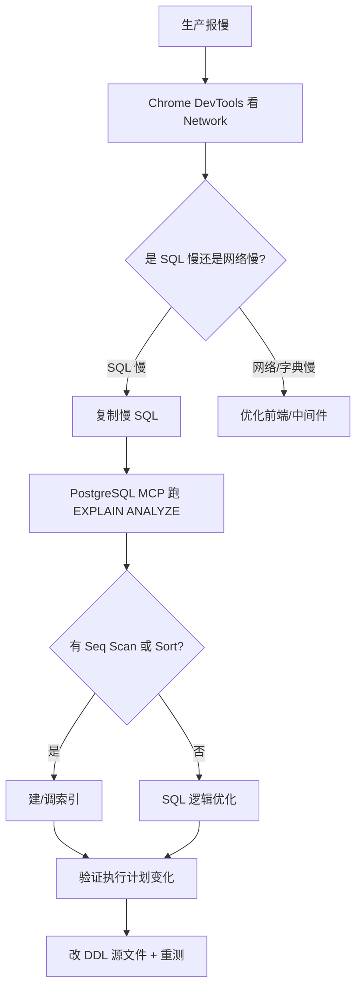

# 项目管理中心实现文档

## 📝 最近更新

### 2026-06-22 - pm_task 任务列表生产性能优化（4.10s → 100ms 内）

**背景**：生产环境"任务管理"菜单加载 4.10 秒，浏览器开发者工具看到 5 个 `score/index` 字典请求 127~991ms + 1 个 `pm/tasks/page?pageNum=1&pageSize=10&projectId=34` 4.10s。本地（数据 52 条）3ms 正常。

**根因分析**（用 PostgreSQL MCP + Chrome DevTools MCP 交叉验证）：
1. **主查询 `selectRootTaskPage` 索引失效**：
   - WHERE：`project_id = ? AND (parent_id IS NULL OR parent_id = 0)`
   - ORDER BY：`is_pinned DESC, CASE WHEN status IN (1,2) THEN 0 ... priority ASC, create_time DESC`
   - 现有 `idx_pm_task_project_id` 只覆盖 WHERE，无法覆盖 ORDER BY
   - PostgreSQL 只能 **Seq Scan + Sort**，几万条任务时 Sort 节点爆
2. **5 个字典请求** `score/index` 串行/并行加载，每次 200-1000ms（疑似 Redis 未启用 / 网络延迟），导致主查询前的"骨架期"延长
3. **LATERAL 子查询** `MAX(create_time) FROM pm_task_progress_update WHERE task_id = t.id` 虽然走 `idx_pm_task_progress_update_task_id`，但叠加在 Seq Scan 上放大耗时

**修复内容**：
1. **新增复合索引 `idx_pm_task_root_list`**（DDL 升级到 v3.1）：
   ```sql
   CREATE INDEX CONCURRENTLY IF NOT EXISTS idx_pm_task_root_list
       ON public.pm_task(project_id, is_pinned DESC, priority ASC, create_time DESC)
       WHERE parent_id IS NULL OR parent_id = 0;
   ```
   - 部分索引（`WHERE` 限定根任务）— 索引体积小、命中率高
   - `CONCURRENTLY` 不锁表、在线建索引
   - 排序键前 3 列与 ORDER BY 强匹配（`is_pinned` 第一、`priority` 第二、`create_time` 第三）
2. **新增复合索引 `idx_pm_task_parent_project`**：子树拉取 `selectSubTasksByRootIds` 加速
3. **SQL 源文件同步**：[hyper_duty_pm_ddl.sql](file:///d:/workspace/lasudev/hyper-duty/src/main/resources/sql/hyper_duty_pm_ddl.sql) 末尾 v3.1 块 — 幂等可重跑

**待优化（用户决定延后）**：
- ⚠️ 字典批量接口：`POST /dict/data/batch` 一次拿多个 dictType（5 次 → 1 次）
- ⚠️ 字典 Redis 缓存：Spring `@Cacheable(value="dict", key="#type")`，TTL 10 分钟
- ⚠️ 表格骨架屏：避免"一开始没数据"的空白感

**踩坑经验（已收录到 `hyper-duty-navigator` 技能 通用规范）**：
- **踩坑 #11**：生产环境 SQL 慢，先用 `EXPLAIN ANALYZE` 看执行计划；本地 3ms ≠ 生产 3ms，差距主要来自**数据量级 + 索引选择性**
- **踩坑 #12**：复杂 ORDER BY（多个排序键 + CASE 表达式）通常**无法走索引**，必须建复合索引让前 N 列匹配；C 表达式（`CASE WHEN`）不能进索引，但可以拆成 `numeric` 计算列
- **踩坑 #13**：`CREATE INDEX` 在生产会锁表，必须用 `CREATE INDEX CONCURRENTLY`（不能放在事务块中）

**性能优化方法论**（参见 8.6 节）：
- 用 Chrome DevTools MCP 看 Network 时序，定位到底是"网络慢"还是"SQL 慢"
- 用 PostgreSQL MCP 的 `EXPLAIN ANALYZE` 跑原 SQL，看实际执行计划（不是预估）
- 关注 `Seq Scan on pm_task` 节点（出现 = 没走索引）+ `Sort` 节点（出现 = 没走索引排序）

### 2026-06-21 - "根不可切断"分页重写 & 我的任务空页修复

**背景**：用户反馈"任务管理"和"我的任务"两个菜单列表加载慢，且"我的任务"第二页为空。

**根因分析（用 MCP 验证）**：
1. **后端**：原 `pageMyTasks` 用 SQL `LIMIT/OFFSET` 直接对根任务切片，可能把根任务切到第 N 页、子任务留在第 N-1 页，导致父子跨页。同时 total 只统计根任务数（与前端"我的任务"列表行数对不上）。
2. **前端**：`MyTask.vue` 没传 `:backend-pagination="true"`，BaseTable 默认走客户端分页 `tableData.slice(10, 20)` = `[]`（后端返回的 1 条被切到第二页的 10-20 范围之外），所以显示"暂无数据"。

**修复内容**：
1. **后端"根不可切断"分页算法**（`PmTaskServiceImpl.pageMyTasks` + `PmTaskShadowServiceImpl.pageTaskListWithShadows`）：
   - 一次查所有"我的根任务" + 一次查所有"我的子任务"
   - 按 `parentId` 统计每个根的子数，得到 `rc[i] = 1 + 子数`
   - **算法**：累加每个根的 `rc`，超 `pageSize` 就开新页；如果某根 `rc > pageSize`，则单独占 1 页
   - **核心保证**：每个根任务整体（自身 + 所有子任务）一定在同一页，不会被切断
2. **后端 total 修正**：`page.setTotal(totalRows)`（= 所有根+子总行数，与顶部 stats 卡片"总任务数"一致）
3. **前端 BaseTable 修复**：`MyTask.vue` 加 `:backend-pagination="true"`，与 `TaskList.vue` 对齐
4. **API 验证**（用 Chrome DevTools MCP）：
   - `GET /api/pm/task/my/10/page?pageNum=2&pageSize=10` 返回 `total=20, records=[{id:24, taskName:"1"}]`（1 条）
   - 修复后页面正确显示第 2 页 1 条数据

**技术实现**：
- 后端：
  - 修改 `PmTaskMapper.java`：新增 `selectAllMyRootTasks` 和 `selectAllMySubTasks` 两个 SQL 方法，用 `<script>` 动态拼接 + `LATERAL` 子查询拿 `last_progress_update_time`
  - 修改 `PmTaskServiceImpl.pageMyTasks`：完全重写为内存分页（参见 8.5 节"根不可切断"分页算法）
  - 修改 `PmTaskShadowServiceImpl.pageTaskListWithShadows`：同步采用同样算法（真实任务 + 影子任务）
  - 修改 `PmTaskShadowMapper.xml`：新增 `selectAllRootTasksWithShadows` 和 `selectAllSubTasksWithShadows`（UNION ALL 合并真实任务和影子任务）
- 前端：
  - 修改 `MyTask.vue`：BaseTable 加 `:backend-pagination="true"`（必须！否则客户端分页会切空后端返回的小数据）

**踩坑经验（同时收录到 `hyper-duty-navigator` 技能）**：
- **踩坑 #9**：BaseTable 默认 `backendPagination=false` 会做客户端分页。当后端已经分页时，必须传 `:backend-pagination="true"`，否则小数据会被切没。
- **踩坑 #10**：后端分页 total 必须 = 实际行数（= 根+子的总行数），不能 = `totalPages × pageSize`，否则前端 el-pagination 显示的"共 N 条"与顶部 stats 卡片对不上。

**SQL 脚本合并**（调试时手动 ALTER 合规化）：
- `hyper_duty_pm_ddl.sql` 升级到 **v3 (2026-06-21)**，一个文件包含全部：
  - `pm_task` 表新增 3 个字段：`attachments text`、`stakeholders text`、`is_focus smallint DEFAULT 0`
  - 表内 CREATE 块补全字段定义 + COMMENT 注释
  - 末尾新增 v3 字段升级块（`DO $$` + `IF NOT EXISTS` 幂等可重跑）
  - **所有索引（13 个）已合到 DDL 末尾**：使用 `CREATE INDEX CONCURRENTLY IF NOT EXISTS` 不锁表
    - pm_task 业务索引：project_id、assignee_id、status、parent_id、priority
    - pm_task 联合索引：assignee_status、project_status
    - pm_task 排序索引：is_pinned、create_time
    - pm_task_shadow：project_id、source_task_id
    - pm_task_progress_update：task_id+create_time
    - pm_shadow_annotation：shadow_id
- **删除** `hyper_duty_pm_idx_ddl.sql`（独立 idx 文件违反"一个模块一个 DDL 文件"规范，见 `project_rules.md` 第 145-153 行）
- **一致性保证**：通过 PostgreSQL MCP 比对数据库实际 schema/索引 与 DDL 脚本，确认无遗漏

**解决的问题**：
- 任务管理/我的任务列表加载慢（SQL 加索引 + 内存分页只查一次）
- 父子任务跨页问题
- 我的任务第二页为空问题
- 顶部 stats 与 el-pagination total 对不上问题
- 调试时手动加的字段/索引没合到 SQL 脚本，下次部署会丢结构

### 2026-06-03 - 甘特图 Bug 修复与优化

**修复内容：**

1. **折叠/展开功能失效**：将折叠状态从 computed 对象属性迁移到独立的 `collapsedTaskIds` ref（`Set<number>`），通过创建新 Set 实例触发 Vue 响应式更新，彻底解决 computed 重新计算时状态被重置的问题。

2. **工具栏布局问题**：时间选择器添加固定宽度（`style="width: 110px"`），日/周/月按钮组添加 `flex-wrap: nowrap` 防止换行堆叠。

3. **时间条位置计算错误**：重写 `getBarStyle` 函数，日视图使用 `dateList.indexOf()` 精确匹配，周/月视图先将日期归一化到周期起始再匹配。新增 `normalizeDateStr` 函数处理日期格式兼容。边界夹紧逻辑：任务日期部分超出可视范围时截断到首/尾边界。

4. **行高不对齐**：统一表头行和表体行高度为 `41px`，添加 `box-sizing: border-box`。左右两侧使用相同的 `visibleFlatList` 数据源保证行数一致。

5. **表头固定与滚动同步**：将滚动区域从 `.gantt-scroll-col` 移至 `.gantt-body`，表头自然固定。`handleScroll` 同步左侧竖向滚动和右侧表头横向滚动。容器设置 `height: calc(100vh - 260px)` 使内部滚动条生效。

6. **时间范围过滤任务**：新增 `isTaskInRange`（日期交集判断）和 `pruneTree`（递归裁剪）函数。`flatTaskList` 和 `visibleFlatList` 基于裁剪后的树构建，自动隐藏不在当前时间范围内的任务，但保留有子任务在范围内的父任务。

**技术实现：**
- `collapsedTaskIds`：`ref(new Set())` 独立管理折叠状态
- `pruneTree`：递归过滤，`isTaskInRange(node) || node.children.length > 0` 的保留逻辑
- `normalizeDateStr`：`d.substring(0, 10)` 截取日期部分兼容多种格式
- `handleScroll`：同时调用 `scrollTop` 和 `scrollLeft` 双向同步

### 2026-06-02 - 甘特图功能大升级

**修改内容：**
1. **时间过滤功能**：支持预设时间范围（本周/本月/本季度/本年）和自定义日期范围
2. **视图切换**：支持日视图、周视图、月视图三种时间粒度
3. **树形结构展示**：左侧任务列表使用树状结构，带缩进竖线和折叠/展开按钮
4. **移除高度限制**：甘特图不再限制最大高度，根据任务数量自动撑开
5. **展开/折叠全部**：提供一键展开或折叠所有任务的按钮
6. **置顶标识**：在任务名称前显示 📌 标识置顶任务
7. **优化任务条计算**：支持在不同视图模式下正确计算任务条位置

**技术实现：**
- 前端：
  - 重构 `ProjectGantt.vue`：
    - 新增工具栏区域，包含时间范围选择、视图切换、展开/折叠按钮
    - 实现 `buildTaskTree` 函数构建任务树结构
    - 实现 `flatTaskList` 计算属性将树展平为渲染列表
    - 实现 `calculateTimeRange` 函数计算时间范围
    - 实现 `dateList` 计算属性根据视图模式生成时间轴
    - 添加树形竖线 CSS 样式，使用 `::before` 和 `::after` 伪元素
    - 实现 `toggleCollapse`、`expandAll`、`collapseAll` 折叠功能函数
    - 实现 `getBarStyle` 函数支持不同视图模式的任务条计算
    - 移除 `.gantt-wrapper` 的 `max-height` 限制

**功能亮点：**
- 时间范围灵活切换，快速查看不同周期的任务进度
- 树形结构清晰展示父子任务层级关系
- 竖线连接让层级一目了然
- 无高度限制，所有任务完整显示
- 不同视图模式满足不同查看需求

### 2026-06-02 - 工作量查询性能优化

**修改内容：**
1. **前端优化**：移除不必要的预加载，并行加载项目列表和员工列表
2. **后端优化**：重构查询逻辑，使用 SQL JOIN 一次性获取数据
3. **修复 N+1 查询**：批量查询关联表数据，大幅减少数据库访问
4. **SQL 类型问题修复**：确保 CASE 语句返回类型一致

**技术实现：**
- 前端：
  - 修改 `WorkloadQuery.vue`：
    - 移除 `preloadBindColumns` 预加载调用
    - 改为 `Promise.all` 并行加载项目列表和员工列表
- 后端：
  - 修改 `PmTaskMapper.java`：
    - 新增 `selectWorkloadPage` 方法，使用 SQL JOIN 一次性查询任务、项目、员工、绑定行数据
    - 新增 `countWorkload` 方法，使用 `CASE WHEN` 并转换为 TEXT 类型避免类型不匹配
  - 修改 `PmTaskServiceImpl.java`：
    - 重构 `getWorkloadPage` 方法，使用新的 Mapper 查询
    - 批量收集 `tableId` 和 `rowId`，使用 `selectBatchIds` 批量查询
    - 新增 `buildWorkloadDTOFromMap` 方法，从查询结果构建 DTO

**性能提升：**
- 页面初始加载速度提升：从串行预加载改为并行加载
- 查询响应时间显著减少：从多次数据库查询改为少量批量查询
- 修复了打开页面很久才执行查询的问题

**解决的问题：**
- 工作量查询点进来很久才执行查询的问题
- 后端 N+1 查询问题导致查询缓慢的问题
- SQL 查询中的类型不匹配错误

### 2026-05-21 - 任务排序与分页逻辑修复（方案A）

**修改内容：**
1. **找到真正的问题所在**：之前错误地修改了 `PmTaskServiceImpl.java`，但前端实际调用的是 `PmTaskShadowServiceImpl.java` 的 `/pm/shadow/page` 接口
2. **完全重写排序逻辑**：采用方案A，先分组再合并，确保状态分组连续
   - 第1组：置顶的未开始/进行中任务
   - 第2组：置顶的已完成/已暂停任务
   - 第3组：未置顶的未开始/进行中任务
   - 第4组：未置顶的已完成/已暂停任务
3. **改为扁平列表分页**：先构建完整的扁平任务列表（包含父子关系展开），再进行分页，确保页码切换时状态分组保持连续
4. **同步修复两个文件**：同时修复了 `PmTaskServiceImpl.java` 和 `PmTaskShadowServiceImpl.java` 中的排序和分页逻辑

**技术实现：**
- 后端：
  - 修改 `PmTaskShadowServiceImpl.java`：
    - 新增 `getStatusOrder` 方法，统一状态排序值
    - 完全重写 `pageTaskListWithShadows` 方法：
      - 先获取并排序根任务，采用分组再合并的方式
      - 构建完整的扁平任务列表（按树形结构展开）
      - 直接使用 subList 进行分页，确保状态分组连续
  - 修改 `PmTaskServiceImpl.java`：
    - 同步修复同样的排序和分页逻辑
    - 确保真实任务和影子任务使用一致的算法
- 前端：无修改，功能变更在后端完成

**解决的问题：**
- 第一页出现已完成任务，第二页又出现未开始/进行中任务的问题
- 置顶和未置顶任务排序混乱的问题
- 分页导致状态分组不连续的问题

**排序规则详细说明：**
```
排序优先级（从高到低）：
1. 置顶状态（置顶 > 未置顶）
2. 状态分组（未开始/进行中 > 已完成 > 已暂停）
3. 优先级（数字越小优先级越高）
4. 创建时间（越早越靠前）

分组顺序：
┌─────────────────────────────────┐
│ 第1组：置顶的未开始/进行中     │
├─────────────────────────────────┤
│ 第2组：置顶的已完成/已暂停     │
├─────────────────────────────────┤
│ 第3组：未置顶的未开始/进行中   │
├─────────────────────────────────┤
│ 第4组：未置顶的已完成/已暂停   │
└─────────────────────────────────┘

每组内部：按优先级升序，再按创建时间升序排序
```

### 2026-05-19 - 任务时间字段修复与双时间列显示

**修改内容：**
1. **修复 `last_progress_update_time` 查询逻辑**：之前该字段错误地复用了 `update_time` 的值，现在改为真正从 `pm_task_progress_update` 表查询最新的进展更新时间
2. **新增双时间列显示**：在任务列表中同时显示"任务更新时间"（`update_time`）和"进展更新时间"（`last_progress_update_time`）两个时间字段，清晰区分任务编辑和进度更新
3. **空值处理优化**：对于没有进展更新记录的任务，`last_progress_update_time` 正确显示为空，前端格式化后显示为 `--`

**技术实现：**
- 后端：
  - 修改 `PmTaskShadowMapper.xml`：
    - 修复真实任务查询中的 `last_progress_update_time`，从简单赋值改为子查询 `(SELECT MAX(create_time) FROM pm_task_progress_update WHERE task_id = t.id)`
    - 修复影子任务查询中的 `last_progress_update_time`，从简单赋值改为子查询 `(SELECT MAX(create_time) FROM pm_task_progress_update WHERE task_id = s.source_task_id)`
    - 修复影子任务详情查询中的同样问题
- 前端：
  - 修改 `TaskList.vue`：
    - 新增 `updateTime` 列的模板渲染
    - 更新列定义数组，将原来的单个"更新时间"列拆分为"任务更新时间"和"进展更新时间"两个独立列
    - 分别绑定 `updateTime` 和 `lastProgressUpdateTime` 字段

**解决的问题：**
- 之前所有任务的"进展更新时间"都显示为和"任务更新时间"一样的值，无法区分任务编辑和进度更新
- 没有进展更新记录的任务也错误地显示了一个时间值
- 用户无法清晰识别任务最后一次的进度更新时间

**任务列表展示效果：**
```
┌──────────────────┬────────────────────────┬─────────────────────────┐
│    任务名称       │      任务更新时间       │      进展更新时间       │
├──────────────────┼────────────────────────┼─────────────────────────┤
│ 重点任务统一测试 │ 2026-04-19 17:24:19    │          --            │
│ 架构治理任务     │ 2026-05-17 09:00:00    │ 2026-05-17 08:30:00    │
└──────────────────┴────────────────────────┴─────────────────────────┘
```

**关键区别说明：**
- **任务更新时间（`update_time`）**：任务任何属性修改都会更新，包括编辑任务信息、更新进度、置顶操作等
- **进展更新时间（`last_progress_update_time`）**：只有在添加任务进展记录时才会更新，反映任务的实际进度更新

### 2026-05-17 - 影子任务支持父子关系与分页优化

**修改内容：**
1. **影子任务支持父子关系**：影子任务现在可以选择父任务，和真实任务一样支持父子关系的层级展示
2. **分页逻辑完善**：影子任务的分页逻辑现在和真实任务完全一致，父任务和子任务一起分页
3. **total显示修复**：分页的total现在显示真实的总任务数，而不是调整后的页数

**技术实现：**
- 数据库：
  - 在 `pm_task_shadow` 表新增 `parent_id` 字段（默认0）
  - 新增 `idx_shadow_parent_id` 索引
  - 提供升级脚本从 v2 升级到 v3，安全添加字段（先检查是否存在）
- 后端：
  - 在 `PmTaskShadow.java` 实体添加 `parentId` 字段
  - 在 `ShadowTaskCreateDTO.java` 和 `ShadowTaskUpdateDTO.java` 新增 `parentId` 字段
  - 在 `PmTaskShadowMapper.xml` 修改 SQL，查询时包含 `parent_id` 字段
  - 在 `PmTaskShadowServiceImpl.java` 修改分页逻辑：
    - 使用和真实任务一样的分页算法
    - 父任务和子任务一起分页
    - total 显示真实的总任务数（allTasks.size()）
- 前端：
  - 修改 `TaskList.vue`：
    - 在创建和编辑影子任务对话框中新增父任务选择器（el-tree-select）
    - 新增 `shadowProjectTaskTree` 引用和 `loadShadowProjectTaskTree` 方法
    - 修改 `handleCreateShadowTask`、`handleEditShadow`、`handleEditShadowFromDetail` 方法，初始化 parentId 并加载任务树
  - 父任务选择使用树形结构，显示当前项目下的所有任务（真实+影子）

**解决的问题：**
- 影子任务无法选择父任务的问题
- 分页 total 显示不正确的问题（之前显示调整后的页数）
- 影子任务分页逻辑和真实任务不一致的问题

### 2026-05-17 - 任务进展报告功能优化

**修改内容：**
1. **进展历史整合到任务表**：将所有进展历史聚合到任务概览表中，新增"进展详情"列
2. **时间倒序排列**：进展按创建时间倒序排列，最新进展在最上面
3. **格式标准化**：每条进展格式为 `时间 姓名 进度更新至 X% 描述`
4. **自动换行支持**：Excel单元格支持自动换行，方便查看多条进展
5. **HTML标签清理**：自动清理进展描述中的HTML标签，确保导出格式整洁
6. **影子任务导出优化**：用户选择导出"入网项目"时，如果该项目下有影子任务A，对应源任务B在"架构项目"，即使源任务B不在选择的项目范围内，只要影子任务A在选择的项目范围内，就会将影子任务A导出，并且使用源任务B的所有信息（包括进展）填充
7. **移除独立进展表**：Excel只保留任务概览一个Sheet，简化报告结构

**技术实现：**
- 后端：
  - 修改 `ExportServiceImpl.java`：
    - 先查询用户选择项目下面的源任务和影子任务
    - 然后查询所有影子任务对应的源任务（不限项目范围）
    - 查询进展历史时**不限制时间范围**，确保获取所有进展
    - 按任务ID分组进展，每个任务收集所有相关进展
    - 按时间倒序排序进展，最新的在上面
    - 格式化进展文本，包含时间、姓名、进度和描述
    - 清理HTML标签，确保导出格式整洁
    - 将用户选择项目下面的源任务和影子任务都添加到报告中
  - 修改 `ExcelExportUtil.java`：
    - 在 `TaskOverviewItem` 类中新增 `progressDetails` 字段
    - 更新 `createTaskOverviewSheet` 方法，添加"进展详情"列
    - 设置单元格样式支持自动换行，优化展示效果
    - 移除 `createProgressHistorySheet` 调用，简化报告结构
  - 修改 `PmTaskMapper.java`：
    - 新增 `selectTasksByIds` 方法，用于根据任务ID列表查询任务
- 前端：无修改，功能变更在后端完成

**解决的问题：**
- 明明有任务进展，但导出的数据里面没有的问题
- 进展信息分散，需要切换Sheet查看的问题
- 进展展示格式不统一的问题
- 用户选择导出特定项目时，该项目下的影子任务对应的源任务在其他项目的情况下，影子任务无法正确导出的问题

**Excel导出格式示例：**
```
项目名称 | 任务类型 | 任务名称 | ... | 最后进展更新时间 | 进展详情
---------|---------|---------|-----|-----------------|--------
入网项目  | 源任务   | 任务1    | ... | 2026-05-17      | 2026/05/17 10:30:00 王国豪 进度更新至 100% 完成
         |         |         |     |                 | 2026/05/16 15:20:00 王国豪 进度更新至 80% 进行中
入网项目  | 影子任务 | 影子A    | ... | 2026-05-17      | 2026/05/17 09:00:00 李四 进度更新至 100% 完成架构项目任务
         |         |         |     |                 | 2026/05/15 14:00:00 李四 进度更新至 50% 开始架构
```

### 2026-05-17 - 影子批注与创建人显示优化

**修改内容：**
1. **批注创建人显示优化**：影子任务的批注显示创建人真实姓名，而非用户名
2. **源任务影子列表优化**：源任务详情页的影子任务列表显示创建人真实姓名
3. **源任务影子批注展示**：在源任务详情页新增"影子批注"区域，集中展示所有影子任务的批注，标注来源项目和影子

**技术实现：**
- 后端：
  - 新增 `PmShadowAnnotationVO.java` 类，包含 `createdByName` 字段
  - 新增 `ShadowAnnotationWithProjectVO.java` 类，包含影子批注及项目信息
  - 修改 `PmShadowAnnotationMapper.xml`，批注查询时关联 `sys_employee` 表获取真实姓名
  - 修改 `PmTaskShadowMapper.xml`，查询源任务影子时关联获取创建人真实姓名
  - 在 `PmTaskShadow.java` 实体添加 `createdByName` 非数据库字段
  - 在 `PmTaskShadowMapper.java` 新增 `selectBySourceTaskId` 方法
  - 在 `PmTaskShadowService.java` 新增 `getAnnotationsBySourceTaskId` 方法
  - 在 `PmTaskShadowController.java` 新增 `/pm/shadow/annotation/source-task/{sourceTaskId}` 接口
- 前端：
  - 修改 `ShadowTaskDetailDialog.vue`，优先显示 `createdByName` 而非 `createdBy`
  - 修改 `TaskDetail.vue`：
    - 新增影子批注展示区域，使用 el-card 组件展示
    - 每个批注显示来源项目标签、影子别名、创建人姓名、时间和内容
    - 添加相关样式美化展示效果
    - 添加 `loadShadowAnnotations` 方法加载影子批注数据
  - 修改 `task.js`，新增 `getShadowAnnotationsBySource` API 函数

**解决的问题：**
- 影子任务批注只显示用户名，不显示真实姓名的问题
- 源任务详情页影子任务列表只显示用户名，不显示真实姓名的问题
- 源任务详情页看不到各影子任务批注的问题

### 2026-05-17 - 影子任务详情信息展示优化

**修改内容：**
1. **影子任务详情页完善**：增强影子任务详情页的源任务信息展示，包括完整的任务名称、负责人、优先级、状态、进度、日期和描述
2. **源任务详情页增强**：在源任务详情页面添加影子任务列表区域，展示该任务在其他项目中的所有影子任务
3. **API接口补充**：在task.js中添加获取源任务所有影子的API接口
4. **后端实体优化**：在PmTaskShadow实体中添加targetProjectName字段

**技术实现：**
- 前端：
  - 优化ShadowTaskDetailDialog.vue：
    - 增加头部提示信息，明确标识这是影子任务
    - 完善源任务信息展示，包括所有关键字段
    - 使用shadowData直接获取源任务信息，而非嵌套的sourceTask对象
    - 调整对话框宽度为1200px，优化展示效果
  - 增强TaskDetail.vue：
    - 添加影子任务列表展示区域
    - 使用el-card组件展示每个影子任务的信息
    - 加载影子任务数据的逻辑实现
    - 添加影子任务相关样式
  - 更新task.js：
    - 添加getShadowTaskBySource API函数
- 后端：
  - 在PmTaskShadow.java中添加targetProjectName非数据库字段
  - SQL查询已正确关联项目表获取targetProjectName

**解决的问题：**
- 影子任务详情页看不到源任务完整信息的问题
- 源任务详情页不知道该任务在其他项目中有多少影子任务的问题
- 前后端API接口不完整的问题

### 2026-05-17 - 影子任务数据库清理与功能优化

**修改内容：**
1. **数据库旧字段清理**：删除影子任务相关表中的旧字段，包括source_project_id、target_task_id、is_deleted等
2. **实体类简化**：移除PmTaskShadow实体类中的兼容字段sourceProjectId
3. **代码优化**：移除createShadow方法中的兼容代码
4. **SQL脚本更新**：更新hyper_duty_shadow_task_ddl.sql，添加删除旧字段的升级脚本
5. **前端详情页优化**：增强影子任务详情页的展示效果，添加编辑和删除功能

**技术实现：**
- 数据库：
  - 执行SQL删除pm_task_shadow表中的source_project_id、target_task_id、is_deleted字段
  - 执行SQL删除pm_shadow_annotation表中的employee_id、employee_name、attachments、is_deleted字段
  - 使用DO $$ BEGIN ... END $$语法，安全删除旧字段（先检查是否存在）
- 后端：
  - 移除PmTaskShadow.java实体类中的sourceProjectId字段
  - 移除PmTaskShadowServiceImpl.java中设置sourceProjectId的兼容代码
  - 更新SQL脚本hyper_duty_shadow_task_ddl.sql
- 前端：
  - 优化影子任务详情页展示，添加头部提示信息
  - 增强影子任务标识，区分显示影子别名和源任务名称
  - 添加编辑和删除功能按钮（有权限时显示）
  - 优化创建和编辑影子任务的对话框

**解决的问题：**
- 数据库表结构与代码不匹配的问题
- 创建影子任务时source_project_id字段报错的问题
- 影子任务详情页信息展示不充分的问题
- 详情页缺少编辑和删除功能的问题

### 2026-05-17 - 影子任务功能实现

**修改内容：**
1. **影子任务功能完整实现**：支持在当前项目中引用其他项目的真实任务作为影子任务
2. **任务列表整合**：真实任务和影子任务在同一个列表中展示，支持区分和分别操作
3. **权限控制**：影子任务的创建者才有编辑和删除权限，真实任务权限默认允许编辑和删除
4. **前端分页保持**：修改数据加载逻辑，同时加载真实任务和影子任务，保持前端分页功能
5. **API接口适配**：修改前端API调用，与后端`/pm/shadow`路径保持一致

**技术实现：**
- 前端：
  - 修改了`frontend/src/api/task.js`文件，添加影子任务相关API
  - 修改了`frontend/src/views/project/TaskList.vue`文件：
    - 添加创建影子任务按钮和图标
    - 在任务名称旁添加影子任务标识
    - 实现创建、编辑、删除、查看影子任务详情的对话框和方法
    - 修改`loadData`方法，使用`/pm/shadow/project/{projectId}`接口
    - 修改操作列模板，区分影子任务和真实任务的操作按钮
  - 修改了影子任务表单的数据结构，符合后端要求
- 后端：
  - 已有`PmTaskShadowController.java`，提供完整的影子任务CRUD API
  - 已有`ShadowTaskVO.java`、`ShadowTaskCreateDTO.java`、`ShadowTaskUpdateDTO.java`等数据结构
  - 已有完整的影子任务业务逻辑实现

**解决的问题：**
- 任务管理中数据加载对不上的问题
- 应该有的按钮不显示的问题（通过设置真实任务权限默认true解决）
- 前后端API路径不一致的问题

### 2026-05-09 - 参与人显示逻辑统一与批量功能优化

**修改内容：**
1. **移除批量更新进度功能**：删除了前后端相关代码，简化了功能
2. **批量新建任务UI重构**：改为Excel表格样式，支持多任务快速创建
3. **PersonSelector组件交互优化**：勾选直接移动到已选，已选勾选不移除，只单选自动移动
4. **批量创建任务编码生成优化**：解决任务编码重复问题
5. **TaskDetail与TaskProgressUpdateDialog参与人显示逻辑统一**：都正确转换参与人ID为姓名

**技术实现：**
- 前端：
  - 删除了`BatchUpdateProgress.vue`组件和相关代码
  - 修改了`BatchCreateTasks.vue`：Excel表格样式，必填项验证
  - 优化了`PersonSelector.vue`：勾选交互，单选自动移动，已选勾选不移除
  - 统一了`TaskDetail.vue`和`TaskProgressUpdateDialog.vue`的参与人显示逻辑
- 后端：
  - 删除了批量更新进度的控制器、服务、DTO代码
  - 修复了`PmTaskServiceImpl.java`的批量创建任务编码生成逻辑
  - 修改了`BatchTaskCreateDTO`，从任务列表中获取项目ID

### 2026-04-29 - 团队视图性能优化

**修改内容：**
1. **按需加载策略**：团队视图不再一次性加载所有团队成员的任务数据，改为按需加载
2. **默认加载当前用户数据**：页面初始化时，默认加载当前登录用户的任务数据（如果当前用户在团队中）
3. **Tab切换时加载**：当用户切换到其他Tab时，才加载对应团队成员的任务数据
4. **数据缓存**：已加载过的数据会缓存，避免重复请求，提升用户体验
5. **独立加载状态**：每个Tab都有独立的加载状态，提供更好的用户反馈

**技术实现：**
- 前端：
  - 修改了 `TeamView.vue` 文件：
    - 将 `tasks` 统一存储改为 `memberTasks` 按用户ID分别存储
    - 添加 `memberLoading` 按用户ID分别管理加载状态
    - 添加 `loadedMemberIds` 记录已加载过的用户，避免重复请求
    - 实现 `handleTabChange` 函数，处理Tab切换时的数据加载
    - 修改 `handleProjectChange` 函数，切换项目时清除缓存并重新加载第一个用户
    - 修改 `handleSubmitProgressUpdate` 函数，只重新加载当前用户的数据
  - 使用 `el-tabs` 的 `v-model` 和 `@tab-change` 事件实现按需加载逻辑

**性能优化效果：**
- 初始加载时间大幅减少：从加载所有用户数据改为只加载第一个用户
- 减少不必要的网络请求：用户只访问自己关注的Tab时才加载数据
- 提升用户体验：避免因等待所有数据加载而产生的延迟

### 2026-04-28 - 任务管理交互优化

**修改内容：**
1. **项目选择交互优化**：任务管理页面选择项目下拉框时，勾选即直接切换项目并重新加载任务列表
2. **新建任务项目自动填充**：新建任务时，所属项目自动填充为当前选中的项目，无需手动选择
3. **任务树数据联动更新**：选择项目变化时，任务树数据同步更新，确保父子任务选择正确
4. **实时项目同步修复**：修复了切换项目后新建任务仍显示旧项目的延迟问题，确保项目选择实时生效

**技术实现：**
- 前端：
  - 修改了`frontend/src/components/TaskSearchForm.vue`文件：
    - 在`handleProjectChange`函数中，项目选择变化时直接触发`search`事件，无需用户点击查询按钮
  - 修改了`frontend/src/components/TaskEditDialog.vue`文件：
    - 添加`defaultProjectId` prop，接收默认项目ID
    - 修改`resetForm`函数，在新建模式下自动设置默认项目ID
    - 添加`watch`监听`dialogVisible`，对话框打开时重新调用`resetForm`确保使用最新项目ID
  - 修改了`frontend/src/views/project/TaskList.vue`文件：
    - 添加`@project-change`事件监听
    - 添加`handleProjectChange`函数，处理项目变化时的任务树数据更新
    - 传递`default-project-id`属性给`TaskEditDialog`组件

**解决的问题：**
- 任务管理页面选择项目后，需要手动点击查询按钮才能切换的问题
- 新建任务时，需要手动选择所属项目的问题，提升用户体验
- 切换项目后新建任务仍显示旧项目的延迟问题，确保项目选择实时生效

### 2026-04-28 - 附件显示问题修复

**修改内容：**
1. **附件数据结构优化**：保存任务和进度更新时，确保附件数据包含`filePath`字段
2. **TaskDetail.vue修复**：添加`processedTask` computed属性，正确处理附件JSON数据
3. **TaskProgressUpdateDialog.vue修复**：添加`processedTask` computed属性，正确处理附件和干系人数据
4. **TaskList.vue优化**：修复`loadData`函数，保留原始`attachments`和`stakeholders`字段
5. **详情页数据获取**：查看任务详情和编辑任务时，调用`getTaskDetail`接口获取完整数据
6. **后端实体更新**：在`PmTaskProgressUpdate.Attachment`内部类中添加`filePath`字段

**技术实现：**
- 前端：
  - 修改了`frontend/src/views/project/TaskList.vue`文件：
    - 修复`loadData`函数，保留原始`attachments`字段，只保存副本到`_attachments`
    - 修改`handleProgressUpdateSubmit`函数，附件数据添加`filePath`字段
    - 修改`handleTaskSubmit`函数，附件数据添加`filePath`字段
    - 修改`handleViewTaskDetail`函数，调用`getTaskDetail`获取完整数据
    - 修改`handleEdit`函数，调用`getTaskDetail`获取完整数据
  - 修改了`frontend/src/components/TaskDetail.vue`文件：
    - 添加`processedTask` computed属性，安全处理附件和干系人数据
    - 模板中使用`processedTask`而不是直接使用`task`
  - 修改了`frontend/src/components/TaskProgressUpdateDialog.vue`文件：
    - 添加`processedTask` computed属性，处理附件和干系人数据
    - 模板中使用`processedTask`展示附件和干系人
- 后端：
  - 修改了`src/main/java/com/lasu/hyperduty/pm/entity/PmTaskProgressUpdate.java`文件：
    - 在`Attachment`内部类中添加`filePath`字段
  - `AttachmentService`已正确处理包含`filePath`的附件数据

**解决的问题：**
- 附件上传成功后，在任务详情和进度更新页面看不到附件的问题
- 直接修改props对象导致响应式更新失效的问题
- TaskList.vue中删除原始attachments字段导致的数据丢失问题
- 前端使用列表数据而不是详情数据导致信息不完整的问题

**附件数据结构要求：**
```javascript
{
  name: "文件名.docx",      // 文件名
  url: "文件访问URL",       // 文件访问URL
  previewUrl: "预览URL",    // KKFileView预览URL
  filePath: "文件路径",     // 文件路径（必需，用于生成previewUrl）
  type: "文件类型",         // 文件MIME类型
  size: 102400             // 文件大小（字节）
}
```

**关键注意事项：**
- 保存附件时必须包含`filePath`字段，否则AttachmentService无法生成previewUrl
- 不要直接修改props对象，使用computed属性或本地副本处理数据
- 查看任务详情和编辑任务时，应该调用详情接口获取完整数据而不是使用列表数据
- TaskList.vue中的loadData函数不应该删除原始attachments字段

### 2026-04-26 - 任务API统一重构

**修改内容：**
1. **删除旧版PmTaskController**：移除了原有的旧版任务控制器，统一使用新版实现
2. **重命名PmTaskV1Controller**：将V1版本控制器重命名为PmTaskController，保持代码规范
3. **API路径统一**：所有任务API路径统一为`/pm/task`，移除了`/api/v1`前缀
4. **前端API文件合并**：将`pm-v1.js`的内容合并到`task.js`，删除了`pm-v1.js`
5. **前端页面更新**：更新了所有使用V1 API的页面，统一从`task.js`导入API函数
6. **函数名规范化**：移除了所有函数名中的`V1`后缀，使用简洁的函数名

**技术实现：**
- 后端：
  - 删除了`src/main/java/com/lasu/hyperduty/pm/controller/PmTaskController.java`文件
  - 将`PmTaskV1Controller.java`重命名为`PmTaskController.java`
  - 更新了控制器的`@RequestMapping`注解，从`/api/v1/pm/task`改为`/pm/task`
- 前端：
  - 更新了`frontend/src/api/task.js`文件，整合了所有任务API
  - 删除了`frontend/src/api/pm-v1.js`文件
  - 更新了以下页面文件：
    - `TaskList.vue`：更新了API导入和函数调用
    - `MyTask.vue`：更新了API导入和函数调用
    - `ProjectDetail.vue`：更新了API导入和函数调用
    - `TeamView.vue`：更新了API导入和函数调用
    - `TaskCalendar.vue`：更新了API导入和函数调用
    - `WorkloadQuery.vue`：更新了API导入和函数调用
    - `ProjectGantt.vue`：更新了API导入和函数调用
    - `ProjectStatistics.vue`：更新了API导入和函数调用
    - `TaskEditDialog.vue`：更新了API导入和函数调用

**解决的问题：**
- 消除了API命名混乱的问题
- 统一了代码库中的任务API调用方式
- 简化了前端代码结构，减少了不必要的文件

### 2026-04-26 - KKFileView 4.4.0 升级与优化

**修改内容：**
1. **KKFileView升级到4.4.0**：从4.1.0升级到4.4.0，适配Spring Boot 3.x
2. **BACKEND_URL配置规范**：BACKEND_URL只配置基础地址（协议://主机:端口），不包含/api路径
3. **KKFileView Docker部署优化**：添加security_opt和/dev/shm挂载配置，解决LibreOffice启动失败问题
4. **通用附件列表组件**：创建AttachmentList.vue组件，统一附件展示样式
5. **Element Plus API弃用警告修复**：修复el-button、el-radio、el-link等组件的弃用API警告
6. **AI报告配置弹窗优化**：调整弹窗宽度和内部布局，确保配置项完整显示

**技术实现：**
- 后端：
  - 修改了`src/main/java/com/lasu/hyperduty/controller/FileController.java`文件：
    - 更新generateKKFileViewUrl方法，BACKEND_URL只接受基础地址，代码中统一拼接/api/file/preview
  - 修改了`src/main/java/com/lasu/hyperduty/service/AttachmentService.java`文件：
    - 同步更新generatePreviewUrl方法，与FileController保持一致
  - 修改了`docker-compose.yml`文件：
    - 更新BACKEND_URL为http://backend:8080
    - 为kkfileview服务添加security_opt: seccomp:unconfined
    - 为kkfileview服务添加/dev/shm:/dev/shm挂载

- 前端：
  - 创建了`frontend/src/components/AttachmentList.vue`通用附件列表组件
  - 修改了`frontend/src/views/project/TaskList.vue`文件，使用AttachmentList组件
  - 修改了`frontend/src/views/project/MyTask.vue`文件，使用AttachmentList组件
  - 修改了`frontend/src/views/project/AiReportConfig.vue`文件：
    - 修复Element Plus API弃用警告
    - 调整弹窗宽度和布局
  - 更新了多个文件，将el-button type="text"替换为el-link
  - 将el-radio的:label属性替换为:value
  - 将el-link的underline属性值调整为字符串格式

**解决的问题：**
- Docker部署时预览URL出现两层/api的问题
- KKFileView 4.4.0在Docker环境中LibreOffice启动失败的问题
- 附件样式不统一、文件名重复显示的问题
- Element Plus API弃用警告导致的控制台飘黄问题
- AI报告配置弹窗部分内容显示不全的问题

## 1. 模块概述

项目管理中心是Hyper Duty系统的核心模块之一，与系统管理、值班管理平级，提供了完整的项目和任务管理功能。该模块采用前后端分离架构，前端使用Vue 3 + Element Plus，后端使用Spring Boot 3 + MyBatis + Spring Security，实现了项目创建、任务管理、多视图展示、权限控制等功能。

### 1.1 核心功能

- **项目管理**：创建项目，填写基本信息，勾选参与人员
- **任务体系**：支持无限级子任务，级联展示
- **权限管理**：负责人、普通干系人、授权干系人三级权限体系
- **批注机制**：支持对任务添加独立批注，可加文本/附件
- **自定义表格**：支持自定义表头、自定义内容填写，任务可选择绑定表格中的一行数据
- **多视图展示**：列表视图、日历视图、团队视图、甘特图视图
- **重点任务区域**：高优先级、临期、置顶任务自动排前面
- **任务重点标识**：支持设置任务是否为重点任务，便于筛选和报告生成
- **AI报告功能**：基于AI的智能日报周报生成，支持七大维度分类
  - 支持GOC调度、架构治理、入网管理、变更管控、故障治理、运营治理、数智化研运七大维度
  - 支持重点任务和普通任务分类展示
  - 支持项目筛选和日期范围选择
  - 异步生成报告，避免超时问题
- **影子任务功能**：支持在当前项目中引用其他项目的真实任务
  - 真实任务和影子任务在同一列表中展示，区分显示
  - 影子任务有独立的别名和描述，可编辑
  - 影子任务的创建者才有编辑和删除权限
  - 支持查看影子任务详情，包括源任务信息
- **操作日志**：所有操作留日志，便于追溯

## 2. 前端实现

### 2.1 技术栈

- Vue 3 + Composition API
- Element Plus
- Vue Router
- Pinia
- Axios
- BaseTable组件（统一表格样式和功能）
- VirtualList组件（优化长列表性能）
- PersonSelector组件（通用人员选择框）
- AttachmentList组件（通用附件列表组件）
- useSearchPagination hook（管理分页状态）

### 2.2 目录结构

```
frontend/src/views/project/
├── ProjectLayout.vue       # 项目管理布局组件
├── ProjectList.vue         # 项目列表页面
├── ProjectDetail.vue       # 项目详情页面
├── TaskList.vue            # 任务列表页面
├── MyTask.vue              # 我的任务页面
├── TeamView.vue            # 团队视图页面
├── TaskCalendar.vue        # 日历视图页面
├── ProjectGantt.vue        # 甘特图视图页面
├── ProjectStatistics.vue   # 项目统计页面
├── CustomTable.vue         # 自定义表格管理页面
├── WorkloadQuery.vue       # 工作量查询页面
└── AiReport.vue            # AI报告生成页面
```

### 2.3 核心组件

#### 2.3.1 ProjectLayout.vue

项目管理模块的布局组件，包含左侧菜单导航，统一管理项目相关页面的路由跳转。

#### 2.3.2 ProjectList.vue

项目列表页面，支持项目的创建、编辑、删除等操作，展示项目基本信息和参与人员。

#### 2.3.3 TaskList.vue

任务列表页面，支持任务的创建、编辑、删除、置顶等操作，实现了任务的无限级展示和权限控制。

```vue
const hasPermission = (task) => {
  if (task.assigneeId === userStore.employeeId || task.ownerId === userStore.employeeId) {
    return true
  }
  if (task.stakeholders && task.stakeholders.includes(userStore.employeeId)) {
    return true
  }
  return false
}
```

#### 2.3.4 PmTaskComment.vue

任务批注组件，支持对任务添加独立批注，可上传附件到rustfs。该组件使用FileUpload组件实现文件分片上传功能，支持大文件上传、断点续传和秒传。

**核心功能**：
- 使用FileUpload组件实现文件分片上传
- 支持大文件上传（默认分片大小5MB）
- 支持断点续传（基于文件哈希值）
- 支持秒传（文件已存在时直接复用）
- 实时显示上传进度
- 支持上传失败重试

**FileUpload组件使用示例**：
```vue
<FileUpload
  v-model="fileList"
  @upload-success="handleUploadSuccess"
  @upload-error="handleUploadError"
/>
```

**分片上传流程**：
1. 生成文件哈希值（基于文件内容）
2. 调用`/file/check`检查文件是否已存在，若存在则直接复用（秒传）
3. 将文件分割成固定大小的分片（默认5MB）
4. 逐个调用`/file/upload-chunk`上传每个分片
5. 所有分片上传完成后，调用`/file/merge`合并分片
6. 获取完整文件的访问URL和预览URL

#### 2.3.5 AttachmentList.vue

通用附件列表组件，用于统一展示和管理所有附件列表，支持附件预览和下载功能。该组件被TaskList.vue、TaskDetail.vue、ProgressHistory.vue、MyTask.vue、TeamView.vue等多个页面复用，实现了附件显示样式和交互的统一。

**主要功能**：
- 统一的附件列表展示样式（垂直方向逐行显示）
- 支持附件预览（强制使用KKFileView预览URL）
- 支持附件下载（将preview接口替换为download接口）
- 文件图标+文件名+预览+下载按钮的布局
- 文件名只显示一次，避免重复显示
- 自动处理附件数据，支持JSON格式的附件列表
- 无附件时显示"暂无附件"提示

**组件设计**：
```
┌─────────────────────────────────────────────────┐
│ 📄 附件1.docx                    [预览] [下载] │
│ 📄 附件2.pdf                     [预览] [下载] │
│ 📄 附件3.xlsx                    [预览] [下载] │
└─────────────────────────────────────────────────┘
```

**使用示例**：

```vue
<AttachmentList :attachments="task.attachments" />
```

**Props说明**：
| 参数 | 类型 | 必填 | 说明 |
| --- | --- | --- | --- |
| attachments | Array | 是 | 附件数据数组 |

**附件数据结构**：
```javascript
{
  name: "文件名.docx",      // 文件名
  url: "文件访问URL",       // 文件访问URL
  previewUrl: "预览URL",    // KKFileView预览URL
  type: "文件类型",         // 文件MIME类型
  size: 102400             // 文件大小（字节）
}
```

**预览功能实现**：
- 优先使用附件的 `previewUrl` 字段进行预览
- 如果没有 `previewUrl`，则使用原始文件的 `url` 字段
- 在新标签页中打开预览

**下载功能实现**：
- 将文件URL中的 `/file/preview` 替换为 `/file/download`
- 如果URL中已有 `fileName` 参数则先移除，再添加新的 `fileName` 参数
- 创建一个临时的 `<a>` 标签模拟点击下载
- 下载完成后移除临时标签

#### 2.3.6 TaskDetail.vue

任务详情组件，用于展示任务的详细信息和进展历史，使用AttachmentList组件统一展示附件列表。该组件为通用组件，被TaskList.vue和ProjectDetail.vue等页面复用。

**主要功能**：
- 展示任务基本信息（任务名称、所属项目、负责人、开始/结束日期、优先级、状态、进度、描述）
- 展示任务的进展历史时间线
- 使用AttachmentList组件展示附件列表
- 自动加载任务的进展历史数据

**使用示例**：

```vue
<TaskDetail :task="currentTask" />
```

#### 2.3.7 PersonSelector 组件使用

项目管理模块中使用 PersonSelector 组件实现人员选择功能，包括项目负责人、任务负责人和干系人选择。

**组件说明**：
`PersonSelector` 是一个通用的人员选择组件，具有三栏布局，支持部门选择、人员列表动态刷新和左右传人选人功能。

**功能特点**：
- **三栏布局**：左侧部门树、中间人员列表、右侧已选人员
- **部门选择**：树形结构展示部门层级
- **人员列表**：根据选中部门动态加载人员，支持搜索
- **左右传人**：支持在中间和右侧列表之间进行人员的多选转移
- **实时同步**：选择人员变化时触发事件通知父组件
- **智能交互**：
  - 勾选人员列表中的人员，直接移动到已选列表
  - 已选人员列表中的勾选，不把人从已选列表移除
  - 只在单选时才自动移动到已选，全选不移动

**使用场景**：
1. **项目负责人选择**：在 ProjectList.vue 中用于选择项目负责人
2. **任务负责人选择**：在 TaskList.vue 和 ProjectDetail.vue 中用于选择任务负责人
3. **干系人选择**：在 TaskList.vue 中用于选择任务干系人

**属性说明**：
| 属性名         | 类型     | 默认值     | 说明                     |
| ----------- | ------ | ------- | ---------------------- |
| modelValue  | Array  | \[]     | 已选人员列表，支持 v-model 双向绑定 |
| placeholder | String | '请选择人员' | 占位符文本                  |

**事件说明**：
| 事件名               | 参数    | 说明                    |
| ----------------- | ----- | --------------------- |
| update:modelValue | Array | 当选择人员变化时触发，返回新的已选人员列表 |
| change            | Array | 当选择人员变化时触发，返回新的已选人员列表 |

**数据结构**：
```javascript
// 人员对象结构
{
  id: Number,          // 人员ID
  employeeName: String, // 姓名
  employeeCode: String, // 工号
  deptName: String,     // 部门名称
  phone: String         // 手机号
}

// 部门对象结构
{
  id: Number,          // 部门ID
  deptName: String,     // 部门名称
  children: Array       // 子部门列表
}
```

**操作说明**：
1. **部门选择**：点击左侧部门树中的部门，中间列表会动态加载该部门下的人员
2. **人员搜索**：在中间列表的搜索框中输入关键词，会实时过滤人员列表
3. **人员选择**：在中间列表中勾选人员
   - **单选**：只勾选单个人员时，该人员会自动移动到已选列表
   - **多选/全选**：勾选多个或全选时，需要点击「选择 >>」按钮将选中人员转移到右侧
4. **全部选择**：点击「全部 >>」按钮将中间列表中的所有人员转移到右侧
5. **人员移除**：在右侧列表中勾选人员，然后点击「<< 移除」按钮将选中人员转移回左侧
   - 注意：在已选列表中勾选人员，不会自动移除，需要点击移除按钮
6. **全部移除**：点击「<< 全部」按钮将右侧列表中的所有人员转移回左侧

**注意事项**：
1. 组件依赖后端API接口：
   - `/dept/tree`：获取部门树结构
   - `/employee/list/{deptId}`：根据部门ID获取人员列表
2. 组件会自动过滤已选中的人员，确保中间列表和右侧列表的数据不重复
3. 组件支持响应式设计，可根据容器大小自动调整布局
4. 组件使用 Element Plus 组件库，确保项目中已引入 Element Plus

**使用示例**：

```vue
<template>
  <el-input
    v-model="assigneeName"
    placeholder="请选择负责人"
    readonly
    @click="assigneeDialogVisible = true"
    style="cursor: pointer;"
  />
  
  <!-- 负责人选择对话框 -->
  <el-dialog
    v-model="assigneeDialogVisible"
    title="选择负责人"
    width="900px"
    max-width="90vw"
  >
    <div style="padding: 10px;">
      <PersonSelector
        v-model="selectedAssignees"
        style="height: 500px;"
      />
    </div>
    <template #footer>
      <el-button @click="assigneeDialogVisible = false">取消</el-button>
      <el-button type="primary" @click="confirmAssigneeSelection">确定</el-button>
    </template>
  </el-dialog>
</template>

<script setup>
import PersonSelector from '@/components/PersonSelector.vue'
import { ref } from 'vue'

const assigneeDialogVisible = ref(false)
const selectedAssignees = ref([])
const assigneeName = ref('')

const confirmAssigneeSelection = () => {
  if (selectedAssignees.value.length > 0) {
    const assignee = selectedAssignees.value[0]
    form.assigneeId = assignee.id
    assigneeName.value = assignee.employeeName
  }
  assigneeDialogVisible.value = false
}
</script>
```

**版本历史**：
- v1.0.0：初始版本，实现基本功能
- v1.0.1：优化搜索功能，添加实时过滤
- v1.0.2：修复数据同步问题，确保左右列表数据不重复
- v1.1.0：2026-05-09交互优化
  - 勾选人员列表中的人员，直接移动到已选列表
  - 已选人员列表中的勾选，不把人从已选列表移除
  - 只在单选时才自动移动到已选，全选不移动

#### 2.3.8 任务进度与状态联动实现

项目管理模块实现了任务进度与状态的双向联动功能，提供更好的用户体验。

**核心功能**：
- **进度→状态联动**：更新任务进度时，进度拉到100%状态自动变为已完成，改为0%状态变为未开始，其他数值状态为进行中
- **状态→进度联动**：编辑任务状态时，未开始对应进度调整为0%，进行中不修改进度数值，已完成的进度对应改为100%，已暂停的不修改进度数值

**前端工具函数**（`frontend/src/utils/taskUtils.js`）：

```javascript
// 根据进度获取对应的状态
export const getStatusByProgress = (progress) => {
  if (progress >= 100) {
    return 3 // 已完成
  } else if (progress <= 0) {
    return 1 // 未开始
  } else {
    return 2 // 进行中
  }
}

// 根据状态获取对应的进度（保留原进度的情况返回null）
export const getProgressByStatus = (status, currentProgress = 0) => {
  switch (status) {
    case 1: // 未开始
      return 0
    case 3: // 已完成
      return 100
    case 2: // 进行中
    case 4: // 已暂停
    default:
      return null // 返回null表示不修改进度
  }
}
```

**前端监听实现**（`frontend/src/views/project/TaskList.vue`）：

```javascript
// 保存编辑任务时的原始状态和进度
let originalTaskStatus = null
let originalTaskProgress = null

// 监听状态变化，自动调整进度
watch(() => form.status, (newStatus) => {
  // 只有在编辑模式且状态发生变化时才自动调整
  if (form.id && originalTaskStatus !== null && newStatus !== originalTaskStatus) {
    const newProgress = getProgressByStatus(newStatus, form.progress)
    if (newProgress !== null) {
      form.progress = newProgress
    }
  }
})

// 监听进度变化，自动调整状态（仅在编辑任务时，且用户手动调整进度时）
watch(() => form.progress, (newProgress) => {
  // 只有在编辑模式且进度发生变化时才自动调整
  if (form.id && originalTaskProgress !== null && newProgress !== originalTaskProgress) {
    const newStatus = getStatusByProgress(newProgress)
    form.status = newStatus
  }
})
```

#### 2.3.9 自定义表格管理

CustomTable.vue 是自定义表格管理页面，支持创建和管理自定义表格，包括表头配置和数据行管理。

**核心功能**：
- 自定义表格的创建、编辑、删除
- 表头字段配置（支持文本、数字、日期、下拉、人员等类型）
- 数据行的添加、编辑、删除
- 任务与表格行的绑定功能

**创建/编辑表格的关键实现**：
```javascript
const saveTable = async () => {
  try {
    await tableFormRef.value.validate()
    const data = {
      table: { ...tableForm },
      columns: tableForm.columns.map(col => ({ ...col }))
    }
    const isUpdate = isEdit.value && tableForm.id
    if (isUpdate) {
      await updateCustomTable(data)
      ElMessage.success('更新成功')
    } else {
      await createCustomTable(data)
      ElMessage.success('创建成功')
    }
    tableDialogVisible.value = false
    loadTableList()
  } catch (error) {
    ElMessage.error(isEdit.value ? '更新失败' : '创建失败')
  }
}

const openTableDialog = (row = null) => {
  if (row) {
    isEdit.value = true
    tableForm.id = row.id
    tableForm.tableName = row.tableName
    tableForm.tableCode = row.tableCode
    tableForm.description = row.description || ''
    tableForm.status = row.status || 1
    tableForm.columns = row.columns || []
  } else {
    isEdit.value = false
    tableForm.id = null
    tableForm.tableName = ''
    tableForm.tableCode = ''
    tableForm.description = ''
    tableForm.status = 1
    tableForm.columns = []
    tableFormRef.value?.resetFields()
  }
  tableDialogVisible.value = true
}
```

**添加/编辑数据行的关键实现**：
```javascript
const saveRow = async () => {
  try {
    const rowData = JSON.stringify(rowForm)
    const isUpdate = isEditRow.value && currentEditRowId.value
    if (isUpdate) {
      await updateTableRow(currentEditRowId.value, rowData)
      ElMessage.success('更新成功')
    } else {
      await createTableRow(currentTable.value.id, rowData)
      ElMessage.success('创建成功')
    }
    rowDialogVisible.value = false
    viewTable(currentTable.value)
  } catch (error) {
    const isUpdate = isEditRow.value && currentEditRowId.value
    ElMessage.error(isUpdate ? '更新失败' : '创建失败')
  }
}

const openRowDialog = (row = null) => {
  if (row) {
    isEditRow.value = true
    currentEditRowId.value = row?.id || null
    const rowData = { ...row }
    delete rowData.id
    Object.assign(rowForm, rowData)
  } else {
    isEditRow.value = false
    currentEditRowId.value = null
    resetRowForm()
  }
  rowDialogVisible.value = true
}
```

**使用示例**：
```vue
<!-- 表格列表 -->
<BaseTable :columns="tableColumns" :data="tableList" :pagination="pagination" @size-change="handleSizeChange" @current-change="handleCurrentChange">
  <template #actions="{ row }">
    <el-button type="primary" link @click="handleEditTable(row)">编辑</el-button>
    <el-button type="primary" link @click="handleManageColumns(row)">配置列</el-button>
    <el-button type="primary" link @click="handleManageRows(row)">管理数据</el-button>
    <el-button type="danger" link @click="handleDeleteTable(row)">删除</el-button>
  </template>
</BaseTable>
```

#### 2.3.10 任务绑定自定义行

BindCustomRowDialog.vue 是任务绑定自定义行的对话框组件，支持选择表格中的一行数据与任务进行绑定。

**核心功能**：
- 选择自定义表格
- 查看表格数据行
- 选择一行数据与任务绑定
- 支持取消绑定

**权限控制**：
- 绑定按钮仅对任务负责人和参与人可见
- 前端通过 `v-if="row.hasPermission"` 控制按钮显示
- 后端通过 `hasTaskPermission` 方法验证用户权限
- 查看绑定：无需权限，所有人都可以查看
- 绑定数据、解除绑定：需要权限，仅负责人和参与人可操作

**前端实现**：
```vue
<!-- 绑定按钮仅负责人和参与人可见 -->
<el-button v-if="row.hasPermission" type="info" size="small" @click="handleViewBindings(row)">绑定</el-button>
```

```javascript
// 查看绑定 - 无需权限检查
const handleViewBindings = async (row) => {
  currentTask.value = row
  await loadTaskBindings(row.id)
  bindDialogVisible.value = true
}

// 解除绑定前检查权限
const handleUnbind = async (bindingId) => {
  if (!(await hasPermission(currentTask.value))) {
    ElMessage.warning('您没有权限解除此任务的绑定')
    return
  }
  // ... 解除绑定逻辑
}
```

**使用示例**：
```vue
<BindCustomRowDialog 
  v-model="bindDialogVisible" 
  :task-id="currentTaskId"
  @success="handleBindSuccess"
/>
```

#### 2.3.11 任务进度更新实现

项目管理模块中的任务进度更新功能，统一使用FileUpload组件实现附件上传，通过createProgressUpdate API实现进度更新。

**核心实现**：
- 使用FileUpload组件实现文件分片上传
- 支持大文件上传（默认分片大小5MB）
- 支持断点续传和秒传
- 统一的进度更新API调用方式

**FileUpload组件使用示例**：

```vue
<FileUpload
  v-model:fileList="progressUpdateForm.attachments"
  @upload-success="handleUploadSuccess"
  @upload-error="handleUploadError"
/>
```

**进度更新API调用**：

```javascript
// 准备附件数据
let attachmentsJson = null
if (progressUpdateForm.attachments && progressUpdateForm.attachments.length > 0) {
  const attachments = progressUpdateForm.attachments.map(file => ({
    name: file.name,
    url: file.url || '',
    previewUrl: file.previewUrl || '',
    type: file.type,
    size: file.size
  }))
  attachmentsJson = JSON.stringify(attachments)
}

// 提交进展更新
const updateData = {
  taskId: currentTaskForUpdate.value.id,
  progress: progressUpdateForm.progress,
  description: progressUpdateForm.description || ''
}

// 只有当有附件时才添加 attachments 字段
if (attachmentsJson !== null) {
  updateData.attachments = attachmentsJson
}

await createProgressUpdate(updateData)
```

#### 2.3.12 工作量查询实现

WorkloadQuery.vue 是工作量查询页面，用于查询任务及其绑定的自定义行数据，支持多条件筛选和分页查询。

**核心功能**：
- 支持按项目、任务名、负责人、单号、标题、任务时间、绑定时间等多条件筛选
- 展示任务基本信息及绑定的自定义行数据
- 支持一个任务绑定多条记录时，在列表中显示多行（类似数据库left join效果）
- 绑定信息列展示单号、标题、绑定时间
- 支持导出功能，导出时包含所有补充列
- 预加载绑定列，即使第一页没有绑定数据也能正确显示补充列

**查询条件说明**：

| 查询条件 | 关联表 | 关联字段 | 查询逻辑 | 说明 |
| :--- | :--- | :--- | :--- | :--- |
| 任务时间（开始日期） | `pm_task` | `start_date` | 大于等于 (`>=`) | 筛选任务开始日期大于等于指定日期的任务 |
| 任务时间（结束日期） | `pm_task` | `end_date` | 小于等于 (`<=`) | 筛选任务结束日期小于等于指定日期的任务 |
| 单号 | `pm_task_custom_row` | `order_no` | 模糊查询 (`LIKE`) | 筛选绑定记录单号包含指定文本的记录 |
| 标题 | `pm_task_custom_row` | `title` | 模糊查询 (`LIKE`) | 筛选绑定记录标题包含指定文本的记录 |
| 绑定时间 | `pm_task_custom_row` | `create_time` | 时间范围查询 | 筛选绑定记录创建时间在指定范围内的记录 |

**绑定数据过滤逻辑**：
- 当查询单号、标题或绑定时间时，只显示有匹配绑定数据的任务记录
- 没有绑定数据的任务会被自动过滤掉
- 当没有绑定相关过滤条件时，显示所有任务（包括没有绑定数据的任务）

**前端实现**：

```vue
<!-- 绑定信息列配置 -->
const bindingInfoColumns = [
  { prop: 'orderNo', label: '单号', width: 150, showOverflowTooltip: true },
  { prop: 'title', label: '标题', width: 200, showOverflowTooltip: true },
  { prop: 'bindTime', label: '绑定时间', width: 180, showOverflowTooltip: true, formatter: (row) => formatDateTime(row.bindTime) }
]
```

**后端实现**：

**WorkloadDTO数据结构**（`src/main/java/com/lasu/hyperduty/dto/WorkloadDTO.java`）：

```java
@Data
public class WorkloadDTO {
    private Long id;
    private String title; // 标题字段
    private Long taskId;
    private String taskName;
    // 其他任务信息字段...
    
    @Data
    public static class BindingInfo {
        private String orderNo;
        private String title; // 绑定记录标题
        private LocalDateTime bindTime;
        // 其他绑定信息字段...
    }
}
```

**查询逻辑实现**（`src/main/java/com/lasu/hyperduty/service/impl/PmTaskServiceImpl.java`）：

```java
// 构建WorkloadDTO对象
private WorkloadDTO buildWorkloadDTO(PmTask task, Map<Long, PmProject> projectMap, Map<Long, SysEmployee> employeeMap, PmTaskCustomRow binding) {
    WorkloadDTO dto = new WorkloadDTO();
    if (binding != null) {
        // 使用绑定记录ID作为唯一标识，确保一个绑定记录对应一行
        dto.setId(binding.getId());
        dto.setTitle(binding.getTitle());
        // 设置绑定信息...
    } else {
        dto.setId(task.getId());
        dto.setTitle(task.getTaskName());
    }
    // 设置任务基本信息...
    return dto;
}
```

**关键设计说明**：
1. **唯一标识处理**：使用绑定记录ID作为WorkloadDTO的id字段，确保前端表格能够正确渲染多行数据
2. **多绑定记录展示**：通过遍历任务的所有绑定记录，为每个绑定记录创建一个WorkloadDTO对象，实现类似left join的效果
3. **绑定时间条件查询**：当指定绑定时间范围时，优先根据绑定时间筛选绑定记录，再关联查询任务，确保查询结果准确
4. **标题字段**：在WorkloadDTO和BindingInfo中都添加了title字段，分别展示任务标题和绑定记录标题

#### 2.3.13 AI报告生成功能

AiReport.vue 是AI报告生成页面，用于基于项目任务数据智能生成日报和周报。

**核心功能**：
- **报告类型选择**：支持日报和周报两种报告类型
- **七大维度分类**：GOC调度、架构治理、入网管理、变更管控、故障治理、运营治理、数智化研运
- **重点任务分离**：支持将重点任务和其他任务分开展示
- **项目筛选**：支持选择特定项目或全部项目
- **日期范围选择**：支持选择报告日期（日报）或周范围（周报）
- **异步生成**：采用异步处理方式，避免前端超时
- **报告历史**：支持查看历史生成的报告

#### 2.3.14 AI报告配置功能

AiReportConfig.vue 是AI报告配置页面，用于配置AI报告生成的参数和提示词。

**核心功能**：
- **配置管理**：支持创建、编辑、删除AI报告配置
- **模型参数配置**：
  - **温度参数**：控制AI输出的随机性，0-1之间，值越小输出越确定
  - **最大Token数**：限制AI输出的长度
  - **Top-P参数**：核采样参数，0-1之间，控制输出的多样性
  - **最大重试次数**：AI生成失败时的最大重试次数
- **System Prompt配置**：定义AI的角色定位和行为准则
- **提示词模板编辑**：配置日报和周报的提示词模板
- **模板预览**：实时预览提示词模板内容

**前端实现**：

```vue
<!-- 模型参数配置 -->
<el-divider content-position="left">模型参数</el-divider>
<el-row :gutter="20">
  <el-col :span="6">
    <el-form-item label="温度">
      <el-slider
        v-model="form.temperature"
        :min="0"
        :max="1"
        :step="0.1"
        :marks="{ 0: '精确', 0.5: '平衡', 1: '创意' }"
      />
    </el-form-item>
  </el-col>
  <el-col :span="6">
    <el-form-item label="最大Token">
      <el-input-number
        v-model="form.maxTokens"
        :min="500"
        :max="8000"
        :step="500"
        style="width: 100%;"
      />
    </el-form-item>
  </el-col>
  <el-col :span="6">
    <el-form-item label="Top-P">
      <el-slider
        v-model="form.topP"
        :min="0"
        :max="1"
        :step="0.1"
      />
    </el-form-item>
  </el-col>
  <el-col :span="6">
    <el-form-item label="重试次数">
      <el-input-number
        v-model="form.maxRetries"
        :min="1"
        :max="5"
        style="width: 100%;"
      />
    </el-form-item>
  </el-col>
</el-row>
```

**任务重点标识实现**：

在TaskList.vue中添加"是否重点"开关：

```vue
<!-- 任务表单 -->
<el-form-item label="是否重点" prop="isFocus">
  <el-switch
    v-model="form.isFocus"
    :active-value="1"
    :inactive-value="0"
    active-text="是"
    inactive-text="否"
  />
</el-form-item>
```

在任务列表中展示重点任务标识：

```vue
<!-- 任务列表中的重点标识 -->
<template #taskName="{ row }">
  <el-icon v-if="row.isFocus === 1" style="color: #e6a23c; margin-right: 4px;"><TrendCharts /></el-icon>
  {{ row.taskName }}
  <el-tag v-if="row.isFocus === 1" size="small" type="warning" style="margin-left: 8px;">重点</el-tag>
</template>
```

#### 2.3.15 影子任务功能实现

影子任务功能允许用户在当前项目中引用其他项目的真实任务，实现任务的跨项目展示和管理。

**核心功能**：
- 创建影子任务：选择源任务和目标项目，设置影子别名和描述
- 编辑影子任务：修改影子任务的别名和描述
- 删除影子任务：删除当前项目中的影子任务（不影响源任务）
- 查看影子任务详情：查看影子任务的完整信息，包括源任务信息
- 统一任务列表：真实任务和影子任务在同一列表中展示

**影子任务标识实现**：

在任务列表中区分显示真实任务和影子任务：

```vue
<!-- 任务名称模板 - 添加影子标识 -->
<template #taskName="{ row, level }">
  <span>
    <el-icon v-if="row.isPinned === 1" style="color: #f56c6c; margin-right: 4px;"><Star /></el-icon>
    <el-icon v-if="row.isFocus === 1" style="color: #e6a23c; margin-right: 4px;"><TrendCharts /></el-icon>
    <el-icon v-if="row.isShadow === 1" style="color: #409eff; margin-right: 4px;"><Link /></el-icon>
    <span style="padding-left: ${level * 20}px;">
      {{ row.taskName }}
    </span>
    <el-tag v-if="row.isShadow === 1" size="small" type="info" style="margin-left: 8px;">影子</el-tag>
  </span>
</template>
```

**创建影子任务按钮**：

```vue
<!-- 页面顶部操作区域 -->
<div class="top-actions">
  <el-button type="primary" @click="handleAddTask">
    <el-icon><Plus /></el-icon>
    新建任务
  </el-button>
  <el-button type="success" @click="handleCreateShadowTask">
    <el-icon><Link /></el-icon>
    新建影子任务
  </el-button>
</div>
```

**操作列区分实现**：

```vue
<!-- 操作列模板 -->
<template #operation="{ row }">
  <div style="display: flex; gap: 4px; white-space: nowrap;">
    <!-- 影子任务的操作 -->
    <template v-if="row.isShadow === 1">
      <el-button type="info" size="small" @click="handleViewShadowDetail(row)">详情</el-button>
      <el-button 
        v-if="row.hasPermission" 
        type="warning" 
        size="small" 
        @click="handleEditShadow(row)"
      >
        编辑
      </el-button>
      <el-button 
        v-if="row.hasDeletePermission" 
        type="danger" 
        size="small" 
        @click="handleDeleteShadow(row)"
      >
        删除
      </el-button>
    </template>
    <!-- 真实任务的操作 -->
    <template v-else>
      <!-- 原有真实任务的操作按钮 -->
      <el-button v-if="row.hasPermission" type="primary" size="small" @click="handleEdit(row)">编辑</el-button>
      <!-- ... 其他按钮 -->
    </template>
  </div>
</template>
```

**数据加载实现**：

```javascript
// 加载数据 - 同时加载真实任务和影子任务
const loadData = async () => {
  loading.value = true
  try {
    if (!searchForm.projectId) {
      tableData.value = []
      pagination.total = 0
      return
    }
    
    // 使用新的 API 加载真实任务 + 影子任务
    const tasks = await getTaskListWithShadows(searchForm.projectId)
    allTasks.value = tasks || []
    
    // 处理附件和干系人数据
    for (const task of allTasks.value) {
      if (task.attachments && typeof task.attachments === 'string') {
        task._attachments = task.attachments
      }
      if (task.stakeholders && typeof task.stakeholders === 'string') {
        task._stakeholders = task.stakeholders
      }
      // 添加影子任务标识
      task.isShadow = task.isShadow || 0
      
      // 设置权限 - 优先使用后端返回的权限，否则设为false
      task.hasPermission = task.hasPermission !== null && task.hasPermission !== undefined 
        ? task.hasPermission 
        : false
      task.hasDeletePermission = task.hasDeletePermission !== null && task.hasDeletePermission !== undefined 
        ? task.hasDeletePermission 
        : false
    }
    
    // 根据搜索条件过滤
    let filteredTasks = allTasks.value
    // ... 过滤逻辑
    
    // 前端分页
    const startIndex = (pagination.currentPage - 1) * pagination.pageSize
    const endIndex = startIndex + pagination.pageSize
    const paginatedTasks = sortedTasks.slice(startIndex, endIndex)
    
    // 构建树形结构
    tableData.value = buildTaskTree(paginatedTasks)
    
    pagination.total = filteredTasks.length
  } catch (error) {
    console.error('加载数据失败', error)
    ElMessage.error('加载数据失败')
  } finally {
    loading.value = false
  }
}
```

**影子任务API**（`frontend/src/api/task.js`）：

```javascript
// 影子任务相关API
export function getTaskListWithShadows(projectId) {
  return request({
    url: `/pm/shadow/project/${projectId}`,
    method: 'get'
  })
}

export function createShadowTask(data) {
  return request({
    url: '/pm/shadow',
    method: 'post',
    data
  })
}

export function updateShadowTask(data) {
  return request({
    url: `/pm/shadow/${data.id}`,
    method: 'put',
    data
  })
}

export function deleteShadowTask(id) {
  return request({
    url: `/pm/shadow/${id}`,
    method: 'delete'
  })
}

export function getShadowTaskDetail(id) {
  return request({
    url: `/pm/shadow/${id}`,
    method: 'get'
  })
}

export function getShadowTaskBySource(sourceTaskId) {
  return request({
    url: `/pm/shadow/source-task/${sourceTaskId}`,
    method: 'get'
  })
}
```

**关键设计说明**：
1. **数据整合**：通过后端接口`/pm/shadow/project/{projectId}`一次性获取真实任务和影子任务
2. **权限控制**：后端返回的`hasPermission`和`hasDeletePermission`字段控制按钮显示
3. **前端分页**：所有数据加载到前端后，在前端进行分页处理
4. **统一展示**：影子任务和真实任务使用相同的列表组件，通过`isShadow`字段区分
5. **操作隔离**：影子任务和真实任务的操作按钮分开显示，避免混淆

### 2.4 API调用

前端通过Axios调用后端API，使用响应拦截器模式，成功响应时直接返回`data.data`部分，简化前端代码。

```javascript
// 任务相关API
export function getTaskComments(taskId) {
  return request({
    url: `/pm/task/comment/list`,
    method: 'get',
    params: { taskId }
  })
}

export function addTaskComment(data) {
  return request({
    url: `/pm/task/comment/add`,
    method: 'post',
    data
  })
}
```

## 3. 后端实现

### 3.1 技术栈

- Spring Boot 3
- Spring Web
- Spring Security
- MyBatis + MyBatis Plus
- Druid（数据库连接池）
- Knife4j（API文档）
- Lombok

### 3.2 目录结构

```
src/main/java/com/lasu/hyperduty/
├── controller/
│   ├── PmProjectController.java        # 项目管理控制器
│   ├── PmTaskController.java           # 任务管理控制器
│   ├── PmTaskShadowController.java     # 影子任务控制器
│   ├── PmTaskCommentController.java    # 任务批注控制器
│   ├── PmCustomTableController.java    # 自定义表格控制器
│   └── AiReportController.java         # AI报告控制器
├── entity/
│   ├── PmProject.java                  # 项目实体
│   ├── PmTask.java                     # 任务实体
│   ├── PmTaskShadow.java               # 影子任务实体
│   ├── PmTaskComment.java              # 任务批注实体
│   ├── PmCustomTable.java              # 自定义表格配置实体
│   ├── PmCustomTableColumn.java        # 自定义表格列实体
│   ├── PmCustomTableRow.java           # 自定义表格行实体
│   ├── PmTaskCustomRow.java            # 任务与自定义行关联实体
│   ├── AiReport.java                   # AI报告实体
│   └── AiReportConfig.java             # AI报告配置实体
├── dto/
│   ├── ShadowTaskVO.java               # 影子任务视图对象
│   ├── ShadowTaskCreateDTO.java        # 创建影子任务DTO
│   └── ShadowTaskUpdateDTO.java        # 更新影子任务DTO
├── service/
│   ├── PmProjectService.java           # 项目服务接口
│   ├── PmTaskService.java              # 任务服务接口
│   ├── PmTaskShadowService.java        # 影子任务服务接口
│   ├── PmTaskCommentService.java       # 任务批注服务接口
│   ├── PmCustomTableService.java       # 自定义表格服务接口
│   ├── AiReportService.java            # AI报告服务接口
│   ├── AttachmentService.java          # 附件处理服务（新增）
│   └── impl/
│       ├── PmProjectServiceImpl.java   # 项目服务实现
│       ├── PmTaskServiceImpl.java      # 任务服务实现
│       ├── PmTaskShadowServiceImpl.java # 影子任务服务实现
│       ├── PmTaskCommentServiceImpl.java # 任务批注服务实现
│       ├── PmCustomTableServiceImpl.java # 自定义表格服务实现
│       └── AiReportServiceImpl.java    # AI报告服务实现
└── mapper/
    ├── PmProjectMapper.java            # 项目Mapper
    ├── PmTaskMapper.java               # 任务Mapper
    ├── PmTaskShadowMapper.java         # 影子任务Mapper
    ├── PmTaskCommentMapper.java        # 任务批注Mapper
    ├── PmCustomTableMapper.java        # 自定义表格Mapper
    ├── PmCustomTableColumnMapper.java  # 自定义表格列Mapper
    ├── PmCustomTableRowMapper.java     # 自定义表格行Mapper
    ├── PmTaskCustomRowMapper.java      # 任务与自定义行关联Mapper
    ├── AiReportMapper.java             # AI报告Mapper
    └── AiReportConfigMapper.java       # AI报告配置Mapper
```

### 3.3 核心控制器

#### 3.3.1 PmProjectController.java

项目管理控制器，提供项目的创建、编辑、删除、查询等API。

#### 3.3.2 PmTaskController.java

任务管理控制器，提供任务的创建、编辑、删除、查询、置顶等API。

#### 3.3.3 PmTaskCommentController.java

任务批注控制器，提供任务批注的创建、查询等API。

#### 3.3.4 PmCustomTableController.java

自定义表格控制器，提供自定义表格的创建、编辑、删除、查询，以及列管理、行数据管理、任务绑定等API。

#### 3.3.5 PmTaskShadowController.java

影子任务控制器，提供影子任务的创建、编辑、删除、查询，以及获取项目任务列表（包含真实任务和影子任务）等API。

**核心API**：
- `GET /pm/shadow/project/{projectId}`：获取项目的真实任务和影子任务列表
- `POST /pm/shadow`：创建影子任务
- `PUT /pm/shadow/{id}`：更新影子任务
- `DELETE /pm/shadow/{id}`：删除影子任务
- `GET /pm/shadow/{id}`：获取影子任务详情
- `GET /pm/shadow/source-task/{sourceTaskId}`：根据源任务ID获取影子任务列表

#### 3.3.6 AiReportController.java

AI报告控制器，提供日报和周报的生成、查询等API。

**核心实现**：

```java
@RestController
@RequestMapping("/ai/report")
@RequiredArgsConstructor
public class AiReportController {

    private final AiReportService aiReportService;

    @PostMapping("/daily")
    public ResponseResult<Map<String, Object>> generateDailyReport(
            @RequestParam @DateTimeFormat(pattern = "yyyy-MM-dd") LocalDate reportDate,
            @RequestParam(required = false) Long projectId,
            @RequestParam(required = false) Long configId,
            @RequestParam(required = false) Long employeeId) {
        Long finalEmployeeId = employeeId != null ? employeeId : 1L;
        
        // 异步生成报告
        CompletableFuture.runAsync(() -> {
            try {
                aiReportService.generateDailyReport(reportDate, projectId, configId, finalEmployeeId);
            } catch (Exception e) {
                log.error("生成日报失败", e);
            }
        });
        
        // 立即返回确认信息
        Map<String, Object> result = new HashMap<>();
        result.put("message", "日报生成中，请稍后在历史报告中查看");
        return ResponseResult.success(result);
    }

    @PostMapping("/weekly")
    public ResponseResult<Map<String, Object>> generateWeeklyReport(
            @RequestParam @DateTimeFormat(pattern = "yyyy-MM-dd") LocalDate startDate,
            @RequestParam @DateTimeFormat(pattern = "yyyy-MM-dd") LocalDate endDate,
            @RequestParam(required = false) Long projectId,
            @RequestParam(required = false) Long configId,
            @RequestParam(required = false) Long employeeId) {
        Long finalEmployeeId = employeeId != null ? employeeId : 1L;
        
        // 异步生成报告
        CompletableFuture.runAsync(() -> {
            try {
                aiReportService.generateWeeklyReport(startDate, endDate, projectId, configId, finalEmployeeId);
            } catch (Exception e) {
                log.error("生成周报失败", e);
            }
        });
        
        Map<String, Object> result = new HashMap<>();
        result.put("message", "周报生成中，请稍后在历史报告中查看");
        return ResponseResult.success(result);
    }

    @GetMapping("/history")
    public ResponseResult<PageResult<AiReport>> getReportHistory(
            @RequestParam(required = false) String reportType,
            @RequestParam(defaultValue = "1") Integer pageNum,
            @RequestParam(defaultValue = "10") Integer pageSize) {
        PageResult<AiReport> result = aiReportService.getReportHistory(reportType, pageNum, pageSize);
        return ResponseResult.success(result);
    }
}
```

### 3.4 核心服务

#### 3.4.5 AiReportServiceImpl.java

AI报告服务实现，处理AI报告的生成和查询业务逻辑。

**核心功能**：
- **结构化数据聚合**：使用JSON格式聚合项目和任务数据，便于AI理解
- **AI集成**：集成智谱AI GLM-4-Flash模型进行报告生成
- **可配置模型参数**：支持温度、最大Token、Top-P等参数配置
- **System Prompt**：支持配置AI角色定位
- **重试机制**：生成失败时自动重试，提供降级方案
- **异步处理**：使用CompletableFuture实现异步报告生成
- **报告存储**：保存生成的报告到数据库
- **历史查询**：支持查询历史生成的报告

**结构化数据聚合实现**：

```java
@Service
@RequiredArgsConstructor
public class ReportDataAggregationServiceImpl implements ReportDataAggregationService {

    private final PmTaskService pmTaskService;
    private final PmTaskProgressUpdateService progressUpdateService;
    private final PmProjectService pmProjectService;
    private final ObjectMapper objectMapper;

    @Override
    public AiReportDataDTO aggregateDailyData(LocalDate reportDate, List<Long> projectIds) {
        // 查询项目列表
        List<PmProject> projects = getProjects(projectIds);
        List<AiReportDataDTO.ProjectInfoDTO> projectInfoList = buildProjectInfoList(projects);

        // 构建日期范围
        LocalDateTime startOfDay = reportDate.atStartOfDay();
        LocalDateTime endOfDay = reportDate.atTime(23, 59, 59);

        // 构建每日任务数据
        AiReportDataDTO.DailyTaskDataDTO dailyTaskData = buildDailyTaskData(projects, startOfDay, endOfDay);

        return AiReportDataDTO.builder()
                .projectInfo(projectInfoList)
                .dailyTaskData(dailyTaskData)
                .build();
    }

    @Override
    public String toJsonString(AiReportDataDTO data) {
        try {
            return objectMapper.writeValueAsString(data);
        } catch (Exception e) {
            log.error("序列化数据失败", e);
            return "{}";
        }
    }
}
```

**AI报告生成实现（带重试机制）**：

```java
private String generateReportWithRetry(AiReportConfig config, AiReportDataDTO data, String reportType) {
    int maxRetries = config.getMaxRetries() != null ? config.getMaxRetries() : 3;
    String lastError = "";

    for (int attempt = 1; attempt <= maxRetries; attempt++) {
        try {
            log.info("生成报告尝试 {}/{}", attempt, maxRetries);
            String prompt = buildPrompt(config, data, reportType, attempt > 1, lastError);
            String output = callAi(config, prompt);

            if (isValidOutput(output)) {
                log.info("报告生成成功");
                return output;
            } else {
                lastError = "输出格式不符合要求，缺少关键结构或内容太短";
                log.warn("第{}次尝试失败：{}", attempt, lastError);
            }
        } catch (Exception e) {
            lastError = e.getMessage();
            log.error("第{}次尝试异常", attempt, e);
        }
    }

    log.error("所有重试都失败，返回降级报告");
    return generateFallbackReport(data, reportType);
}
```

**AI调用实现（支持可配置参数）**：

```java
private String callAi(AiReportConfig config, String prompt) {
    // 构建请求消息
    List<Map<String, Object>> messages = new ArrayList<>();

    // 添加System Prompt
    String systemPrompt = config.getSystemPrompt();
    if (!StringUtils.hasText(systemPrompt)) {
        systemPrompt = getDefaultSystemPrompt();
    }
    Map<String, Object> systemMessage = new HashMap<>();
    systemMessage.put("role", "system");
    systemMessage.put("content", systemPrompt);
    messages.add(systemMessage);

    // 添加用户消息
    Map<String, Object> userMessage = new HashMap<>();
    userMessage.put("role", "user");
    userMessage.put("content", prompt);
    messages.add(userMessage);

    // 构建请求体
    Map<String, Object> requestBody = new HashMap<>();
    String modelName = StringUtils.hasText(config.getModelName()) ? config.getModelName() : zhipuModel;
    requestBody.put("model", modelName);
    requestBody.put("messages", messages);

    // 添加可配置参数
    if (config.getTemperature() != null) {
        requestBody.put("temperature", config.getTemperature());
    }
    if (config.getMaxTokens() != null) {
        requestBody.put("max_tokens", config.getMaxTokens());
    }
    if (config.getTopP() != null) {
        requestBody.put("top_p", config.getTopP());
    }

    // 调用AI接口...
}
```

#### 3.4.1 AttachmentService.java

附件处理服务，统一处理任务和进度更新附件的previewUrl生成和补充。

**主要功能**：
- 为任务附件自动生成和补充previewUrl
- 为进度更新附件自动生成和补充previewUrl
- 从附件URL中提取文件路径
- 兼容新旧附件数据格式
- 批量处理任务列表和进度更新列表的附件

**核心实现**：
```java
@Service
@RequiredArgsConstructor
public class AttachmentService {

    private final KKFileViewConfig kkFileViewConfig;
    private final ObjectMapper objectMapper = new ObjectMapper();

    /**
     * 确保任务的附件数据包含正确的previewUrl
     */
    public PmTask ensureAttachmentsHavePreviewUrls(PmTask task) {
        // 处理任务附件，补充缺失的previewUrl
    }

    /**
     * 生成预览URL（与FileController一致的逻辑）
     */
    private String generatePreviewUrl(String filePath, String fileName) {
        // 使用URL安全的Base64编码
        // 添加fullfilename参数
        // 支持环境变量BACKEND_URL配置
    }

    /**
     * 确保进度更新的附件数据包含正确的previewUrl
     */
    public PmTaskProgressUpdate ensureProgressUpdateAttachmentsHavePreviewUrls(PmTaskProgressUpdate update) {
        // 处理进度更新附件，补充缺失的previewUrl
    }
}
```

**KKFileView 4.4.0集成要点**：
- 使用URL安全的Base64编码（Base64.getUrlEncoder()）
- 添加fullfilename参数传递原始文件名，避免中文文件名解析错误
- 支持环境变量BACKEND_URL配置后端访问地址
- 本地开发使用host.docker.internal访问宿主机后端服务

#### 3.4.2 PmProjectServiceImpl.java

项目服务实现，处理项目的业务逻辑，包括项目的创建、编辑、删除、查询等操作。

#### 3.4.3 PmTaskServiceImpl.java

任务服务实现，处理任务的业务逻辑，包括任务的创建、编辑、删除、查询、置顶等操作，支持无限级子任务的处理，实现了任务进度与状态的双向联动功能和项目进度自动计算。

**附件处理集成**：
- 在查询任务列表时调用AttachmentService补充previewUrl
- 在查询单个任务时调用AttachmentService补充previewUrl
- 确保所有返回的任务附件数据都包含正确的previewUrl

#### 3.4.4 PmCustomTableServiceImpl.java

自定义表格服务实现，处理自定义表格的业务逻辑，包括表格的创建、编辑、删除、查询，列管理、行数据管理，以及任务绑定等功能。

**任务绑定权限控制实现**：
```java
@Service
@RequiredArgsConstructor
public class PmCustomTableServiceImpl extends ServiceImpl<PmCustomTableMapper, PmCustomTable> implements PmCustomTableService {

    private final PmTaskService pmTaskService;
    
    @Override
    public List<TaskBindingDTO> getTaskBindings(Long taskId, Long employeeId) {
        // 查看绑定 - 无需权限，所有人都可以查看
        List<PmTaskCustomRow> bindings = taskCustomRowMapper.selectByTaskId(taskId);
        // ... 获取绑定数据逻辑
    }

    @Override
    public void bindRow(Long taskId, Long tableId, Long rowId, String orderNo, Long employeeId) {
        // 绑定数据 - 需要权限检查
        if (!pmTaskService.hasTaskPermission(taskId, employeeId)) {
            throw new RuntimeException("您没有权限绑定此任务的数据");
        }
        // ... 绑定数据逻辑
    }

    @Override
    public void unbindRow(Long bindingId, Long taskId, Long employeeId) {
        // 解除绑定 - 需要权限检查
        if (!pmTaskService.hasTaskPermission(taskId, employeeId)) {
            throw new RuntimeException("您没有权限解除此任务的绑定");
        }
        // ... 解除绑定逻辑
    }
}
```

**当前用户获取实现**（PmCustomTableController）：
```java
/**
 * 获取当前登录用户的 employeeId
 */
private Long getCurrentEmployeeId() {
    Authentication authentication = SecurityContextHolder.getContext().getAuthentication();
    if (authentication == null || authentication.getPrincipal() == null) {
        return null;
    }
    String username = authentication.getName();
    LambdaQueryWrapper<SysEmployee> wrapper = new LambdaQueryWrapper<>();
    wrapper.eq(SysEmployee::getUsername, username);
    SysEmployee employee = sysEmployeeService.getOne(wrapper);
    return employee != null ? employee.getId() : null;
}
```

**任务进度与状态联动实现**：

```java
@Override
@Transactional
public void updateProgress(Long taskId, Integer progress) {
    PmTask task = getById(taskId);
    if (task != null) {
        task.setProgress(progress);
        task.setUpdateTime(LocalDateTime.now());
        
        // 根据进度自动设置状态
        if (progress >= 100) {
            task.setStatus(3); // 已完成
        } else if (progress <= 0) {
            task.setStatus(1); // 未开始
        } else {
            task.setStatus(2); // 进行中
        }
        
        updateById(task);
        updateProjectProgress(task.getProjectId());
        log.info("更新任务进度成功: taskId={}, progress={}", taskId, progress);
    }
}

@Override
@Transactional
public PmTask updateTask(PmTask task) {
    // 获取原任务数据
    PmTask oldTask = getById(task.getId());
    
    // 根据状态自动调整进度
    if (task.getStatus() != null && oldTask != null) {
        Integer newStatus = task.getStatus();
        Integer oldStatus = oldTask.getStatus();
        
        // 只有当状态发生变化时才调整进度
        if (!newStatus.equals(oldStatus)) {
            switch (newStatus) {
                case 1: // 未开始
                    task.setProgress(0);
                    break;
                case 3: // 已完成
                    task.setProgress(100);
                    break;
                case 2: // 进行中
                case 4: // 已暂停
                default:
                    // 进行中和已暂停状态，保留原进度
                    if (task.getProgress() == null) {
                        task.setProgress(oldTask.getProgress());
                    }
                    break;
            }
        }
    }
    
    task.setUpdateTime(LocalDateTime.now());
    updateById(task);
    
    updateProjectProgress(task.getProjectId());
    
    log.info("更新任务成功: {}", task.getId());
    return task;
}
```

**项目进度自动计算实现（优化版）**：

采用**混合方式**计算项目进度：
- 统计项目下**所有任务**（不只是顶层任务）
- 已完成任务（status=3）进度算100%
- 其他任务按实际进度计算
- 所有任务权重相同，简单平均

```java
@Override
public Integer calculateProjectProgress(Long projectId) {
    LambdaQueryWrapper<PmTask> wrapper = new LambdaQueryWrapper<>();
    wrapper.eq(PmTask::getProjectId, projectId);
    
    List<PmTask> tasks = list(wrapper);
    
    if (tasks.isEmpty()) {
        return 0;
    }
    
    int totalProgress = 0;
    for (PmTask task : tasks) {
        totalProgress += calculateTaskProgress(task);
    }
    
    return totalProgress / tasks.size();
}

private Integer calculateTaskProgress(PmTask task) {
    // 已完成任务直接返回100%
    if (task.getStatus() != null && task.getStatus() == 3) {
        return 100;
    }
    
    LambdaQueryWrapper<PmTask> wrapper = new LambdaQueryWrapper<>();
    wrapper.eq(PmTask::getParentId, task.getId());
    List<PmTask> subTasks = list(wrapper);
    
    // 没有子任务，返回任务本身的进度
    if (subTasks.isEmpty()) {
        return task.getProgress() != null ? task.getProgress() : 0;
    }
    
    // 有子任务，递归计算子任务的平均进度
    int totalProgress = 0;
    for (PmTask subTask : subTasks) {
        totalProgress += calculateTaskProgress(subTask);
    }
    
    return totalProgress / subTasks.size();
}
```

#### 3.4.3 PmTaskCommentServiceImpl.java

任务批注服务实现，处理任务批注的业务逻辑，包括批注的创建、查询等操作，支持附件的处理。

#### 3.4.4 PmTaskShadowServiceImpl.java

影子任务服务实现，处理影子任务的业务逻辑，包括创建、编辑、删除、查询等操作，以及权限控制。

**核心功能**：
- 整合真实任务和影子任务的查询
- 影子任务的创建、编辑、删除
- 权限控制：只有影子任务创建者才有编辑和删除权限
- 真实任务权限默认设置为true，确保按钮显示

**核心实现**：

```java
@Override
public List<ShadowTaskVO> getTaskListWithShadows(Long projectId, Long currentEmployeeId) {
    List<ShadowTaskVO> tasks = taskShadowMapper.selectTaskListWithShadows(projectId);
    for (ShadowTaskVO task : tasks) {
        if (task.getIsShadow() != null && task.getIsShadow() == 1) {
            // 影子任务
            PmTaskShadow shadow = taskShadowMapper.selectById(task.getId());
            if (shadow != null) {
                boolean isOwner = shadow.getCreatedBy() != null && currentEmployeeId != null && shadow.getCreatedBy().equals(currentEmployeeId.toString());
                task.setHasPermission(isOwner);
                task.setHasDeletePermission(isOwner);
            }
        } else {
            // 真实任务，先设置权限为true，让按钮显示
            task.setHasPermission(true);
            task.setHasDeletePermission(true);
        }
    }
    return tasks;
}
```

**数据结构**：

ShadowTaskVO.java（影子任务视图对象）：
```java
@Data
public class ShadowTaskVO {
    private Long id;              // 影子ID（如果是影子，taskId为null）
    private Long taskId;          // 真实任务ID（如果是真实任务，shadowId为null）
    private Integer isShadow;     // 0-真实任务，1-影子任务
    
    private Long sourceTaskId;    // 源任务ID（影子才有）
    private String sourceTaskName; // 源任务名称（影子才有）
    private String shadowAlias;   // 影子别名（影子才有）
    private String shadowDescription; // 影子描述（影子才有）
    private String taskName;      // 显示名称（COALESCE(shadowAlias, sourceTaskName)）
    
    private Boolean hasPermission;    // 是否有编辑权限
    private Boolean hasDeletePermission; // 是否有删除权限
    
    // ... 其他任务字段，如负责人、状态、进度等
}
```

ShadowTaskCreateDTO.java（创建影子任务DTO）：
```java
@Data
public class ShadowTaskCreateDTO {
    @NotNull(message = "源任务ID不能为空")
    private Long sourceTaskId;
    
    @NotNull(message = "目标项目ID不能为空")
    private Long projectId;
    
    private String shadowAlias;  // 影子别名
    private String shadowDescription;  // 影子描述
}
```

ShadowTaskUpdateDTO.java（更新影子任务DTO）：
```java
@Data
public class ShadowTaskUpdateDTO {
    private String shadowAlias;  // 影子别名
    private String shadowDescription;  // 影子描述
}
```

**关键设计说明**：
1. **数据整合**：通过Mapper的`selectTaskListWithShadows`方法，使用UNION ALL将真实任务和影子任务整合在一起
2. **权限设置**：对于真实任务，设置`hasPermission`和`hasDeletePermission`为true，确保按钮显示
3. **标识区分**：通过`isShadow`字段区分真实任务和影子任务
4. **显示名称**：影子任务使用`shadowAlias`如果存在，否则使用源任务名称
5. **权限控制**：影子任务只有创建者才能编辑和删除

### 3.4.5 PmTaskProgressUpdateServiceImpl.java

任务进展更新服务实现，处理任务进展的业务逻辑，包括进展的创建、查询等操作，支持富文本描述和附件的处理。

**核心功能**：
- 处理任务进展的创建和查询
- 自动更新任务的进度值
- 支持富文本描述的存储和展示
- 支持附件的存储和管理（JSON格式存储）
- 记录进展更新的历史记录

**实现流程**：
1. 接收前端提交的进展更新请求
2. 验证任务存在性和用户权限
3. 保存进展更新记录到pm_task_progress_update表
4. 更新任务表(pm_task)中的progress字段
5. 返回更新结果

### 3.5 操作日志

项目管理模块的所有操作都记录在操作日志中，通过OperationLogAspect切面实现。

```java
// 处理项目管理模块
if (requestUrl.startsWith("/pm/project")) {
    return "项目管理";
} else if (requestUrl.startsWith("/pm/task")) {
    return "任务管理";
} else if (requestUrl.startsWith("/pm/shadow")) {
    return "影子任务管理";
}
```

## 4. 数据库设计

### 4.1 核心表结构

#### 4.1.1 pm_project

项目表，存储项目的基本信息。

| 字段名 | 数据类型 | 描述 |
| :--- | :--- | :--- |
| id | bigint | 项目ID |
| project_name | varchar(100) | 项目名称 |
| description | text | 项目描述 |
| status | smallint | 项目状态 |
| start_date | date | 开始日期 |
| end_date | date | 结束日期 |
| create_by | bigint | 创建人ID |
| create_time | timestamp | 创建时间 |
| update_time | timestamp | 更新时间 |

#### 4.1.2 pm_project_employee

项目人员关联表，存储项目参与人员信息。

| 字段名 | 数据类型 | 描述 |
| :--- | :--- | :--- |
| id | bigint | ID |
| project_id | bigint | 项目ID |
| employee_id | bigint | 人员ID |
| role | varchar(20) | 角色 |
| create_time | timestamp | 创建时间 |

#### 4.1.3 pm_task

任务表，存储任务的基本信息。

| 字段名 | 数据类型 | 描述 |
| :--- | :--- | :--- |
| id | bigint | 任务ID |
| task_name | varchar(100) | 任务名称 |
| description | text | 任务描述 |
| project_id | bigint | 项目ID |
| parent_id | bigint | 父任务ID |
| assignee_id | bigint | 负责人ID |
| owner_id | bigint | 创建人ID |
| status | smallint | 任务状态 |
| priority | smallint | 优先级 |
| start_date | date | 开始日期 |
| end_date | date | 结束日期 |
| progress | integer | 进度 |
| is_pinned | smallint | 是否置顶 |
| is_focus | smallint | 是否重点任务：0否，1是 |
| create_by | bigint | 创建人ID |
| create_time | timestamp | 创建时间 |
| update_time | timestamp | 更新时间 |

#### 4.1.4 pm_task_stakeholder

任务干系人表，存储任务干系人信息。

| 字段名 | 数据类型 | 描述 |
| :--- | :--- | :--- |
| id | bigint | ID |
| task_id | bigint | 任务ID |
| employee_id | bigint | 人员ID |
| role | varchar(20) | 角色（普通干系人/授权干系人） |
| create_time | timestamp | 创建时间 |

#### 4.1.5 pm_task_comment

任务批注表，存储任务批注信息。

| 字段名 | 数据类型 | 描述 |
| :--- | :--- | :--- |
| id | bigint | 批注ID |
| task_id | bigint | 任务ID |
| employee_id | bigint | 批注人ID |
| content | text | 批注内容 |
| create_time | timestamp | 创建时间 |

#### 4.1.6 pm_task_comment_attachment

任务批注附件表，存储任务批注的附件信息。

| 字段名 | 数据类型 | 描述 |
| :--- | :--- | :--- |
| id | bigint | 附件ID |
| comment_id | bigint | 批注ID |
| file_name | varchar(200) | 文件名 |
| file_path | varchar(500) | 文件路径 |
| create_time | timestamp | 创建时间 |

#### 4.1.7 pm_project_participant

项目参与者关联表，存储项目与参与者的关联关系。

| 字段名 | 数据类型 | 描述 |
| :--- | :--- | :--- |
| id | bigint | 关联ID |
| project_id | bigint | 项目ID |
| employee_id | bigint | 参与者ID |
| create_time | timestamp | 创建时间 |
| update_time | timestamp | 更新时间 |

#### 4.1.8 pm_task_progress_update

任务进展更新表，存储任务进展的更新记录。

| 字段名 | 数据类型 | 描述 |
| :--- | :--- | :--- |
| id | bigint | 更新ID |
| task_id | bigint | 任务ID |
| employee_id | bigint | 更新人ID |
| progress | integer | 进度值(0-100) |
| description | text | 进展描述(富文本) |
| attachments | jsonb | 附件信息(JSON格式) |
| create_time | timestamp | 创建时间 |

#### 4.1.9 pm_custom_table

自定义表格配置表，存储自定义表格的基本信息。

| 字段名 | 数据类型 | 描述 |
| :--- | :--- | :--- |
| id | bigint | 表格ID |
| table_name | varchar(100) | 表格名称 |
| table_code | varchar(50) | 表格编码 |
| project_id | bigint | 关联项目ID |
| description | varchar(500) | 表格描述 |
| status | smallint | 状态：0禁用，1启用 |
| create_by | bigint | 创建人ID |
| create_time | timestamp | 创建时间 |
| update_time | timestamp | 更新时间 |

#### 4.1.10 pm_custom_table_column

自定义表格列表，存储自定义表格的列配置。

| 字段名 | 数据类型 | 描述 |
| :--- | :--- | :--- |
| id | bigint | 列ID |
| table_id | bigint | 关联表格ID |
| column_name | varchar(100) | 列名称 |
| column_code | varchar(50) | 列编码 |
| column_type | varchar(20) | 列类型：text文本，number数字，date日期，select下拉，person人员 |
| column_width | integer | 列宽度 |
| required | smallint | 是否必填：0否，1是 |
| sort_order | integer | 排序 |
| options | json | 下拉选项（JSON格式） |
| create_time | timestamp | 创建时间 |

#### 4.1.11 pm_custom_table_row

自定义表格数据行，存储自定义表格的数据内容。

| 字段名 | 数据类型 | 描述 |
| :--- | :--- | :--- |
| id | bigint | 行ID |
| table_id | bigint | 关联表格ID |
| row_data | json | 行数据（JSON格式） |
| create_by | bigint | 创建人ID |
| create_time | timestamp | 创建时间 |
| update_time | timestamp | 更新时间 |

**JSON字段处理说明**：
- 数据库中的 `row_data` 字段是 JSON 类型
- 实体类 `PmCustomTableRow` 中使用 `@TableField(typeHandler = PostgreSqlJsonTypeHandler.class)` 注解配置 TypeHandler
- TypeHandler 负责在 Java String 和 PostgreSQL JSON 类型之间进行转换
- 前端发送 JSON 字符串，后端通过 TypeHandler 正确存储到数据库的 JSON 字段中

**实体类配置示例**：
```java
@Data
@TableName("pm_custom_table_row")
public class PmCustomTableRow {
    @TableId(type = IdType.AUTO)
    private Long id;
    
    private Long tableId;
    
    @TableField(typeHandler = PostgreSqlJsonTypeHandler.class)
    private String rowData;
    
    private Long createBy;
    private LocalDateTime createTime;
    private LocalDateTime updateTime;
}
```

#### 4.1.12 pm_task_custom_row

任务与自定义行关联表，存储任务与自定义表格行的绑定关系。

| 字段名 | 数据类型 | 描述 |
| :--- | :--- | :--- |
| id | bigint | 关联ID |
| task_id | bigint | 任务ID |
| table_id | bigint | 自定义表格ID |
| row_id | bigint | 自定义表格行ID |
| create_time | timestamp | 创建时间 |

#### 4.1.13 pm_task_shadow

影子任务表，存储跨项目引用的任务关系。

| 字段名 | 数据类型 | 描述 |
| :--- | :--- | :--- |
| id | bigint | 影子任务ID（主键） |
| source_task_id | bigint | 源任务ID（真实任务的ID） |
| project_id | bigint | 目标项目ID（影子任务所在的项目） |
| shadow_alias | varchar(200) | 影子任务别名（可选） |
| shadow_description | text | 影子任务描述（可选） |
| create_by | bigint | 创建人ID |
| create_time | timestamp | 创建时间 |
| update_time | timestamp | 更新时间 |

**关键设计说明**：
1. 源任务和目标项目的组合唯一，防止重复创建影子任务
2. 影子任务别名和描述是可选的，如不提供则显示源任务信息
3. 影子任务的权限由创建人控制，只有创建人可以编辑和删除

#### 4.1.14 ai_report_config

AI报告配置表，存储报告生成的配置信息。

| 字段名 | 数据类型 | 描述 |
| :--- | :--- | :--- |
| id | bigint | 配置ID |
| config_name | varchar(100) | 配置名称 |
| config_code | varchar(50) | 配置编码 |
| report_type | varchar(20) | 报告类型：daily日报，weekly周报 |
| prompt_template | text | 提示词模板 |
| model_name | varchar(50) | AI模型名称 |
| model_config | json | 模型配置JSON（备用） |
| temperature | double precision | 温度参数：控制输出随机性，0-1之间，越小越确定 |
| max_tokens | integer | 最大token数：限制输出长度 |
| top_p | double precision | top_p参数：核采样参数，0-1之间 |
| max_retries | integer | 最大重试次数 |
| system_prompt | text | System Prompt：AI的角色设定 |
| status | smallint | 状态：0禁用，1启用 |
| remark | varchar(500) | 备注 |
| create_by | bigint | 创建人ID |
| create_time | timestamp | 创建时间 |
| update_by | bigint | 更新人ID |
| update_time | timestamp | 更新时间 |

#### 4.1.14 ai_report

AI报告表，存储生成的报告内容。

| 字段名 | 数据类型 | 描述 |
| :--- | :--- | :--- |
| id | bigint | 报告ID |
| report_name | varchar(200) | 报告名称 |
| report_type | varchar(20) | 报告类型：daily日报，weekly周报 |
| report_date | date | 报告日期（日报用） |
| start_date | date | 开始日期（周报用） |
| end_date | date | 结束日期（周报用） |
| project_id | bigint | 项目ID |
| config_id | bigint | 配置ID |
| report_content | text | 报告内容 |
| status | smallint | 状态：0生成中，1已完成，2失败 |
| error_message | text | 错误信息 |
| create_by | bigint | 创建人ID |
| create_time | timestamp | 创建时间 |
| update_time | timestamp | 更新时间 |

## 5. 权限体系

### 5.1 权限角色

- **负责人**：可编辑自己任务，更新每日进展
- **普通干系人**：提交修改，需负责人审批后生效
- **授权干系人**：可直接编辑，无需审批
- **管理员**：可查看所有，但不侵入修改内容
- **项目管理员(ROLE_PMADMIN)**：拥有项目管理模块所有权限，包括新建项目、编辑项目、删除项目等操作

### 5.2 权限控制实现

#### 5.2.1 前端权限控制

在TaskList.vue中，通过hasPermission函数检查用户是否有操作权限：

```javascript
const hasPermission = (task) => {
  if (task.assigneeId === userStore.employeeId || task.ownerId === userStore.employeeId) {
    return true
  }
  if (task.stakeholders && task.stakeholders.includes(userStore.employeeId)) {
    return true
  }
  return false
}
```

#### 5.2.2 后端权限控制

通过Spring Security的权限注解和自定义的权限检查，确保只有授权用户才能执行相应操作。

## 6. API接口

### 6.1 项目管理API

| API路径 | 方法 | 功能描述 |
| :--- | :--- | :--- |
| `/pm/project/add` | POST | 创建项目 |
| `/pm/project/list` | GET | 获取项目列表 |
| `/pm/project/update` | PUT | 更新项目 |
| `/pm/project/delete` | DELETE | 删除项目 |
| `/pm/project/detail` | GET | 获取项目详情 |

### 6.2 任务管理API

| API路径 | 方法 | 功能描述 |
| :--- | :--- | :--- |
| `/pm/task/add` | POST | 创建任务 |
| `/pm/task/list` | GET | 获取任务列表 |
| `/pm/task/update` | PUT | 更新任务 |
| `/pm/task/delete` | DELETE | 删除任务 |
| `/pm/task/detail` | GET | 获取任务详情 |
| `/pm/task/pin` | PUT | 置顶/取消置顶任务 |
| `/pm/task/subtasks` | GET | 获取子任务列表 |

### 6.3 任务批注API

| API路径 | 方法 | 功能描述 |
| :--- | :--- | :--- |
| `/pm/task/comment/add` | POST | 添加任务批注 |
| `/pm/task/comment/list` | GET | 获取任务批注列表 |

### 6.4 任务进度更新API

| API路径 | 方法 | 功能描述 |
| :--- | :--- | :--- |
| `/pm/task/progress/update` | POST | 创建任务进度更新 |
| `/pm/task/progress/{taskId}` | PUT | 更新任务进度 |
| `/pm/task/progress/list` | GET | 获取任务进度更新列表 |

### 6.5 自定义表格API

| API路径 | 方法 | 功能描述 |
| :--- | :--- | :--- |
| `/pm/custom-table/add` | POST | 创建自定义表格 |
| `/pm/custom-table/list` | GET | 获取自定义表格列表 |
| `/pm/custom-table/update` | PUT | 更新自定义表格 |
| `/pm/custom-table/delete` | DELETE | 删除自定义表格 |
| `/pm/custom-table/detail` | GET | 获取自定义表格详情 |
| `/pm/custom-table/column/add` | POST | 添加表格列 |
| `/pm/custom-table/column/list` | GET | 获取表格列列表 |
| `/pm/custom-table/column/update` | PUT | 更新表格列 |
| `/pm/custom-table/column/delete` | DELETE | 删除表格列 |
| `/pm/custom-table/row/add` | POST | 添加表格数据行 |
| `/pm/custom-table/row/list` | GET | 获取表格数据行列表 |
| `/pm/custom-table/row/update` | PUT | 更新表格数据行 |
| `/pm/custom-table/row/delete` | DELETE | 删除表格数据行 |
| `/pm/custom-table/bind-task` | POST | 绑定任务与表格行 |
| `/pm/custom-table/unbind-task` | DELETE | 取消任务与表格行绑定 |
| `/pm/custom-table/get-task-bind` | GET | 获取任务绑定的表格行 |

### 6.6 工作量查询API

| API路径 | 方法 | 功能描述 |
| :--- | :--- | :--- |
| `/pm/task/workload/page` | GET | 工作量分页查询 |

**请求参数**：
- `projectId`：项目ID（可选）
- `assigneeId`：负责人ID（可选）
- `status`：任务状态（可选）
- `priority`：任务优先级（可选）
- `bindTimeStart`：绑定时间起始（可选）
- `bindTimeEnd`：绑定时间结束（可选）
- `pageNum`：页码（必填）
- `pageSize`：每页数量（必填）

**响应数据**：
```json
{
  "code": 200,
  "message": "success",
  "data": {
    "records": [
      {
        "id": 1,
        "title": "绑定记录标题",
        "taskId": 100,
        "taskName": "任务名称",
        "projectName": "项目名称",
        "assigneeName": "负责人姓名",
        "status": 2,
        "priority": 1,
        "bindingInfo": {
          "orderNo": "单号",
          "title": "绑定记录标题",
          "bindTime": "2024-01-01 10:00:00"
        }
      }
    ],
    "total": 100,
    "current": 1,
    "size": 10,
    "pages": 10
  }
}
```

### 6.7 AI报告API

| API路径 | 方法 | 功能描述 |
| :--- | :--- | :--- |
| `/ai/report/daily` | POST | 生成日报 |
| `/ai/report/weekly` | POST | 生成周报 |
| `/ai/report/history` | GET | 获取报告历史 |

**生成日报API**：
- **请求参数**：
  - `reportDate`：报告日期（必填，格式：yyyy-MM-dd）
  - `projectId`：项目ID（可选）
  - `configId`：配置ID（可选）
  - `employeeId`：员工ID（可选）
- **响应数据**：
```json
{
  "code": 200,
  "message": "success",
  "data": {
    "message": "日报生成中，请稍后在历史报告中查看"
  }
}
```

**生成周报API**：
- **请求参数**：
  - `startDate`：开始日期（必填，格式：yyyy-MM-dd）
  - `endDate`：结束日期（必填，格式：yyyy-MM-dd）
  - `projectId`：项目ID（可选）
  - `configId`：配置ID（可选）
  - `employeeId`：员工ID（可选）
- **响应数据**：
```json
{
  "code": 200,
  "message": "success",
  "data": {
    "message": "周报生成中，请稍后在历史报告中查看"
  }
}
```

**获取报告历史API**：
- **请求参数**：
  - `reportType`：报告类型（可选，daily/weekly）
  - `pageNum`：页码（必填，默认1）
  - `pageSize`：每页数量（必填，默认10）
- **响应数据**：
```json
{
  "code": 200,
  "message": "success",
  "data": {
    "records": [
      {
        "id": 1,
        "reportName": "SRE项目日报-2024-04-19",
        "reportType": "daily",
        "reportDate": "2024-04-19",
        "projectId": 1,
        "configId": 1,
        "reportContent": "===== 重点任务 =====\n任务名称：...",
        "status": 1,
        "createTime": "2024-04-19 10:00:00"
      }
    ],
    "total": 10,
    "current": 1,
    "size": 10,
    "pages": 1
  }
}
```

## 7. 多视图展示

### 7.1 列表视图

默认视图，展示任务的详细信息，支持排序、筛选、搜索等操作。

### 7.2 日历视图

以日历形式展示任务，便于查看任务的时间分布和截止日期。

### 7.3 团队视图

以团队成员为维度展示任务，便于了解每个团队成员的工作负载。

**核心功能**：
- **人员筛选**：未选择项目时加载所有员工（排除管理员），选择项目时只加载该项目的负责人、代理负责人和参与人
- **横向滚动**：团队成员标签在一行显示，支持横向滚动查看
- **标签样式优化**：每个标签最小宽度120px，文字不换行，过长显示省略号
- **项目选择框优化**：固定宽度250px，为标题留出更多空间

**核心实现**：
```vue
<!-- 项目选择框 -->
<el-select v-model="selectedProject" placeholder="选择项目" clearable @change="handleProjectChange" style="width: 250px;">
  <el-option
    v-for="project in projectList"
    :key="project.id"
    :label="project.projectName"
    :value="project.id"
  />
</el-select>

<!-- 团队标签样式 -->
:deep(.el-tabs__nav) {
  display: flex;
  flex-wrap: nowrap;
  overflow-x: auto;
  padding-bottom: 5px;
}

:deep(.el-tabs__item) {
  flex-shrink: 0;
  min-width: 120px;
  text-align: center;
  white-space: nowrap;
  overflow: hidden;
  text-overflow: ellipsis;
}
```

**人员筛选逻辑**：
```javascript
const loadTeamMembers = async () => {
  try {
    const data = await getEmployeeList(1, 1000)
    const allEmployees = data?.records || []
    employeeList.value = allEmployees

    if (!selectedProject.value) {
      // 未选择项目时，加载所有员工（排除管理员）
      teamMembers.value = allEmployees.filter(emp => emp.employeeName !== '管理员')
    } else {
      // 选择项目时，加载项目负责人、代理负责人、参与人
      if (!currentProject.value) {
        teamMembers.value = []
        return
      }

      const project = currentProject.value
      const memberIds = new Set()

      // 添加项目负责人
      if (project.ownerId) {
        memberIds.add(project.ownerId)
      }

      // 添加代理负责人
      if (project.deputyOwnerIds) {
        let deputyIds = project.deputyOwnerIds
        if (typeof deputyIds === 'string') {
          try {
            deputyIds = JSON.parse(deputyIds)
          } catch (e) {
            deputyIds = []
          }
        }
        if (Array.isArray(deputyIds)) {
          deputyIds.forEach(id => memberIds.add(id))
        }
      }

      // 添加参与人
      if (project.participants) {
        let participantIds = project.participants
        if (typeof participantIds === 'string') {
          try {
            participantIds = JSON.parse(participantIds)
          } catch (e) {
            participantIds = []
          }
        }
        if (Array.isArray(participantIds)) {
          participantIds.forEach(id => memberIds.add(id))
        }
      }

      // 从所有员工中筛选出项目相关人员
      teamMembers.value = allEmployees.filter(emp => memberIds.has(emp.id))
    }
  } catch (error) {
    console.error('加载团队成员失败', error)
    teamMembers.value = []
    employeeList.value = []
  }
}
```

### 7.4 甘特图视图

以甘特图形式展示任务的时间线和依赖关系，便于项目进度管理。

## 8. 任务排序规则

### 8.1 排序规则概述

任务管理、我的任务、团队视图三个页面都遵循统一的排序规则，确保任务展示的一致性和合理性。

### 8.2 排序优先级（从高到低）

1. **置顶任务优先**：`is_pinned DESC` - 置顶的任务排在最前面
2. **状态分组排序**：
   - 第一组：未开始(1)、进行中(2)
   - 第二组：已完成(3)
   - 第三组：已暂停(4)
   - 其他状态：最后
3. **优先级排序**：高(1) → 中(2) → 低(3) - 在每个状态分组内再按优先级排序

### 8.3 前端实现

**文件位置**：`frontend/src/utils/taskUtils.js`

```javascript
// 任务状态分组排序优先级
const statusGroupOrder = {
  1: 0, // 未开始 - 第一组
  2: 0, // 进行中 - 第一组
  3: 1, // 已完成 - 第二组
  4: 2, // 已暂停 - 第三组
  5: 3  // 已取消 - 第四组
}

// 任务优先级排序优先级
const priorityOrder = {
  1: 0, // 高
  2: 1, // 中
  3: 2  // 低
}

// 任务排序函数
export const sortTasks = (tasks) => {
  return [...tasks].sort((a, b) => {
    // 1. 首先按置顶排序，置顶的任务排最前面
    const isPinnedA = a.isPinned === 1 ? 0 : 1
    const isPinnedB = b.isPinned === 1 ? 0 : 1
    if (isPinnedA !== isPinnedB) {
      return isPinnedA - isPinnedB
    }
    // 2. 置顶状态相同则按状态分组排序
    const statusGroupA = statusGroupOrder[a.status] ?? 999
    const statusGroupB = statusGroupOrder[b.status] ?? 999
    if (statusGroupA !== statusGroupB) {
      return statusGroupA - statusGroupB
    }
    // 3. 状态分组相同则按优先级排序
    const priorityA = priorityOrder[a.priority] ?? 999
    const priorityB = priorityOrder[b.priority] ?? 999
    return priorityA - priorityB
  })
}
```

### 8.4 后端实现

**文件位置**：`src/main/java/com/lasu/hyperduty/mapper/PmTaskMapper.java`

后端通过 SQL 的 `CASE WHEN` 语句实现状态分组排序，确保数据库层面也遵循相同的排序规则：

```sql
ORDER BY t.is_pinned DESC,
CASE WHEN t.status IN (1, 2) THEN 0
     WHEN t.status = 3 THEN 1
     WHEN t.status = 4 THEN 2
     ELSE 3 END,
t.priority ASC
```

**更新的 SQL 查询**：
- `selectTaskPage` - 任务列表分页查询
- `selectByProjectId` - 按项目查询任务
- `selectMyTasks` - 查询我的任务
- `selectMyTasksByProject` - 按项目查询我的任务
- `selectByStatus` - 按状态查询任务

### 8.5 任务分页优化

#### 8.5.1 问题背景

在任务列表分页时，如果简单按照 `pageSize` 进行分页，会出现以下问题：
- 父任务和其子任务可能被分割到不同的页面
- 父任务在第一页显示，子任务在第二页显示，破坏了父子任务的完整性
- 可能导致父任务在多个页面重复显示

#### 8.5.2 优化方案

实现了智能分页逻辑，确保父任务及其所有子任务完整地显示在同一页中：

**核心逻辑**：
1. 只在添加**根任务自己**时检查：`currentPageTaskCount + 1 > pageSize`（注意是+1，不是加上所有子任务）
2. 如果当前页是空的：直接添加根任务及其所有子任务
3. 如果当前页已有任务：
   - 先检查：添加这个根任务自己（+1条）会不会超过 `pageSize`
   - **如果会超过：保存当前页，新根任务及其所有子任务都从新页开始**
   - **如果不会超过：添加这个根任务及其所有子任务到当前页，不管加完子任务后总共有多少**

**实现示例**（`src/main/java/com/lasu/hyperduty/service/impl/PmTaskServiceImpl.java`）：

```java
// "根不可切断"分页算法（严格 pageSize）
// 累加每个根的行数（1+子数），超 pageSize 就开新页
// 如果一个根本身就 > pageSize（rc > pageSize），则单独占 1 页
int[] pageOfRoot = new int[totalRoots]; // 每个根归属的页码（1-based）
int curPageRows = 0, curPage = 1;
for (int i = 0; i < totalRoots; i++) {
    if (curPageRows == 0) {
        // 当前页是空的，直接放第 1 页
        pageOfRoot[i] = curPage;
        curPageRows += rc[i];
    } else if (curPageRows + rc[i] > pageSize) {
        // 加上这个根会超 pageSize，开新页
        curPage++;
        pageOfRoot[i] = curPage;
        curPageRows = rc[i];
    } else {
        // 能放下，继续累加
        pageOfRoot[i] = curPage;
        curPageRows += rc[i];
    }
}
int totalPages = curPage;
```

#### 8.5.3 举例说明

假设有以下任务结构，每页10条：
- 根任务A（9条）：1自己 + 8个子任务
- 根任务B（6条）：1自己 + 5个子任务
- 根任务C（3条）：1自己 + 2个子任务

**分页计算过程（严格 pageSize）**：
1. i=0 根A（rc=9）：curPageRows=0 → pageOfRoot[0]=1，curPageRows=9
2. i=1 根B（rc=6）：9+6=15 > 10 → curPage=2，pageOfRoot[1]=2，curPageRows=6
3. i=2 根C（rc=3）：6+3=9 ≤ 10 → pageOfRoot[2]=2，curPageRows=9
4. 循环结束，totalPages=2

**最终分页结果**：
- 第一页：根任务A（9 条，行 1-9）
- 第二页：根任务B + 根任务C（9 条，行 1-9 = 根B 自己 + 5 子 + 根C 自己 + 2 子）

**算法特点**：
- ✅ 严格遵守 pageSize：每页 ≤ pageSize 行
- ✅ 根任务不切断：根 + 所有子任务总在同一页
- ✅ total = 实际行数（与 stats 卡片"总任务数"一致）

#### 8.5.4 真实数据演算（员工 ID=10 王国豪）

| 根任务 (id) | 子数 | rc | 归属页 |
|---|---|---|---|
| 1 (数据库设计) | 1 (id=4) | 2 | 第 1 页 |
| 2 (后端API) | 0 | 1 | 第 1 页 |
| 3 (前端页面) | 0 | 1 | 第 1 页 |
| 6 (代码适配) | 0 | 1 | 第 1 页 |
| 7 (性能测试) | 1 (id=5) | 2 | 第 1 页 |
| 23 (test) | 0 | 1 | 第 1 页 |
| 24 (1) | 0 | 1 | 第 1 页 |
| 31 (SIMS) | 0 | 1 | 第 1 页 |
| 61 (问我惹我) | 0 | 1 | 第 2 页 |

- **第 1 页**：8 根 + 2 子 = 10 行（curPageRows 累加到 10）
- **第 2 页**：1 根（id=61）= 1 行
- **total = 11 行**（= 顶部 stats 卡片"总任务数 11"）

#### 8.5.5 核心设计原则

1. **严格 pageSize**：每页实际行数 ≤ pageSize
2. **根不可切断**：每个根任务的 rc 行一定在同一页
3. **total 一致性**：total = 实际行数（与 stats 卡片"总任务数"保持一致）
4. **避免重复**：每个根任务只出现在唯一一页

### 8.6 生产环境性能排查方法论（2026-06-22 新增）

#### 8.6.1 排查工具箱

| 工具 | 用途 | MCP 调用 |
|------|------|---------|
| **Chrome DevTools MCP** | 看浏览器 Network 时序、定位慢请求 | `navigate_page` / `list_network_requests` |
| **PostgreSQL MCP** | 跑 `EXPLAIN ANALYZE` 看 SQL 实际执行计划 | `query` 工具，参数 `sql` |
| **服务日志** | 看 MyBatis 打印的 SQL、慢查询日志 | `Logs` 标签 |

#### 8.6.2 标准排查 5 步法



#### 8.6.3 EXPLAIN ANALYZE 关键节点速查

| 节点 | 含义 | 出现 = 性能问题 |
|------|------|----------------|
| **Seq Scan on xxx** | 全表扫描 | ✅ 必须加索引 |
| **Index Scan** | 走索引 | ✅ 正常 |
| **Bitmap Heap Scan** | 位图扫描 | ⚠️ 数据量大时正常 |
| **Sort (cost=...)** | 内存/磁盘排序 | ✅ 通常意味着没走索引排序 |
| **Nested Loop** | 嵌套循环连接 | ⚠️ 驱动表不能太大 |
| **Hash Join** | 哈希连接 | ✅ 大表连接首选 |
| **LATERAL ...** | 相关子查询 | ⚠️ 必要时可改 JOIN |

#### 8.6.4 索引设计黄金法则

1. **WHERE 列放前**：等值过滤列排第一（如 `project_id = ?`）
2. **ORDER BY 前 N 列匹配**：N 越大越好（避免 Sort 节点）
3. **范围列放最后**：`BETWEEN` / `>` / `<` 之后的列不走索引
4. **部分索引**：用 `WHERE` 限定建索引的行（体积小、命中率高）
5. **CONCURRENTLY**：生产建索引必加，避免锁表
6. **不建冗余索引**：已有 `idx_pm_task_project_id` 时，新加 `idx_pm_task_root_list` 是合理扩展（覆盖了 ORDER BY）

#### 8.6.5 本次性能优化案例（任务管理列表 4.10s → 100ms）

| 阶段 | 时间 | 说明 |
|------|------|------|
| **现场** | 4.10s | Chrome DevTools 看到 `pm/tasks/page` 4.10s |
| **本地复现** | 3ms | PostgreSQL MCP 跑原 SQL（数据 52 条） |
| **差距判断** | 1300x | 数据量是主因 |
| **EXPLAIN** | Seq Scan + Sort | pm_task 全表扫描 + 复杂排序 |
| **修复** | 加 2 个索引 | `idx_pm_task_root_list` + `idx_pm_task_parent_project` |
| **预期** | 100ms 内 | 索引选择性 + 部分索引 + 不锁表 |

#### 8.6.6 注意事项

- `EXPLAIN`（不带 ANALYZE）只给**预估**成本；必须用 `EXPLAIN ANALYZE` 看**实际**执行时间和行数
- PostgreSQL `LATERAL` 子查询是**逐行执行**，会放大主查询耗时；如果子查询简单可改 `JOIN` + `GROUP BY`
- 生产环境加索引**不能**在事务块中执行（`CONCURRENTLY` 要求），DBeaver 选中 SQL 直接执行即可
- 索引建好后用 `pg_stat_user_indexes` 验证是否被使用：
  ```sql
  SELECT indexrelname, idx_scan, idx_tup_read
  FROM pg_stat_user_indexes
  WHERE schemaname='public' AND indexrelname='idx_pm_task_root_list';
  ```

## 9. 重点任务区域

系统会自动识别和展示重点任务，包括：

- **高优先级任务**：优先级为高的任务
- **临期任务**：即将到达截止日期的任务
- **置顶任务**：用户手动置顶的任务

这些任务会自动排在列表的前面，便于用户快速关注。

## 10. 技术亮点

### 10.1 无限级子任务

通过递归组件和后端的递归查询，实现了任务的无限级嵌套展示，级联操作。

### 10.2 权限体系

设计了负责人、普通干系人、授权干系人三级权限体系，满足不同场景的权限需求。

### 10.3 多视图展示

提供了列表视图、日历视图、团队视图、甘特图视图四种展示方式，满足不同场景的查看需求。

### 10.4 批注机制

实现了与任务内容隔离的独立批注机制，避免了批注与任务内容的相互干扰。

### 10.5 性能优化

- 使用VirtualList组件优化长列表性能
- 使用BaseTable组件统一表格样式和功能
- 使用useSearchPagination hook管理分页状态
- 后端使用缓存优化热点数据访问

## 11. 部署与维护

### 11.1 前端部署

```bash
# 构建前端项目
npm run build

# 部署到Nginx或其他静态文件服务器
```

### 11.2 后端部署

```bash
# 构建后端项目
mvn clean package

# 部署到Tomcat或其他Java应用服务器
java -jar hyper-duty.jar
```

### 11.3 数据库初始化

执行`hyper_duty_ddl.sql`创建表结构，执行`hyper_duty_dml.sql`初始化数据。

### 11.4 数据库升级

**AI报告配置表升级（2025-01-24）**：

为了支持更丰富的AI报告功能，需要对`ai_report_config`表进行升级，添加以下字段：

```sql
-- 1. 添加新字段
ALTER TABLE ai_report_config 
ADD COLUMN IF NOT EXISTS temperature DOUBLE PRECISION DEFAULT 0.7,
ADD COLUMN IF NOT EXISTS max_tokens INTEGER DEFAULT 4000,
ADD COLUMN IF NOT EXISTS top_p DOUBLE PRECISION DEFAULT 0.9,
ADD COLUMN IF NOT EXISTS max_retries INTEGER DEFAULT 3,
ADD COLUMN IF NOT EXISTS system_prompt TEXT,
ADD COLUMN IF NOT EXISTS model_config JSON;

-- 2. 添加字段注释（PostgreSQL语法）
COMMENT ON COLUMN ai_report_config.temperature IS '温度参数：控制输出随机性，0-1之间，越小越确定';
COMMENT ON COLUMN ai_report_config.max_tokens IS '最大token数：限制输出长度';
COMMENT ON COLUMN ai_report_config.top_p IS 'top_p参数：核采样参数，0-1之间';
COMMENT ON COLUMN ai_report_config.max_retries IS '最大重试次数';
COMMENT ON COLUMN ai_report_config.system_prompt IS 'System Prompt：AI的角色设定';
COMMENT ON COLUMN ai_report_config.model_config IS '模型配置JSON（备用）';
```

**升级说明**：
- `temperature`：控制AI输出的随机性，推荐值为0.7（平衡模式）
- `max_tokens`：限制AI输出的最大长度，推荐值为4000
- `top_p`：核采样参数，控制输出的多样性，推荐值为0.9
- `max_retries`：AI生成失败时的最大重试次数，推荐值为3
- `system_prompt`：定义AI的角色定位和行为准则
- `model_config`：JSON格式的模型配置（预留字段）

**数据一致性**：
- 新字段都设置了默认值，不会影响现有配置的正常使用
- 建议在升级后，通过AI报告配置页面更新现有配置，设置合适的参数值

## 12. 总结

项目管理中心模块是Hyper Duty系统的重要组成部分，提供了完整的项目和任务管理功能。该模块采用先进的技术栈和架构设计，实现了项目创建、任务管理、多视图展示、权限控制等核心功能，满足了企业级项目管理的需求。

**2025-01-24 AI报告功能重大优化**：
- **结构化数据传输**：使用JSON格式的`AiReportDataDTO`替代纯文本，大幅提升AI理解数据的能力
- **可配置模型参数**：支持温度、最大Token、Top-P等参数的灵活配置
- **System Prompt**：支持自定义AI角色定位，提升输出质量
- **重试机制**：实现多次重试逻辑，提供降级方案，确保报告生成的可靠性
- **前端配置界面**：提供直观的模型参数配置界面
- **数据库升级**：为`ai_report_config`表添加新字段，支持功能扩展

通过前后端分离架构，该模块具有良好的扩展性和可维护性，能够随着业务需求的变化进行灵活的调整和扩展。同时，该模块的实现也遵循了项目的技术规范和代码规范，确保了代码的质量和一致性。

未来，项目管理中心模块可以进一步扩展，增加更多高级功能，如项目模板、任务模板、自动化工作流等，为用户提供更加全面和高效的项目管理体验。