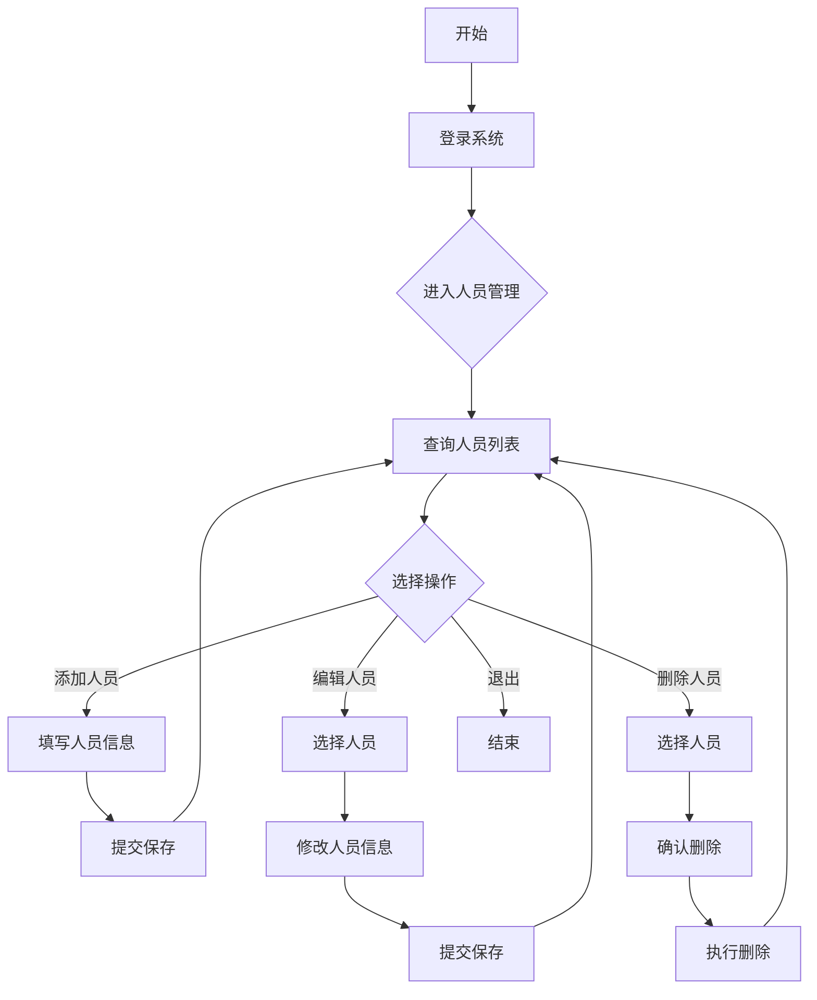
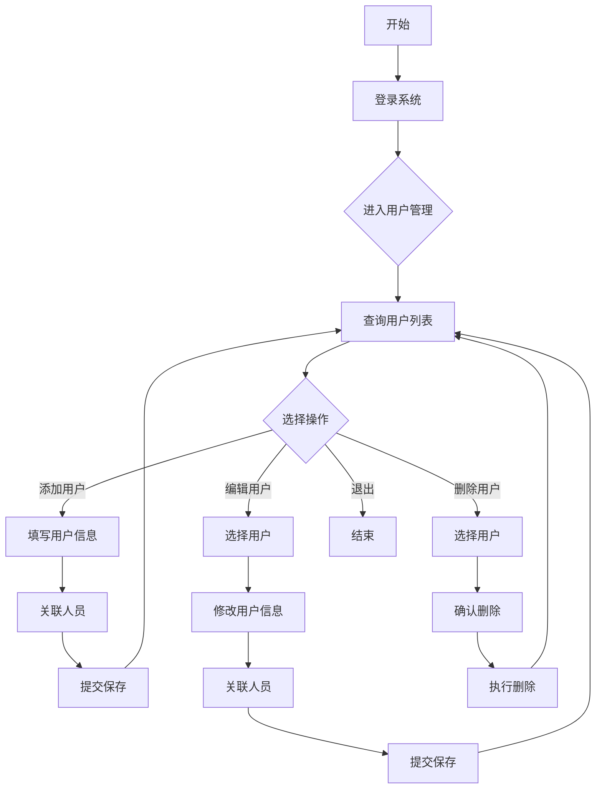
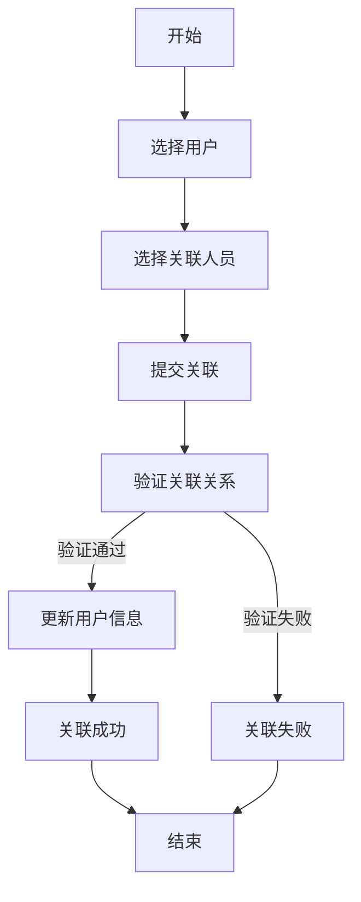

# Hyper Duty 需求说明书

## 1. 项目概述

### 1.1 项目背景
Hyper Duty是一个企业级的人员管理系统，旨在帮助企业高效管理员工信息、部门结构和用户权限，提供统一的认证授权机制。

### 1.2 项目目标
- 实现人员信息的全生命周期管理
- 支持部门结构的灵活配置
- 提供安全可靠的用户认证授权
- 提供友好的用户界面，便于操作和管理
- 支持系统的可扩展性和可维护性

### 1.3 适用范围
本系统适用于各类企业、组织的人员管理需求，特别是需要对员工信息、部门结构和用户权限进行集中管理的场景。

## 2. 功能需求

### 2.1 认证授权模块

#### 2.1.1 用户登录
- 功能描述：用户通过用户名和密码登录系统，支持邮箱验证码二次验证
- 输入：用户名、密码、验证码（可选）
- 输出：登录成功/失败信息，JWT令牌，员工ID，是否需要验证码标识
- 业务流程：
  1. 用户输入用户名和密码
  2. 系统验证用户名和密码
  3. 检查是否启用了邮箱验证码登录
  4. 如果启用且未提供验证码：返回需要验证码标识，发送验证码到用户邮箱
  5. 如果启用且提供验证码：验证验证码有效性
  6. 验证通过后生成JWT令牌
  7. 返回令牌、用户信息和员工ID

#### 2.1.2 邮箱验证码发送
- 功能描述：向用户邮箱发送登录验证码
- 输入：用户名
- 输出：发送成功/失败信息，脱敏邮箱地址
- 约束：验证码有效期可配置（默认5分钟），发送频率可限制（默认60秒内不能重复发送）

#### 2.1.3 邮件服务配置
- 功能描述：配置邮件服务器参数，用于发送各类通知邮件
- 输入：SMTP服务器地址、端口、是否启用SSL/TLS、发件人邮箱、授权密码、发件人名称、邮件模板、是否启用邮箱验证码登录、验证码有效期
- 输出：保存成功/失败信息
- 功能特性：
  - 支持邮件服务器连接测试
  - 支持多种邮件模板配置（登录验证码、密码找回、异地登录提醒等）
  - 支持邮箱验证码登录开关
  - 支持验证码有效期配置

#### 2.1.4 用户登出
- 功能描述：用户退出系统
- 输入：无（依赖登录状态）
- 输出：登出成功信息
- 业务流程：
  1. 用户点击登出按钮
  2. 系统清除当前用户的认证信息
  3. 返回登出成功信息

### 2.2 部门管理模块

#### 2.2.1 部门列表查询
- 功能描述：查询所有部门信息
- 输入：无
- 输出：部门列表，包括部门ID、名称、上级部门ID、部门编码、排序、状态等

#### 2.2.2 部门添加
- 功能描述：添加新部门
- 输入：部门名称、上级部门ID、部门编码、排序、状态
- 输出：添加成功/失败信息

#### 2.2.3 部门编辑
- 功能描述：编辑现有部门信息
- 输入：部门ID、部门名称、上级部门ID、部门编码、排序、状态
- 输出：编辑成功/失败信息

#### 2.2.4 部门删除
- 功能描述：删除指定部门
- 输入：部门ID
- 输出：删除成功/失败信息
- 约束：删除部门时，会级联删除其下所有子部门

### 2.3 人员管理模块

#### 2.3.1 人员列表查询
- 功能描述：查询所有人员信息
- 输入：无
- 输出：人员列表，包括人员ID、姓名、所属部门、人员编码、手机号、邮箱、性别、状态等

#### 2.3.2 人员添加
- 功能描述：添加新人员
- 输入：人员姓名、所属部门ID、人员编码（非必填）、手机号、邮箱、性别、状态
- 输出：添加成功/失败信息

#### 2.3.3 人员编辑
- 功能描述：编辑现有人员信息
- 输入：人员ID、人员姓名、所属部门ID、人员编码（非必填）、手机号、邮箱、性别、状态
- 输出：编辑成功/失败信息

#### 2.3.4 人员删除
- 功能描述：删除指定人员
- 输入：人员ID
- 输出：删除成功/失败信息

### 2.4 用户管理模块

#### 2.4.1 用户列表查询
- 功能描述：查询所有用户信息
- 输入：无
- 输出：用户列表，包括用户ID、用户名、关联人员姓名、状态、创建时间等

#### 2.4.2 用户添加
- 功能描述：添加新用户
- 输入：用户名、密码、关联人员ID、状态
- 输出：添加成功/失败信息

#### 2.4.3 用户编辑
- 功能描述：编辑现有用户信息
- 输入：用户ID、用户名、密码（可选）、关联人员ID、状态
- 输出：编辑成功/失败信息

#### 2.4.4 用户删除
- 功能描述：删除指定用户
- 输入：用户ID
- 输出：删除成功/失败信息

#### 2.4.5 人员关联
- 功能描述：将用户与人员进行关联
- 输入：用户ID、人员ID
- 输出：关联成功/失败信息

### 2.5 角色管理模块

#### 2.5.1 角色列表查询
- 功能描述：查询所有角色信息
- 输入：无
- 输出：角色列表，包括角色ID、角色名称、角色编码、状态、创建时间等

#### 2.5.2 角色添加
- 功能描述：添加新角色
- 输入：角色名称、角色编码、状态
- 输出：添加成功/失败信息

#### 2.5.3 角色编辑
- 功能描述：编辑现有角色信息
- 输入：角色ID、角色名称、角色编码、状态
- 输出：编辑成功/失败信息

#### 2.5.4 角色删除
- 功能描述：删除指定角色
- 输入：角色ID
- 输出：删除成功/失败信息

#### 2.5.5 角色菜单授权
- 功能描述：为角色分配菜单权限
- 输入：角色ID、菜单ID列表
- 输出：授权成功/失败信息

#### 2.5.6 角色用户绑定
- 功能描述：为角色绑定用户
- 输入：角色ID、用户ID列表
- 输出：绑定成功/失败信息
- 改进：用户绑定对话框显示用户实际人名而不是ID，提高用户体验

### 2.6 菜单管理模块

#### 2.6.1 菜单列表查询
- 功能描述：查询所有菜单信息
- 输入：无
- 输出：菜单列表，包括菜单ID、菜单名称、父菜单ID、菜单路径、组件路径、菜单类型、权限标识、排序、状态等

#### 2.6.2 菜单添加
- 功能描述：添加新菜单
- 输入：菜单名称、父菜单ID、菜单路径、组件路径、菜单类型、权限标识、排序、状态
- 输出：添加成功/失败信息

#### 2.6.3 菜单编辑
- 功能描述：编辑现有菜单信息
- 输入：菜单ID、菜单名称、父菜单ID、菜单路径、组件路径、菜单类型、权限标识、排序、状态
- 输出：编辑成功/失败信息

#### 2.6.4 菜单删除
- 功能描述：删除指定菜单
- 输入：菜单ID
- 输出：删除成功/失败信息
- 约束：删除菜单时，会级联删除其下所有子菜单及关联的角色菜单关系

#### 2.6.5 菜单树查询
- 功能描述：查询菜单树形结构
- 输入：无
- 输出：菜单树形结构数据

#### 2.6.6 用户菜单权限查询
- 功能描述：根据用户ID查询用户有权限的菜单列表
- 输入：用户ID
- 输出：用户有权限的菜单列表，包括父菜单（即使父菜单未直接授权）
- 改进：优化菜单权限查询逻辑，确保父菜单在子菜单授权时也能显示

### 2.7 文件管理模块

#### 2.7.1 文件上传
- 功能描述：上传文件到系统，支持多格式文件
- 输入：文件（multipart/form-data）、目录路径（可选）
- 输出：上传成功/失败信息，包含文件路径、访问URL、预览URL等

#### 2.7.2 文件预览
- 功能描述：预览已上传的文件，支持多格式文件在线预览
- 输入：文件路径
- 输出：文件预览内容

#### 2.7.3 文件下载
- 功能描述：下载已上传的文件
- 输入：文件路径
- 输出：文件下载流

#### 2.7.4 文件删除
- 功能描述：删除已上传的文件
- 输入：文件路径
- 输出：删除成功/失败信息

#### 2.7.5 文件存在性检查
- 功能描述：检查指定文件是否存在
- 输入：文件路径
- 输出：文件存在状态（布尔值）

### 2.8 项目管理模块

#### 2.8.1 项目管理

##### 2.8.1.1 项目列表查询
- 功能描述：查询所有项目信息
- 输入：无
- 输出：项目列表，包括项目ID、项目名称、项目描述、状态、开始日期、结束日期、创建人等

##### 2.8.1.2 项目添加
- 功能描述：添加新项目
- 输入：项目名称、项目描述、开始日期、结束日期、参与人员列表
- 输出：添加成功/失败信息

##### 2.8.1.3 项目编辑
- 功能描述：编辑现有项目信息
- 输入：项目ID、项目名称、项目描述、开始日期、结束日期、参与人员列表
- 输出：编辑成功/失败信息

##### 2.8.1.4 项目删除
- 功能描述：删除指定项目
- 输入：项目ID
- 输出：删除成功/失败信息

##### 2.8.1.5 项目详情查询
- 功能描述：查询项目详细信息
- 输入：项目ID
- 输出：项目详细信息，包括项目基本信息、参与人员、相关任务等

#### 2.8.2 任务管理

##### 2.8.2.1 任务列表查询
- 功能描述：查询任务列表，支持多条件筛选
- 输入：项目ID、状态、优先级、负责人等筛选条件
- 输出：任务列表，包括任务ID、任务名称、任务描述、项目ID、父任务ID、负责人ID、状态、优先级、开始日期、结束日期、进度、是否置顶等

##### 2.8.2.2 任务添加
- 功能描述：添加新任务，支持无限级子任务
- 输入：任务名称、任务描述、项目ID、父任务ID、负责人ID、干系人列表、状态、优先级、开始日期、结束日期
- 输出：添加成功/失败信息

##### 2.8.2.3 任务编辑
- 功能描述：编辑现有任务信息
- 输入：任务ID、任务名称、任务描述、负责人ID、干系人列表、状态、优先级、开始日期、结束日期、进度
- 输出：编辑成功/失败信息

##### 2.8.2.4 任务删除
- 功能描述：删除指定任务
- 输入：任务ID
- 输出：删除成功/失败信息

##### 2.8.2.5 任务详情查询
- 功能描述：查询任务详细信息
- 输入：任务ID
- 输出：任务详细信息，包括任务基本信息、负责人、干系人、子任务、批注等

##### 2.8.2.6 任务置顶
- 功能描述：置顶/取消置顶任务
- 输入：任务ID、是否置顶
- 输出：操作成功/失败信息

##### 2.8.2.7 子任务查询
- 功能描述：查询指定任务的子任务列表
- 输入：任务ID
- 输出：子任务列表

##### 2.8.2.8 任务进度与状态联动
- 功能描述：实现任务进度与状态的双向联动，提升用户体验
- 输入：任务进度或任务状态
- 输出：更新后的任务信息
- 业务规则：
  - **进度→状态联动**：更新任务进度时，进度拉到100%状态自动变为已完成，改为0%状态变为未开始，其他数值状态为进行中
  - **状态→进度联动**：编辑任务状态时，未开始对应进度调整为0%，进行中不修改进度数值，已完成的进度对应改为100%，已暂停的不修改进度数值

##### 2.8.2.9 任务重点标识
- 功能描述：支持设置任务是否为重点任务，便于筛选和报告生成
- 输入：任务ID、是否重点
- 输出：操作成功/失败信息
- 业务规则：
  - 重点任务在列表中会有特殊标识（如图标、标签）
  - AI生成报告时会将重点任务和非重点任务分开展示

#### 2.8.3 任务批注管理

##### 2.8.3.1 批注列表查询
- 功能描述：查询指定任务的批注列表
- 输入：任务ID
- 输出：批注列表，包括批注ID、任务ID、批注人ID、批注内容、创建时间、附件信息等

##### 2.8.3.2 批注添加
- 功能描述：为任务添加批注，支持添加文本和附件
- 输入：任务ID、批注内容、附件列表
- 输出：添加成功/失败信息

#### 2.8.4 多视图展示

##### 2.8.4.1 列表视图
- 功能描述：以列表形式展示任务
- 输入：无
- 输出：任务列表，支持排序、筛选、搜索等操作

##### 2.8.4.2 日历视图
- 功能描述：以日历形式展示任务
- 输入：无
- 输出：任务日历，显示任务的时间分布和截止日期

##### 2.8.4.3 团队视图
- 功能描述：以团队成员为维度展示任务
- 输入：无
- 输出：团队任务分布，显示每个团队成员的工作负载

##### 2.8.4.4 甘特图视图
- 功能描述：以甘特图形式展示任务
- 输入：无
- 输出：任务甘特图，显示任务的时间线和依赖关系

#### 2.8.5 AI报告功能

##### 2.8.5.1 日报生成
- 功能描述：基于项目任务数据，使用AI智能生成日报
- 输入：报告日期、项目ID（可选）、配置ID（可选）
- 输出：生成确认信息，报告内容异步生成
- 业务规则：
  - 按GOC调度、架构治理、入网管理、变更管控、故障治理、运营治理、数智化研运七大维度分类
  - 将重点任务和非重点任务分开展示
  - 使用JSON格式的结构化数据传递给AI，提升AI理解能力
  - 使用异步处理，避免前端超时
  - AI生成失败时自动重试（默认3次），每次重试会更新提示词并包含错误信息
  - 如果所有重试都失败，使用原始数据生成降级报告
  - 生成的报告保存到数据库，支持后续查看

##### 2.8.5.2 周报生成
- 功能描述：基于项目任务数据，使用AI智能生成周报
- 输入：开始日期、结束日期、项目ID（可选）、配置ID（可选）
- 输出：生成确认信息，报告内容异步生成
- 业务规则：
  - 按GOC调度、架构治理、入网管理、变更管控、故障治理、运营治理、数智化研运七大维度分类
  - 将重点任务和非重点任务分开展示
  - 使用JSON格式的结构化数据传递给AI，提升AI理解能力
  - 使用异步处理，避免前端超时
  - AI生成失败时自动重试（默认3次），每次重试会更新提示词并包含错误信息
  - 如果所有重试都失败，使用原始数据生成降级报告
  - 生成的报告保存到数据库，支持后续查看

##### 2.8.5.3 报告历史查询
- 功能描述：查询历史生成的AI报告
- 输入：报告类型（日报/周报，可选）、页码、每页数量
- 输出：报告列表，包括报告ID、报告名称、报告类型、报告日期、创建时间、报告内容等
- 业务规则：
  - 支持按报告类型筛选
  - 支持分页查询
  - 显示报告生成状态（生成中/已完成/失败）

##### 2.8.5.4 报告配置管理
- 功能描述：管理AI报告的配置信息，包括提示词模板、AI模型参数等
- 输入：配置名称、配置编码、报告类型、提示词模板、模型名称、温度、最大Token、Top-P、最大重试次数、System Prompt、状态、备注
- 输出：配置保存成功/失败信息
- 业务规则：
  - 支持配置多个报告模板
  - 支持启用/禁用配置
  - 提示词模板支持变量替换
  - 温度参数：控制AI输出的随机性，取值范围0-1，默认0.7
  - 最大Token：限制AI输出的长度，默认4000
  - Top-P：核采样参数，取值范围0-1，默认0.9
  - 最大重试次数：AI生成失败时的最大重试次数，默认3
  - System Prompt：定义AI的角色定位和行为准则

## 3. 非功能需求

### 3.1 性能需求
- 系统响应时间：页面加载时间≤2秒，操作响应时间≤1秒
- 系统并发能力：支持1000+并发用户
- 数据查询性能：单表查询响应时间≤0.5秒
- 缓存性能：热点数据缓存响应时间≤0.1秒，缓存命中率≥90%

### 3.6 缓存需求
- 缓存策略：使用Redis进行热点数据缓存
- 缓存数据：字典数据、菜单数据、角色数据、用户数据、节假日数据等
- 缓存一致性：确保数据增删改后缓存及时更新
- 缓存过期：设置合理的缓存过期时间，避免缓存膨胀
- 序列化支持：支持Java 8日期时间类型和复杂对象的序列化和反序列化

### 3.2 安全性需求
- 采用JWT令牌进行身份认证
- 密码采用BCrypt加密存储
- 实现基于角色的访问控制
- 防止SQL注入、XSS攻击等常见安全漏洞
- 敏感数据加密传输

### 3.3 可靠性需求
- 系统可用性：≥99.9%
- 数据完整性：确保数据的一致性和准确性
- 系统容错能力：出现错误时提供友好的错误提示，不影响系统整体运行

### 3.4 可扩展性需求
- 采用模块化设计，便于功能扩展
- 支持多数据源配置
- 支持微服务架构的扩展

### 3.5 可维护性需求
- 代码结构清晰，注释完整
- 采用标准化的开发规范
- 提供详细的开发文档和用户手册
- 支持日志记录和监控

## 4. 业务流程

### 4.1 人员管理流程

```mermaid
flowchart TD
    A[开始] --> B[登录系统]
    B --> C{进入人员管理}
    C --> D[查询人员列表]
    D --> E{选择操作}
    E -->|添加人员| F[填写人员信息]
    F --> G[提交保存]
    G --> D
    E -->|编辑人员| H[选择人员]
    H --> I[修改人员信息]
    I --> J[提交保存]
    J --> D
    E -->|删除人员| K[选择人员]
    K --> L[确认删除]
    L --> M[执行删除]
    M --> D
    E -->|退出| N[结束]
```

### 4.2 用户管理流程

```mermaid
flowchart TD
    A[开始] --> B[登录系统]
    B --> C{进入用户管理}
    C --> D[查询用户列表]
    D --> E{选择操作}
    E -->|添加用户| F[填写用户信息]
    F --> G[关联人员]
    G --> H[提交保存]
    H --> D
    E -->|编辑用户| I[选择用户]
    I --> J[修改用户信息]
    J --> K[关联人员]
    K --> L[提交保存]
    L --> D
    E -->|删除用户| M[选择用户]
    M --> N[确认删除]
    N --> O[执行删除]
    O --> D
    E -->|退出| P[结束]
```

### 4.3 用户与人员关联流程

```mermaid
flowchart TD
    A[开始] --> B[选择用户]
    B --> C[选择关联人员]
    C --> D[提交关联]
    D --> E[验证关联关系]
    E -->|验证通过| F[更新用户信息]
    F --> G[关联成功]
    E -->|验证失败| H[关联失败]
    G --> I[结束]
    H --> I
```

## 5. 数据模型

### 5.1 部门表（sys_dept）
| 字段名 | 数据类型 | 约束 | 描述 |
|--------|----------|------|------|
| id | bigint | PRIMARY KEY, AUTO_INCREMENT | 部门ID |
| dept_name | varchar(50) | NOT NULL | 部门名称 |
| parent_id | bigint | DEFAULT 0 | 上级部门ID |
| dept_code | varchar(20) | NOT NULL, UNIQUE | 部门编码 |
| sort | int | DEFAULT 0 | 排序 |
| status | tinyint | DEFAULT 1 | 状态：0禁用，1启用 |
| create_time | datetime | DEFAULT CURRENT_TIMESTAMP | 创建时间 |
| update_time | datetime | DEFAULT CURRENT_TIMESTAMP ON UPDATE CURRENT_TIMESTAMP | 更新时间 |

### 5.2 人员表（sys_employee）
| 字段名 | 数据类型 | 约束 | 描述 |
|--------|----------|------|------|
| id | bigint | PRIMARY KEY, AUTO_INCREMENT | 人员ID |
| employee_name | varchar(50) | NOT NULL | 人员姓名 |
| dept_id | bigint | NOT NULL, FOREIGN KEY | 所属部门ID |
| employee_code | varchar(20) | UNIQUE | 人员编码（非必填） |
| phone | varchar(11) | | 手机号码 |
| email | varchar(50) | | 邮箱 |
| gender | int | DEFAULT 0 | 性别：0未知，1男，2女 |
| status | int | DEFAULT 1 | 状态：0禁用，1启用 |
| create_time | datetime | DEFAULT CURRENT_TIMESTAMP | 创建时间 |
| update_time | datetime | DEFAULT CURRENT_TIMESTAMP ON UPDATE CURRENT_TIMESTAMP | 更新时间 |

### 5.3 用户表（sys_user）
| 字段名 | 数据类型 | 约束 | 描述 |
|--------|----------|------|------|
| id | bigint | PRIMARY KEY, AUTO_INCREMENT | 用户ID |
| username | varchar(50) | NOT NULL, UNIQUE | 用户名 |
| password | varchar(100) | NOT NULL | 密码（BCrypt加密） |
| employee_id | bigint | NOT NULL, UNIQUE, FOREIGN KEY | 关联人员ID |
| status | tinyint | DEFAULT 1 | 状态：0禁用，1启用 |
| create_time | datetime | DEFAULT CURRENT_TIMESTAMP | 创建时间 |
| update_time | datetime | DEFAULT CURRENT_TIMESTAMP ON UPDATE CURRENT_TIMESTAMP | 更新时间 |

### 5.4 角色表（sys_role）
| 字段名 | 数据类型 | 约束 | 描述 |
|--------|----------|------|------|
| id | bigint | PRIMARY KEY, AUTO_INCREMENT | 角色ID |
| role_name | varchar(50) | NOT NULL | 角色名称 |
| role_code | varchar(20) | NOT NULL, UNIQUE | 角色编码 |
| status | tinyint | DEFAULT 1 | 状态：0禁用，1启用 |
| create_time | datetime | DEFAULT CURRENT_TIMESTAMP | 创建时间 |
| update_time | datetime | DEFAULT CURRENT_TIMESTAMP ON UPDATE CURRENT_TIMESTAMP | 更新时间 |

### 5.5 菜单表（sys_menu）
| 字段名 | 数据类型 | 约束 | 描述 |
|--------|----------|------|------|
| id | bigint | PRIMARY KEY, AUTO_INCREMENT | 菜单ID |
| menu_name | varchar(50) | NOT NULL | 菜单名称 |
| parent_id | bigint | DEFAULT 0 | 父菜单ID |
| path | varchar(100) | | 菜单路径 |
| component | varchar(200) | | 组件路径 |
| menu_type | char(1) | NOT NULL | 菜单类型：M-目录，C-菜单，F-按钮 |
| perms | varchar(100) | | 权限标识 |
| icon | varchar(50) | | 菜单图标 |
| order_num | int | DEFAULT 0 | 排序 |
| status | tinyint | DEFAULT 1 | 状态：0禁用，1启用 |
| create_time | datetime | DEFAULT CURRENT_TIMESTAMP | 创建时间 |
| update_time | datetime | DEFAULT CURRENT_TIMESTAMP ON UPDATE CURRENT_TIMESTAMP | 更新时间 |

### 5.6 角色菜单关联表（sys_role_menu）
| 字段名 | 数据类型 | 约束 | 描述 |
|--------|----------|------|------|
| role_id | bigint | NOT NULL, FOREIGN KEY | 角色ID |
| menu_id | bigint | NOT NULL, FOREIGN KEY | 菜单ID |
| PRIMARY KEY (role_id, menu_id) | | | 复合主键 |

### 5.7 角色用户关联表（sys_user_role）
| 字段名 | 数据类型 | 约束 | 描述 |
|--------|----------|------|------|
| user_id | bigint | NOT NULL, FOREIGN KEY | 用户ID |
| role_id | bigint | NOT NULL, FOREIGN KEY | 角色ID |
| PRIMARY KEY (user_id, role_id) | | | 复合主键 |

### 5.8 项目表（pm_project）
| 字段名 | 数据类型 | 约束 | 描述 |
|--------|----------|------|------|
| id | bigint | PRIMARY KEY, AUTO_INCREMENT | 项目ID |
| project_name | varchar(100) | NOT NULL | 项目名称 |
| description | text | | 项目描述 |
| status | smallint | DEFAULT 1 | 项目状态：0禁用，1启用 |
| start_date | date | | 开始日期 |
| end_date | date | | 结束日期 |
| create_by | bigint | NOT NULL, FOREIGN KEY | 创建人ID |
| create_time | datetime | DEFAULT CURRENT_TIMESTAMP | 创建时间 |
| update_time | datetime | DEFAULT CURRENT_TIMESTAMP ON UPDATE CURRENT_TIMESTAMP | 更新时间 |

### 5.9 项目人员关联表（pm_project_employee）
| 字段名 | 数据类型 | 约束 | 描述 |
|--------|----------|------|------|
| id | bigint | PRIMARY KEY, AUTO_INCREMENT | ID |
| project_id | bigint | NOT NULL, FOREIGN KEY | 项目ID |
| employee_id | bigint | NOT NULL, FOREIGN KEY | 人员ID |
| role | varchar(20) | | 角色 |
| create_time | datetime | DEFAULT CURRENT_TIMESTAMP | 创建时间 |

### 5.10 任务表（pm_task）
| 字段名 | 数据类型 | 约束 | 描述 |
|--------|----------|------|------|
| id | bigint | PRIMARY KEY, AUTO_INCREMENT | 任务ID |
| task_name | varchar(100) | NOT NULL | 任务名称 |
| description | text | | 任务描述 |
| project_id | bigint | NOT NULL, FOREIGN KEY | 项目ID |
| parent_id | bigint | FOREIGN KEY | 父任务ID |
| assignee_id | bigint | FOREIGN KEY | 负责人ID |
| status | smallint | DEFAULT 0 | 任务状态：0待办，1进行中，2已完成，3已取消 |
| priority | smallint | DEFAULT 0 | 优先级：0低，1中，2高 |
| start_date | date | | 开始日期 |
| end_date | date | | 结束日期 |
| progress | integer | DEFAULT 0 | 进度：0-100 |
| is_pinned | smallint | DEFAULT 0 | 是否置顶：0否，1是 |
| is_focus | smallint | DEFAULT 0 | 是否重点：0否，1是 |
| create_by | bigint | NOT NULL, FOREIGN KEY | 创建人ID |
| create_time | datetime | DEFAULT CURRENT_TIMESTAMP | 创建时间 |
| update_time | datetime | DEFAULT CURRENT_TIMESTAMP ON UPDATE CURRENT_TIMESTAMP | 更新时间 |

### 5.11 任务干系人表（pm_task_stakeholder）
| 字段名 | 数据类型 | 约束 | 描述 |
|--------|----------|------|------|
| id | bigint | PRIMARY KEY, AUTO_INCREMENT | ID |
| task_id | bigint | NOT NULL, FOREIGN KEY | 任务ID |
| employee_id | bigint | NOT NULL, FOREIGN KEY | 人员ID |
| role | varchar(20) | | 角色：普通干系人，授权干系人 |
| create_time | datetime | DEFAULT CURRENT_TIMESTAMP | 创建时间 |

### 5.12 任务批注表（pm_task_comment）
| 字段名 | 数据类型 | 约束 | 描述 |
|--------|----------|------|------|
| id | bigint | PRIMARY KEY, AUTO_INCREMENT | 批注ID |
| task_id | bigint | NOT NULL, FOREIGN KEY | 任务ID |
| employee_id | bigint | NOT NULL, FOREIGN KEY | 批注人ID |
| content | text | NOT NULL | 批注内容 |
| create_time | datetime | DEFAULT CURRENT_TIMESTAMP | 创建时间 |

### 5.13 任务批注附件表（pm_task_comment_attachment）
| 字段名 | 数据类型 | 约束 | 描述 |
|--------|----------|------|------|
| id | bigint | PRIMARY KEY, AUTO_INCREMENT | 附件ID |
| comment_id | bigint | NOT NULL, FOREIGN KEY | 批注ID |
| file_name | varchar(200) | NOT NULL | 文件名 |
| file_path | varchar(500) | NOT NULL | 文件路径 |
| create_time | datetime | DEFAULT CURRENT_TIMESTAMP | 创建时间 |

### 5.14 邮件配置表（sys_mail_config）
| 字段名 | 数据类型 | 约束 | 描述 |
|--------|----------|------|------|
| id | bigint | PRIMARY KEY, AUTO_INCREMENT | 配置ID |
| smtp_host | varchar(255) | NOT NULL | SMTP服务器地址 |
| smtp_port | int | NOT NULL | SMTP端口 |
| enable_ssl | smallint | DEFAULT 0 | 是否启用SSL：0否，1是 |
| enable_tls | smallint | DEFAULT 0 | 是否启用TLS：0否，1是 |
| from_email | varchar(255) | NOT NULL | 发件人邮箱 |
| from_name | varchar(255) | | 发件人名称 |
| auth_password | varchar(255) | NOT NULL | 授权密码 |
| login_code_template | text | | 登录验证码邮件模板 |
| password_reset_template | text | | 密码找回邮件模板 |
| remote_login_template | text | | 异地登录提醒模板 |
| enable_email_login | smallint | DEFAULT 0 | 是否启用邮箱验证码登录：0否，1是 |
| code_expire_minutes | int | DEFAULT 5 | 验证码有效期（分钟） |
| create_time | datetime | DEFAULT CURRENT_TIMESTAMP | 创建时间 |
| update_time | datetime | DEFAULT CURRENT_TIMESTAMP ON UPDATE CURRENT_TIMESTAMP | 更新时间 |
| remark | text | | 备注 |

### 5.15 AI报告配置表（ai_report_config）
| 字段名 | 数据类型 | 约束 | 描述 |
|--------|----------|------|------|
| id | bigint | PRIMARY KEY, AUTO_INCREMENT | 配置ID |
| config_name | varchar(100) | NOT NULL | 配置名称 |
| config_code | varchar(50) | NOT NULL, UNIQUE | 配置编码 |
| report_type | varchar(20) | NOT NULL | 报告类型：daily日报，weekly周报 |
| prompt_template | text | NOT NULL | 提示词模板 |
| model_name | varchar(50) | DEFAULT "glm-4-flash" | AI模型名称 |
| model_config | json | | 模型配置JSON（备用） |
| temperature | double precision | DEFAULT 0.7 | 温度参数：控制输出随机性，0-1之间，越小越确定 |
| max_tokens | integer | DEFAULT 4000 | 最大token数：限制输出长度 |
| top_p | double precision | DEFAULT 0.9 | top_p参数：核采样参数，0-1之间 |
| max_retries | integer | DEFAULT 3 | 最大重试次数 |
| system_prompt | text | | System Prompt：AI的角色设定 |
| status | smallint | DEFAULT 1 | 状态：0禁用，1启用 |
| remark | varchar(500) | | 备注 |
| create_by | bigint | FOREIGN KEY | 创建人ID |
| create_time | datetime | DEFAULT CURRENT_TIMESTAMP | 创建时间 |
| update_by | bigint | FOREIGN KEY | 更新人ID |
| update_time | datetime | DEFAULT CURRENT_TIMESTAMP ON UPDATE CURRENT_TIMESTAMP | 更新时间 |

### 5.16 AI报告表（ai_report）
| 字段名 | 数据类型 | 约束 | 描述 |
|--------|----------|------|------|
| id | bigint | PRIMARY KEY, AUTO_INCREMENT | 报告ID |
| report_name | varchar(200) | NOT NULL | 报告名称 |
| report_type | varchar(20) | NOT NULL | 报告类型：daily日报，weekly周报 |
| report_date | date | | 报告日期（日报使用） |
| start_date | date | | 开始日期（周报使用） |
| end_date | date | | 结束日期（周报使用） |
| project_id | bigint | FOREIGN KEY | 项目ID（可选） |
| report_content | text | | 报告内容 |
| status | smallint | DEFAULT 0 | 状态：0生成中，1已完成，2失败 |
| error_message | varchar(500) | | 错误信息 |
| config_id | bigint | FOREIGN KEY | 使用的配置ID |
| create_by | bigint | FOREIGN KEY | 创建人ID |
| create_time | datetime | DEFAULT CURRENT_TIMESTAMP | 创建时间 |
| update_time | datetime | DEFAULT CURRENT_TIMESTAMP ON UPDATE CURRENT_TIMESTAMP | 更新时间 |

## 6. 界面需求

### 6.1 登录页面
- 包含用户名和密码输入框
- 包含登录按钮
- 支持表单验证
- 支持邮箱验证码二次验证
- 验证码输入弹窗，包含倒计时功能
- 邮箱地址脱敏显示

### 6.2 主页面
- 包含侧边导航栏，支持部门管理、人员管理等功能模块的切换
- 包含顶部导航栏，显示当前用户信息和登出按钮
- 包含主内容区域，显示当前功能模块的内容

### 6.3 部门管理页面
- 显示部门列表，支持分页
- 支持部门的添加、编辑、删除操作
- 支持按部门名称搜索

### 6.4 人员管理页面
- 显示人员列表，支持分页
- 支持人员的添加、编辑、删除操作
- 支持按人员姓名或编码搜索
- 支持按部门筛选

### 6.5 角色管理页面
- 显示角色列表，支持分页
- 支持角色的添加、编辑、删除操作
- 支持角色菜单授权功能，通过树形组件选择菜单
- 支持角色用户绑定功能，通过远程搜索选择用户
- 支持按角色名称或编码搜索

### 6.6 菜单管理页面
- 显示菜单树形结构
- 支持菜单的添加、编辑、删除操作
- 支持按菜单名称搜索

### 6.7 项目管理页面
- 左侧菜单：项目管理、我的任务、团队视图、甘特图
- 项目列表页面：显示项目列表，支持项目的添加、编辑、删除操作，支持按项目名称搜索
- 项目详情页面：显示项目详细信息，包括项目基本信息、参与人员、相关任务等
- 任务列表页面：显示任务列表，支持任务的添加、编辑、删除、置顶等操作，支持按多条件筛选
- 我的任务页面：显示当前用户负责的任务列表
- 团队视图页面：以团队成员为维度显示任务分布
- 日历视图页面：以日历形式显示任务的时间分布
- 甘特图页面：以甘特图形式显示任务的时间线和依赖关系

### 6.8 邮件配置页面
- 位于系统管理菜单下
- 包含SMTP服务器配置区域
- 包含邮件模板配置区域（登录验证码、密码找回、异地登录提醒）
- 包含功能开关区域（启用邮箱验证码登录、验证码有效期）
- 包含测试连接按钮
- 包含保存配置按钮
- 支持配置是否启用SSL/TLS

## 7. 系统集成需求

### 7.1 数据库集成
- 支持MySQL数据库
- 支持数据库连接池

### 7.2 安全集成
- 集成Spring Security框架
- 支持JWT认证
- JWT密钥长度必须符合安全要求（HS512算法要求密钥长度至少为512位）
- 使用安全的密钥生成方式，避免使用弱密钥

### 7.3 前端集成
- 集成Vue 3框架
- 集成Element Plus UI组件库
- 集成Axios用于HTTP请求
- 改进：优化前端菜单路径构建逻辑，为子菜单添加父菜单路径前缀，确保路由正确

### 7.4 Redis集成
- 集成Redis用于热点数据缓存
- 配置要求：Redis 6.0+版本
- 连接配置：支持Redis连接池配置
- 序列化配置：支持Java 8日期时间类型的序列化和反序列化
- 缓存管理：提供统一的缓存管理和清除机制
- 验证码存储：使用Redis存储邮箱验证码，设置过期时间

### 7.5 邮件服务集成
- 集成JavaMailSender用于发送邮件
- 支持SMTP协议，支持SSL/TLS加密
- 支持邮件模板配置，支持变量替换（{code}, {expire}, {ip}, {time}, {location}）
- 支持邮件发送频率限制
- 支持邮件服务器连接测试

## 8. 验收标准

### 8.1 功能验收
- 所有功能需求均已实现
- 功能操作正常，无错误
- 业务流程符合预期

### 8.2 性能验收
- 系统响应时间符合要求
- 系统并发能力符合要求
- 数据查询性能符合要求

### 8.3 安全性验收
- 密码加密存储
- 认证授权机制正常
- 无明显安全漏洞

### 8.4 可靠性验收
- 系统可用性符合要求
- 数据完整性得到保证
- 系统容错能力符合要求

## 9. 风险评估

### 9.1 技术风险
- JWT令牌的安全性管理
- 系统的性能瓶颈
- 数据库的并发访问控制

### 9.2 业务风险
- 需求变更可能导致系统设计调整
- 用户对新系统的接受程度

### 9.3 实施风险
- 项目进度可能受外部因素影响
- 团队成员的技术能力差异

## 10. 附录

### 10.1 术语定义
- JWT：JSON Web Token，用于身份认证的令牌
- BCrypt：一种密码哈希算法
- 部门：组织中的一个单位，用于人员的分类和管理
- 人员：组织中的员工，包含基本信息和状态
- 用户：系统的使用者，用于登录和访问系统资源

### 10.2 参考文档
- Spring Boot官方文档
- Vue 3官方文档
- Element Plus官方文档
- JWT官方文档

---

**文档版本**：1.5
**创建日期**：2026-01-11
**更新日期**：2026-04-18
**文档作者**：系统生成
**更新内容**：
- 添加邮件验证码登录功能
- 添加邮件服务配置功能
- 添加邮件配置页面界面需求
- 添加邮件配置表数据模型
- 更新登录页面界面需求
- 添加邮件服务集成需求
