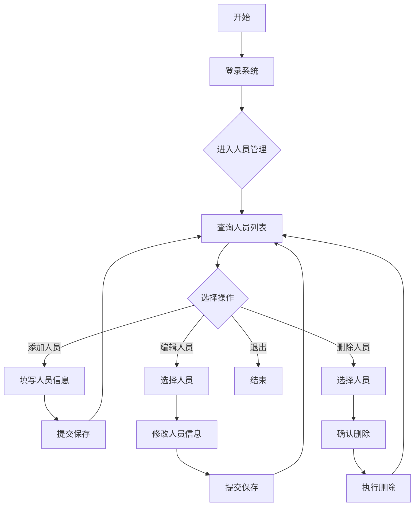
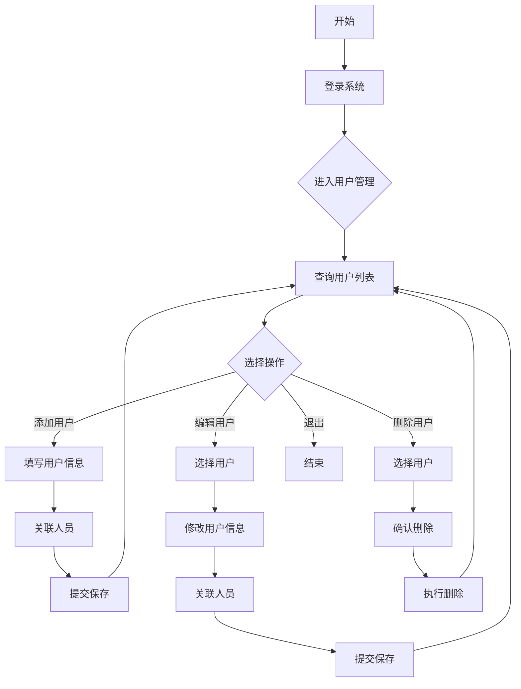
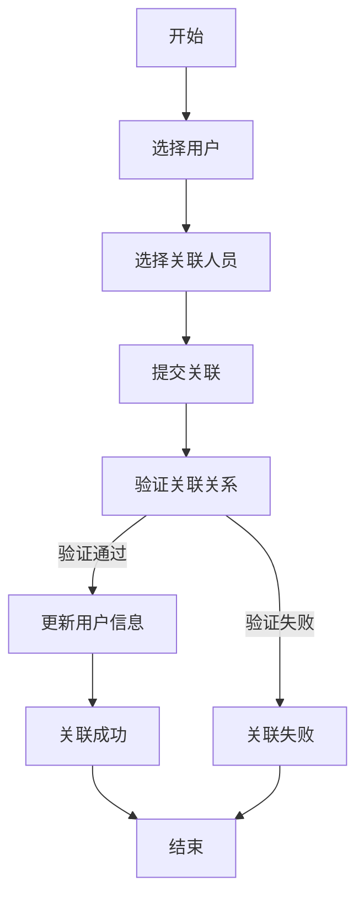

# Hyper Duty 需求说明书

## 1. 项目概述

### 1.1 项目背景
Hyper Duty是一个企业级的人员管理系统，旨在帮助企业高效管理员工信息、部门结构和用户权限，提供统一的认证授权机制。

### 1.2 项目目标
- 实现人员信息的全生命周期管理
- 支持部门结构的灵活配置
- 提供安全可靠的用户认证授权
- 提供友好的用户界面，便于操作和管理
- 支持系统的可扩展性和可维护性

### 1.3 适用范围
本系统适用于各类企业、组织的人员管理需求，特别是需要对员工信息、部门结构和用户权限进行集中管理的场景。

## 2. 功能需求

### 2.1 认证授权模块

#### 2.1.1 用户登录
- 功能描述：用户通过用户名和密码登录系统
- 输入：用户名、密码
- 输出：登录成功/失败信息，JWT令牌
- 业务流程：
  1. 用户输入用户名和密码
  2. 系统验证用户名和密码
  3. 验证通过后生成JWT令牌
  4. 返回令牌和用户信息

#### 2.1.2 用户登出
- 功能描述：用户退出系统
- 输入：无（依赖登录状态）
- 输出：登出成功信息
- 业务流程：
  1. 用户点击登出按钮
  2. 系统清除当前用户的认证信息
  3. 返回登出成功信息

### 2.2 部门管理模块

#### 2.2.1 部门列表查询
- 功能描述：查询所有部门信息
- 输入：无
- 输出：部门列表，包括部门ID、名称、上级部门ID、部门编码、排序、状态等

#### 2.2.2 部门添加
- 功能描述：添加新部门
- 输入：部门名称、上级部门ID、部门编码、排序、状态
- 输出：添加成功/失败信息

#### 2.2.3 部门编辑
- 功能描述：编辑现有部门信息
- 输入：部门ID、部门名称、上级部门ID、部门编码、排序、状态
- 输出：编辑成功/失败信息

#### 2.2.4 部门删除
- 功能描述：删除指定部门
- 输入：部门ID
- 输出：删除成功/失败信息
- 约束：删除部门时，会级联删除其下所有子部门

### 2.3 人员管理模块

#### 2.3.1 人员列表查询
- 功能描述：查询所有人员信息
- 输入：无
- 输出：人员列表，包括人员ID、姓名、所属部门、人员编码、手机号、邮箱、性别、状态等

#### 2.3.2 人员添加
- 功能描述：添加新人员
- 输入：人员姓名、所属部门ID、人员编码（非必填）、手机号、邮箱、性别、状态
- 输出：添加成功/失败信息

#### 2.3.3 人员编辑
- 功能描述：编辑现有人员信息
- 输入：人员ID、人员姓名、所属部门ID、人员编码（非必填）、手机号、邮箱、性别、状态
- 输出：编辑成功/失败信息

#### 2.3.4 人员删除
- 功能描述：删除指定人员
- 输入：人员ID
- 输出：删除成功/失败信息

### 2.4 用户管理模块

#### 2.4.1 用户列表查询
- 功能描述：查询所有用户信息
- 输入：无
- 输出：用户列表，包括用户ID、用户名、关联人员姓名、状态、创建时间等

#### 2.4.2 用户添加
- 功能描述：添加新用户
- 输入：用户名、密码、关联人员ID、状态
- 输出：添加成功/失败信息

#### 2.4.3 用户编辑
- 功能描述：编辑现有用户信息
- 输入：用户ID、用户名、密码（可选）、关联人员ID、状态
- 输出：编辑成功/失败信息

#### 2.4.4 用户删除
- 功能描述：删除指定用户
- 输入：用户ID
- 输出：删除成功/失败信息

#### 2.4.5 人员关联
- 功能描述：将用户与人员进行关联
- 输入：用户ID、人员ID
- 输出：关联成功/失败信息

### 2.5 角色管理模块

#### 2.5.1 角色列表查询
- 功能描述：查询所有角色信息
- 输入：无
- 输出：角色列表，包括角色ID、角色名称、角色编码、状态、创建时间等

#### 2.5.2 角色添加
- 功能描述：添加新角色
- 输入：角色名称、角色编码、状态
- 输出：添加成功/失败信息

#### 2.5.3 角色编辑
- 功能描述：编辑现有角色信息
- 输入：角色ID、角色名称、角色编码、状态
- 输出：编辑成功/失败信息

#### 2.5.4 角色删除
- 功能描述：删除指定角色
- 输入：角色ID
- 输出：删除成功/失败信息

#### 2.5.5 角色菜单授权
- 功能描述：为角色分配菜单权限
- 输入：角色ID、菜单ID列表
- 输出：授权成功/失败信息

#### 2.5.6 角色用户绑定
- 功能描述：为角色绑定用户
- 输入：角色ID、用户ID列表
- 输出：绑定成功/失败信息

### 2.6 菜单管理模块

#### 2.6.1 菜单列表查询
- 功能描述：查询所有菜单信息
- 输入：无
- 输出：菜单列表，包括菜单ID、菜单名称、父菜单ID、菜单路径、组件路径、菜单类型、权限标识、排序、状态等

#### 2.6.2 菜单添加
- 功能描述：添加新菜单
- 输入：菜单名称、父菜单ID、菜单路径、组件路径、菜单类型、权限标识、排序、状态
- 输出：添加成功/失败信息

#### 2.6.3 菜单编辑
- 功能描述：编辑现有菜单信息
- 输入：菜单ID、菜单名称、父菜单ID、菜单路径、组件路径、菜单类型、权限标识、排序、状态
- 输出：编辑成功/失败信息

#### 2.6.4 菜单删除
- 功能描述：删除指定菜单
- 输入：菜单ID
- 输出：删除成功/失败信息
- 约束：删除菜单时，会级联删除其下所有子菜单及关联的角色菜单关系

#### 2.6.5 菜单树查询
- 功能描述：查询菜单树形结构
- 输入：无
- 输出：菜单树形结构数据

## 3. 非功能需求

### 3.1 性能需求
- 系统响应时间：页面加载时间≤2秒，操作响应时间≤1秒
- 系统并发能力：支持1000+并发用户
- 数据查询性能：单表查询响应时间≤0.5秒

### 3.2 安全性需求
- 采用JWT令牌进行身份认证
- 密码采用BCrypt加密存储
- 实现基于角色的访问控制
- 防止SQL注入、XSS攻击等常见安全漏洞
- 敏感数据加密传输

### 3.3 可靠性需求
- 系统可用性：≥99.9%
- 数据完整性：确保数据的一致性和准确性
- 系统容错能力：出现错误时提供友好的错误提示，不影响系统整体运行

### 3.4 可扩展性需求
- 采用模块化设计，便于功能扩展
- 支持多数据源配置
- 支持微服务架构的扩展

### 3.5 可维护性需求
- 代码结构清晰，注释完整
- 采用标准化的开发规范
- 提供详细的开发文档和用户手册
- 支持日志记录和监控

## 4. 业务流程

### 4.1 人员管理流程

### 4.2 用户管理流程

### 4.3 用户与人员关联流程

## 5. 数据模型

### 5.1 部门表（sys_dept）
| 字段名 | 数据类型 | 约束 | 描述 |
|--------|----------|------|------|
| id | bigint | PRIMARY KEY, AUTO_INCREMENT | 部门ID |
| dept_name | varchar(50) | NOT NULL | 部门名称 |
| parent_id | bigint | DEFAULT 0 | 上级部门ID |
| dept_code | varchar(20) | NOT NULL, UNIQUE | 部门编码 |
| sort | int | DEFAULT 0 | 排序 |
| status | tinyint | DEFAULT 1 | 状态：0禁用，1启用 |
| create_time | datetime | DEFAULT CURRENT_TIMESTAMP | 创建时间 |
| update_time | datetime | DEFAULT CURRENT_TIMESTAMP ON UPDATE CURRENT_TIMESTAMP | 更新时间 |

### 5.2 人员表（sys_employee）
| 字段名 | 数据类型 | 约束 | 描述 |
|--------|----------|------|------|
| id | bigint | PRIMARY KEY, AUTO_INCREMENT | 人员ID |
| employee_name | varchar(50) | NOT NULL | 人员姓名 |
| dept_id | bigint | NOT NULL, FOREIGN KEY | 所属部门ID |
| employee_code | varchar(20) | UNIQUE | 人员编码（非必填） |
| phone | varchar(11) | | 手机号码 |
| email | varchar(50) | | 邮箱 |
| gender | int | DEFAULT 0 | 性别：0未知，1男，2女 |
| status | int | DEFAULT 1 | 状态：0禁用，1启用 |
| create_time | datetime | DEFAULT CURRENT_TIMESTAMP | 创建时间 |
| update_time | datetime | DEFAULT CURRENT_TIMESTAMP ON UPDATE CURRENT_TIMESTAMP | 更新时间 |

### 5.3 用户表（sys_user）
| 字段名 | 数据类型 | 约束 | 描述 |
|--------|----------|------|------|
| id | bigint | PRIMARY KEY, AUTO_INCREMENT | 用户ID |
| username | varchar(50) | NOT NULL, UNIQUE | 用户名 |
| password | varchar(100) | NOT NULL | 密码（BCrypt加密） |
| employee_id | bigint | NOT NULL, UNIQUE, FOREIGN KEY | 关联人员ID |
| status | tinyint | DEFAULT 1 | 状态：0禁用，1启用 |
| create_time | datetime | DEFAULT CURRENT_TIMESTAMP | 创建时间 |
| update_time | datetime | DEFAULT CURRENT_TIMESTAMP ON UPDATE CURRENT_TIMESTAMP | 更新时间 |

### 5.4 角色表（sys_role）
| 字段名 | 数据类型 | 约束 | 描述 |
|--------|----------|------|------|
| id | bigint | PRIMARY KEY, AUTO_INCREMENT | 角色ID |
| role_name | varchar(50) | NOT NULL | 角色名称 |
| role_code | varchar(20) | NOT NULL, UNIQUE | 角色编码 |
| status | tinyint | DEFAULT 1 | 状态：0禁用，1启用 |
| create_time | datetime | DEFAULT CURRENT_TIMESTAMP | 创建时间 |
| update_time | datetime | DEFAULT CURRENT_TIMESTAMP ON UPDATE CURRENT_TIMESTAMP | 更新时间 |

### 5.5 菜单表（sys_menu）
| 字段名 | 数据类型 | 约束 | 描述 |
|--------|----------|------|------|
| id | bigint | PRIMARY KEY, AUTO_INCREMENT | 菜单ID |
| menu_name | varchar(50) | NOT NULL | 菜单名称 |
| parent_id | bigint | DEFAULT 0 | 父菜单ID |
| path | varchar(100) | | 菜单路径 |
| component | varchar(200) | | 组件路径 |
| menu_type | char(1) | NOT NULL | 菜单类型：M-目录，C-菜单，F-按钮 |
| perms | varchar(100) | | 权限标识 |
| icon | varchar(50) | | 菜单图标 |
| order_num | int | DEFAULT 0 | 排序 |
| status | tinyint | DEFAULT 1 | 状态：0禁用，1启用 |
| create_time | datetime | DEFAULT CURRENT_TIMESTAMP | 创建时间 |
| update_time | datetime | DEFAULT CURRENT_TIMESTAMP ON UPDATE CURRENT_TIMESTAMP | 更新时间 |

### 5.6 角色菜单关联表（sys_role_menu）
| 字段名 | 数据类型 | 约束 | 描述 |
|--------|----------|------|------|
| role_id | bigint | NOT NULL, FOREIGN KEY | 角色ID |
| menu_id | bigint | NOT NULL, FOREIGN KEY | 菜单ID |
| PRIMARY KEY (role_id, menu_id) | | | 复合主键 |

### 5.7 角色用户关联表（sys_user_role）
| 字段名 | 数据类型 | 约束 | 描述 |
|--------|----------|------|------|
| user_id | bigint | NOT NULL, FOREIGN KEY | 用户ID |
| role_id | bigint | NOT NULL, FOREIGN KEY | 角色ID |
| PRIMARY KEY (user_id, role_id) | | | 复合主键 |

## 6. 界面需求

### 6.1 登录页面
- 包含用户名和密码输入框
- 包含登录按钮
- 支持表单验证

### 6.2 主页面
- 包含侧边导航栏，支持部门管理、人员管理等功能模块的切换
- 包含顶部导航栏，显示当前用户信息和登出按钮
- 包含主内容区域，显示当前功能模块的内容

### 6.3 部门管理页面
- 显示部门列表，支持分页
- 支持部门的添加、编辑、删除操作
- 支持按部门名称搜索

### 6.4 人员管理页面
- 显示人员列表，支持分页
- 支持人员的添加、编辑、删除操作
- 支持按人员姓名或编码搜索
- 支持按部门筛选

### 6.5 角色管理页面
- 显示角色列表，支持分页
- 支持角色的添加、编辑、删除操作
- 支持角色菜单授权功能，通过树形组件选择菜单
- 支持角色用户绑定功能，通过远程搜索选择用户
- 支持按角色名称或编码搜索

### 6.6 菜单管理页面
- 显示菜单树形结构
- 支持菜单的添加、编辑、删除操作
- 支持按菜单名称搜索

## 7. 系统集成需求

### 7.1 数据库集成
- 支持MySQL数据库
- 支持数据库连接池

### 7.2 安全集成
- 集成Spring Security框架
- 支持JWT认证
- JWT密钥长度必须符合安全要求（HS512算法要求密钥长度至少为512位）
- 使用安全的密钥生成方式，避免使用弱密钥

### 7.3 前端集成
- 集成Vue 3框架
- 集成Element Plus UI组件库
- 集成Axios用于HTTP请求

## 8. 验收标准

### 8.1 功能验收
- 所有功能需求均已实现
- 功能操作正常，无错误
- 业务流程符合预期

### 8.2 性能验收
- 系统响应时间符合要求
- 系统并发能力符合要求
- 数据查询性能符合要求

### 8.3 安全性验收
- 密码加密存储
- 认证授权机制正常
- 无明显安全漏洞

### 8.4 可靠性验收
- 系统可用性符合要求
- 数据完整性得到保证
- 系统容错能力符合要求

## 9. 风险评估

### 9.1 技术风险
- JWT令牌的安全性管理
- 系统的性能瓶颈
- 数据库的并发访问控制

### 9.2 业务风险
- 需求变更可能导致系统设计调整
- 用户对新系统的接受程度

### 9.3 实施风险
- 项目进度可能受外部因素影响
- 团队成员的技术能力差异

## 10. 附录

### 10.1 术语定义
- JWT：JSON Web Token，用于身份认证的令牌
- BCrypt：一种密码哈希算法
- 部门：组织中的一个单位，用于人员的分类和管理
- 人员：组织中的员工，包含基本信息和状态
- 用户：系统的使用者，用于登录和访问系统资源

### 10.2 参考文档
- Spring Boot官方文档
- Vue 3官方文档
- Element Plus官方文档
- JWT官方文档

---

**文档版本**：1.3
**创建日期**：2026-01-11
**更新日期**：2026-01-11
**文档作者**：系统生成
